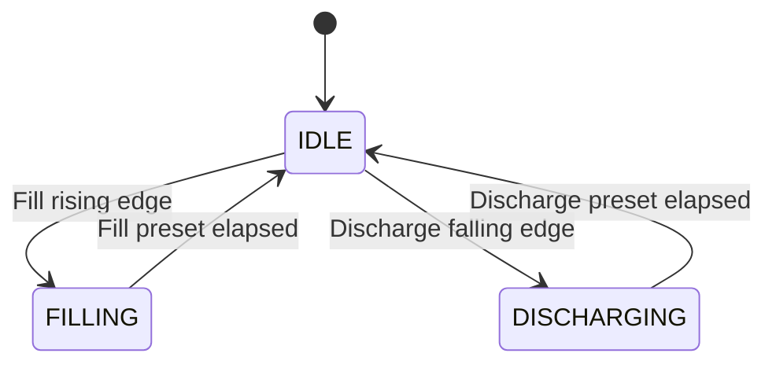

# State and Sequence Model

## 1. Implementation Note

The source does not implement a named enum or `CASE` state machine.

Each `FB_Tank` instance nevertheless has three mutually exclusive conceptual states derived from its two `TP` timers:

- `IDLE`;
- `FILLING`; and
- `DISCHARGING`.

The names in this document are an engineering model of the LD behaviour, not identifiers present in the PLC code.

## 2. Per-Tank State Model

The transition guards also require the opposite valve output to be false. Requests that fail the guard are not stored.

## 3. State Definitions

| Conceptual state | Internal condition | Valve outputs | Countdown source |
|---|---|---|---|
| `IDLE` | `TP_0.Q = FALSE` and `TP_1.Q = FALSE` | Both false | No enabled call; last value retained |
| `FILLING` | `TP_0.Q = TRUE` | Fill true, discharge false | `Fill_PT - Fill_ET` |
| `DISCHARGING` | `TP_1.Q = TRUE` | Fill false, discharge true | `Discharge_PT - Discharge_ET` |

The function block has no `FAULT`, `STOPPED`, `PAUSED`, `RESET_REQUIRED`, or `COMMAND_PENDING` state.

## 4. Transition Table

| Current state | Event / guard | Implemented action | Next state |
|---|---|---|---|
| `IDLE` | Rising edge of fill command and discharge valve false | Start `TP_0` | `FILLING` |
| `IDLE` | Falling edge of discharge command and fill valve false | Start `TP_1` | `DISCHARGING` |
| `FILLING` | `Fill_ET` reaches `Fill_PT` | Clear fill `TP.Q` automatically | `IDLE` |
| `DISCHARGING` | `Discharge_ET` reaches `Discharge_PT` | Clear discharge `TP.Q` automatically | `IDLE` |
| `FILLING` | Any fill request while `TP_0` is active | Request is not queued | `FILLING` |
| `FILLING` | Discharge falling edge while fill output is true | Interlock rejects request | `FILLING` |
| `DISCHARGING` | Any discharge request while `TP_1` is active | Request is not queued | `DISCHARGING` |
| `DISCHARGING` | Fill rising edge while discharge output is true | Interlock rejects request | `DISCHARGING` |

After a rejected edge, a new valid transition must be generated. Simply waiting for the current pulse to finish does not recreate the lost request.

## 5. Command-Level Behaviour

### Fill command

| `Fill` behaviour | Result |
|---|---|
| Starts false | No request |
| Changes false → true while idle | Starts fill |
| Remains true after fill completes | No retrigger |
| Changes true → false | Rearms the rising-edge contact |
| Changes false → true again while idle | Starts another fill |

### Discharge command

| `Discharge` behaviour | Result |
|---|---|
| Starts false | No request |
| Changes false → true | Arms the future falling transition; no discharge yet |
| Changes true → false while idle | Starts discharge |
| Remains false after discharge completes | No retrigger |
| Changes false → true → false again while idle | Starts another discharge |

This difference is important for an HMI or Factory I/O button: fill reacts on press, while discharge reacts on release when both use ordinary active-high momentary controls.

## 6. Simultaneous and Boundary Events

The `FB_Tank` networks execute in this order:

1. fill timer and fill output;
2. discharge timer and discharge output.

This creates deterministic scan-order behaviour.

| Same-scan condition | Implemented outcome |
|---|---|
| Fill rising and discharge falling while idle | Fill starts first; discharge is blocked by the newly true fill output |
| Discharge edge on the scan that fill completes | Fill network clears first; discharge can start later in the same scan |
| Fill edge on the scan that discharge completes | Fill network still sees the previous true discharge output and rejects the edge; discharge clears later in the scan |
| Both command signals held at steady levels | No new edge and no new pulse |

The completion-boundary asymmetry is a consequence of network order, not an explicit requirement. Runtime tracing should confirm it before any refactor.

## 7. Tank 1 Sequence

### Fill sequence

| Step | Condition or action | Expected state/output |
|---:|---|---|
| 1 | `Fill = FALSE`; both valves off | `IDLE` |
| 2 | Set `Fill = TRUE` | Rising edge starts 15-second pulse |
| 3 | Pulse active | `Fill_Valve = TRUE`; `Timer` counts down |
| 4 | 15 seconds elapsed | `Fill_Valve = FALSE`; return to `IDLE` |
| 5 | Set `Fill = FALSE` | Rearm for the next cycle |

### Discharge sequence

| Step | Condition or action | Expected state/output |
|---:|---|---|
| 1 | Both valves off | `IDLE` |
| 2 | Set `Discharge = TRUE` | No valve starts |
| 3 | Set `Discharge = FALSE` | Falling edge starts default 10-second pulse |
| 4 | Pulse active | `Discharge_Valve = TRUE`; `Timer` counts down |
| 5 | 10 seconds elapsed | `Discharge_Valve = FALSE`; return to `IDLE` |

## 8. Tank 2 Sequence

Tank 2 follows the same transition model with independent state.

| Phase | Command event | Duration | Output | Countdown |
|---|---|---:|---|---|
| Fill | Rising edge of `Fill2` | 8 s | `Fill_Valve2` | `Timer2` |
| Discharge | Falling edge of `Discharge2` | 12 s | `Discharge_Valve2` | `Timer2` |

## 9. Two-Tank Concurrency

The overall application state is the product of the two independent per-tank states.

| Tank 1 | Tank 2 | Allowed? | Notes |
|---|---|---:|---|
| `IDLE` | `IDLE` | Yes | No valves active |
| `FILLING` | `IDLE` | Yes | Tank 1 only |
| `DISCHARGING` | `IDLE` | Yes | Tank 1 only |
| `IDLE` | `FILLING` | Yes | Tank 2 only |
| `IDLE` | `DISCHARGING` | Yes | Tank 2 only |
| `FILLING` | `FILLING` | Yes | Both fill valves active |
| `FILLING` | `DISCHARGING` | Yes | Independent opposite phases |
| `DISCHARGING` | `FILLING` | Yes | Independent opposite phases |
| `DISCHARGING` | `DISCHARGING` | Yes | Both discharge valves active |

No logic limits simultaneous demand on a shared supply, drain, pump, or utility because none is represented in the application.

## 10. Countdown State Model

Each tank's display has three conceptual modes even though it is only an `INT`:

| Tank state | Enabled `FC_Timer` call | Display behaviour |
|---|---|---|
| `FILLING` | Fill call | Remaining fill seconds |
| `DISCHARGING` | Discharge call | Remaining discharge seconds |
| `IDLE` | Neither | Retain last written integer |

There is no separate phase tag or valid bit. A client should use the valve outputs to interpret the countdown.

## 11. Missing Fault Transitions

The current model cannot enter a fault state for:

- conflicting or repeated commands;
- a command rejected by the interlock;
- valve failure to move;
- no detected flow;
- tank overfill or low level;
- a timer calculation outside its valid numeric range; or
- communication loss.

These conditions are not silently safe simply because the timed pulse eventually ends; they are outside the implemented model.

## 12. Recommended Future State Model

A production-style `FB_Tank` could expose explicit states such as:

- `IDLE`;
- `FILLING`;
- `DISCHARGING`;
- `COMPLETE`;
- `COMMAND_REJECTED`;
- `FAULTED`; and
- `RESET_REQUIRED`.

It should define command arbitration, permitted transitions, feedback timeouts, level limits, and recovery rules as explicit requirements instead of relying on graphical edge history and network order.
