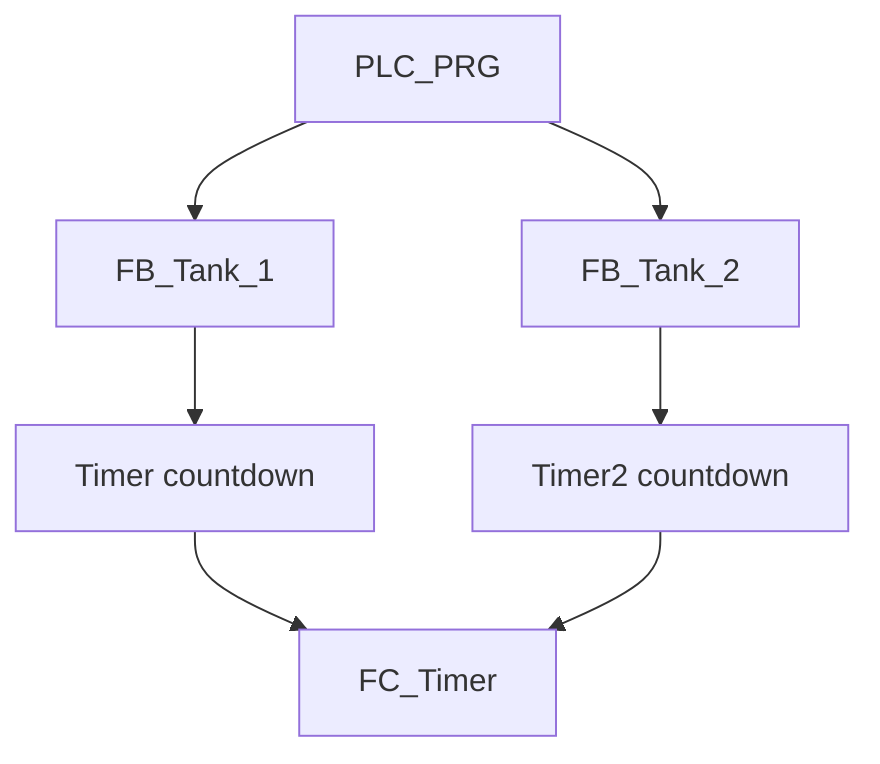

# Two Water Tanks with Reusable Functions and Function Blocks

## Overview

This CODESYS learning project controls two independent, simulated water tanks with reusable IEC 61131-3 program organisation units (POUs).

It demonstrates:

- encapsulating valve timing in one reusable `FB_Tank` function block;
- creating two independent instances of the same function block;
- overriding default function-block inputs per instance;
- using `TP` pulse timers for fixed-duration fill and discharge commands;
- preventing the fill and discharge valves of one tank from operating together;
- converting timer elapsed time into a whole-second countdown with `FC_Timer`; and
- exposing a deliberately small ten-variable interface through CODESYS Symbol Configuration.

The application runs on CODESYS Control Win V3 x64 and is written in Ladder Diagram (LD). It is a portfolio exercise in modular PLC programming, not a complete water-process or safety control system.

## Current Status

| Area | Status | Notes |
|---|---|---|
| PLC logic | Implemented | Nine LD networks across `FB_Tank`, `FC_Timer`, and `PLC_PRG` |
| Portable source export | Included | CODESYS V3.5 SP22 Patch 3 `.export` file |
| Direct-open project | Not included | Recreate a project by importing the export |
| Static code review | Complete | POU interfaces, calls, edges, timing, symbols, and task traced |
| Runtime verification | Pending | A manual test matrix is included |
| Symbol Configuration | Configured | Ten `PLC_PRG` variables are exposed with read/write access |
| Physical I/O mapping | Not configured | No `%I`, `%Q`, or field-device addresses are present |
| Factory I/O scene | Not included | Integration placeholder retained |
| KEPServerEX configuration | Not included | Integration placeholder retained |

The native export is the source of truth for this documentation.

## Technologies

- CODESYS Development System V3.5 SP22 Patch 3
- CODESYS Control Win V3 x64, device version 3.5.22.30
- Ladder Diagram (LD)
- IEC 61131-3 function and function-block modularisation
- CODESYS Standard `TP` timer function block
- CODESYS Symbol Configuration with OPC UA support enabled

## Control Architecture



| POU | Type | Instances or calls | Responsibility |
|---|---|---:|---|
| `FB_Tank` | Function block | 2 | Edge detection, fill/discharge pulse timing, valve mutual exclusion, and elapsed-time outputs |
| `FC_Timer` | Function | 4 calls per scan when enabled | Convert remaining `TIME` to whole seconds |
| `PLC_PRG` | Program | 1 | Instantiate both tanks, assign their presets, and publish countdown values |

## Tank Configuration

| Tank | Fill command | Fill duration | Discharge command | Discharge duration | Countdown |
|---|---|---:|---|---:|---|
| Tank 1 | `Fill` rising edge | 15 s | `Discharge` falling edge | 10 s | `Timer` |
| Tank 2 | `Fill2` rising edge | 8 s | `Discharge2` falling edge | 12 s | `Timer2` |

Tank 1 leaves `Discharge_PT` unconnected at the call site, so it relies on the `FB_Tank` input default of `T#10s`. Tank 2 overrides both presets explicitly.

## Operating Behaviour

Each tank operates independently.

### Fill

1. Change the tank's fill command from false to true.
2. If its discharge valve is off, the rising edge starts the fill `TP` timer.
3. The fill valve remains true for the configured pulse time.
4. The timer variable shows the remaining whole seconds.
5. Toggle the command false before requesting another fill cycle; a held command does not retrigger the pulse.

### Discharge

1. Change the tank's discharge command from true to false.
2. If its fill valve is off, the falling edge starts the discharge `TP` timer.
3. The discharge valve remains true for the configured pulse time.
4. The timer variable shows the remaining whole seconds.
5. Produce a new true-to-false transition for another discharge cycle.

The falling-edge discharge convention means a conventional momentary pushbutton starts discharge when it is released, not when it is pressed. Confirm that this is the intended operator behaviour before treating the project as complete.

## Interlock Behaviour

Within each `FB_Tank` instance:

- fill can start only while `Discharge_Valve = FALSE`;
- discharge can start only while `Fill_Valve = FALSE`;
- fill logic executes before discharge logic; and
- an edge received while the opposite valve is active is rejected rather than queued.

The two instances do not interlock one another, so Tank 1 and Tank 2 can fill, discharge, or remain idle concurrently.

## Countdown Calculation

`FC_Timer` implements the equivalent of:

```text
remaining_ms := Max_Time - Current_Time
countdown_s  := TO_INT(remaining_ms) / 1000
```

The result is an `INT` containing truncated whole seconds. The current maximum preset is 15 seconds, which is within the signed 16-bit `INT` millisecond range. Presets above approximately 32.767 seconds require a wider intermediate type such as `DINT`.

`Timer` and `Timer2` are each written by the active fill or discharge countdown call. When a valve is inactive, its corresponding `FC_Timer` call is disabled and does not write the display value.

## Execution and External Interface

| Layer | Implementation |
|---|---|
| Runtime | CODESYS Control Win V3 x64 |
| Task | `MainTask`, cyclic, 20 ms, priority 1 |
| Called program | `PLC_PRG` |
| Watchdog | Disabled |
| External interface | Ten symbols under `Application.PLC_PRG` |
| Physical addressing | None |

The exported symbols are:

- commands: `Fill`, `Discharge`, `Fill2`, `Discharge2`;
- valve outputs: `Fill_Valve`, `Discharge_Valve`, `Fill_Valve2`, `Discharge_Valve2`; and
- countdown values: `Timer`, `Timer2`.

All ten currently have read/write symbol access. For a production-style interface, the valve and countdown variables should normally be read-only to external clients.

## Engineering Documentation

- [Control philosophy](Documentation/control-philosophy.md)
- [I/O and variable list](Documentation/io-list.md)
- [State and sequence model](Documentation/state-machines.md)
- [Verification plan and static review](Documentation/verification.md)

## Repository Layout

```text
4-twoWaterTanksFuncAndBlockContinued/
├── CODESYS/
│   └── twoWaterTanksFuncAndBlockContinued.export
├── Documentation/
│   ├── control-philosophy.md
│   ├── io-list.md
│   ├── state-machines.md
│   └── verification.md
├── FactoryIO/
├── Kepware Server/
├── Media/
└── README.md
```

## Running the Current Version

1. Install CODESYS Development System V3.5 SP22 Patch 3 and CODESYS Control Win V3 x64.
2. Create a compatible standard project for CODESYS Control Win V3 x64.
3. Select **Project → Import**.
4. Import `CODESYS/twoWaterTanksFuncAndBlockContinued.export`.
5. Confirm that `Application` contains `FB_Tank`, `FC_Timer`, `PLC_PRG`, `Symbols`, and `Task Configuration`.
6. Confirm that `PLC_PRG` is assigned to `MainTask` at a 20 ms interval.
7. Build the application without errors and refresh Symbol Configuration if requested.
8. Start the Control Win runtime, log in, download, and place the application in Run.
9. Follow [the verification plan](Documentation/verification.md) and capture fresh runtime evidence.

## Important Static-Review Findings

- Discharge is initiated by a falling edge; this differs from the rising-edge fill convention and should be confirmed.
- Command edges received while the opposite valve is active are consumed and not queued.
- Tank 1 relies on the default 10-second discharge preset rather than wiring it explicitly at the call site.
- `Timer` and `Timer2` combine fill and discharge countdowns and retain their last written value while idle.
- `FC_Timer` converts milliseconds to a 16-bit `INT` before division, limiting future presets to about 32.767 seconds unless widened.
- All ten symbols are writable, including PLC-generated valve outputs and countdowns.
- There is no level feedback, high/low limit protection, dry-run protection, flow confirmation, alarm handling, manual reset, or safety function.
- No network titles or comments are present in the exported LD implementation.

These are recorded as design and verification items rather than hidden behind a generic “complete” status.

## Safety Boundary

The valves are timed Boolean commands in a Windows soft-PLC simulation. This project must not directly control a real tank process. A physical implementation requires engineered level protection, actuator feedback, fail-safe output design, independent overfill safeguards, electrical protection, risk assessment, and appropriate safety hardware.

## Planned Improvements

- Confirm or change discharge to a rising-edge command.
- Decide whether commands received during an active opposite cycle should be rejected, queued, or alarmed.
- Wire Tank 1's discharge preset explicitly for call-site clarity.
- Use separate fill and discharge countdown variables, with a defined idle value.
- Change `FC_Timer` to use a wider intermediate type and clamp invalid ranges.
- Restrict external write access to genuine command variables.
- Add tank level simulation, high/low switches, permissives, timeouts, and fault handling.
- Add network titles and comments in CODESYS.
- Add Factory I/O, KEPServerEX, and dated runtime evidence when available.
