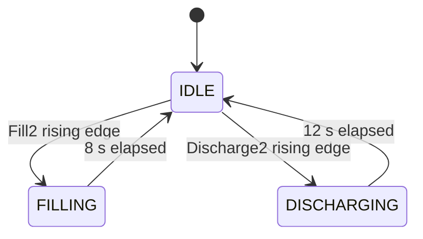

# State and Sequence Model

## 1. Implementation Note

Neither language path contains an explicit enum or `CASE` state machine.

Each tank has three conceptual states derived from its two `TP` instances:

- `IDLE`;
- `FILLING`; and
- `DISCHARGING`.

The state shapes are the same, but their discharge transition events are different.

## 2. Tank 1 LD State Model

Tank 1 uses the retained LD function block. A conventional active-high momentary discharge command starts the pulse when it is released.

## 3. Tank 2 FBD State Model

Tank 2 uses the refactored FBD function block. Its discharge pulse starts when the command is pressed or otherwise changes false to true.

## 4. State Definitions

| Conceptual state | Timer condition | Valve outputs | Countdown source |
|---|---|---|---|
| `IDLE` | Both `TP.Q` values false | Both valves false | Neither call enabled; prior value retained |
| `FILLING` | Fill `TP.Q` true | Fill true; discharge false | Configured maximum minus fill elapsed time |
| `DISCHARGING` | Discharge `TP.Q` true | Fill false; discharge true | Configured maximum minus discharge elapsed time |

No `FAULT`, `STOPPED`, `PAUSED`, `RESET_REQUIRED`, or `COMMAND_PENDING` state is implemented.

## 5. Tank 1 Transition Table

| Current state | Event / guard | Action | Next state |
|---|---|---|---|
| `IDLE` | Rising edge of `Fill` and discharge valve false | Start 15-second fill `TP` | `FILLING` |
| `IDLE` | Falling edge of `Discharge` and fill valve false | Start default 10-second discharge `TP` | `DISCHARGING` |
| `FILLING` | Fill preset reached | Clear fill output automatically | `IDLE` |
| `DISCHARGING` | Discharge preset reached | Clear discharge output automatically | `IDLE` |
| `FILLING` | Discharge falling edge | Reject request; no queue | `FILLING` |
| `DISCHARGING` | Fill rising edge | Reject request; no queue | `DISCHARGING` |

## 6. Tank 2 Transition Table

| Current state | Event / guard | Action | Next state |
|---|---|---|---|
| `IDLE` | Rising edge of `Fill2` and discharge valve false | Start 8-second fill `TP` | `FILLING` |
| `IDLE` | Rising edge of `Discharge2` and fill valve false | Start 12-second discharge `TP` | `DISCHARGING` |
| `FILLING` | Fill preset reached | Clear fill output automatically | `IDLE` |
| `DISCHARGING` | Discharge preset reached | Clear discharge output automatically | `IDLE` |
| `FILLING` | Discharge rising edge | Reject request; no queue | `FILLING` |
| `DISCHARGING` | Fill rising edge | Reject request; no queue | `DISCHARGING` |

## 7. Command Interaction Comparison

| Operator action from false | Tank 1 / LD | Tank 2 / FBD |
|---|---|---|
| Press fill | Fill starts | Fill starts |
| Release fill | Rearms future fill edge | Rearms future fill edge |
| Press discharge | Arms later falling edge; no pulse | Discharge starts |
| Release discharge | Discharge starts | Rearms future rising edge |

An HMI or Factory I/O scene cannot use one unqualified button instruction for both tank discharge commands while this difference remains.

## 8. Simultaneous Requests and Scan Order

Both function blocks execute fill before discharge.

| Same-scan condition | Implemented outcome |
|---|---|
| Tank 1 fill rising plus discharge falling while idle | Fill starts; discharge is blocked later in the scan |
| Tank 2 fill rising plus discharge rising while idle | Fill starts; discharge is blocked later in the scan |
| Discharge request on the scan fill completes | Fill output clears first; discharge can start later in that scan |
| Fill request on the scan discharge completes | Fill logic still sees the prior true discharge output; fill request is lost before discharge clears |

The completion-boundary asymmetry is caused by network order. It should be traced during regression testing rather than treated as a desirable operator feature.

## 9. Busy-Time Requests

For either tank:

- an opposite-phase request is blocked by the active valve contact;
- a same-phase edge during an active `TP` does not create a later pulse;
- no pending command bit is set; and
- no rejected-command diagnostic is published.

A client must generate a new valid edge after the tank returns to `IDLE`.

## 10. Tank 1 Sequence

### Fill

| Step | Action / condition | Expected result |
|---:|---|---|
| 1 | Both valves off; `Fill = FALSE` | `IDLE` |
| 2 | Set `Fill = TRUE` | `Fill_Valve` starts |
| 3 | Pulse active | `Timer` counts approximately 15 to 0 |
| 4 | 15 seconds elapsed | Fill output off; `IDLE` |
| 5 | Set `Fill = FALSE` | Rearm next request |

### Discharge

| Step | Action / condition | Expected result |
|---:|---|---|
| 1 | Both valves off; `Discharge = FALSE` | `IDLE` |
| 2 | Set `Discharge = TRUE` | No output; falling edge armed |
| 3 | Set `Discharge = FALSE` | `Discharge_Valve` starts |
| 4 | Pulse active | `Timer` counts approximately 10 to 0 |
| 5 | 10 seconds elapsed | Discharge output off; `IDLE` |

## 11. Tank 2 Sequence

### Fill as currently exported

| Step | Action / condition | Expected result |
|---:|---|---|
| 1 | Both valves off; `Fill2 = FALSE` | `IDLE` |
| 2 | Set `Fill2 = TRUE` | `Fill_Valve2` starts |
| 3 | Pulse active | Valve runs for 8 s, but `Timer2` counts from about 15 |
| 4 | 8 seconds elapsed | Fill output off; display expected to retain near 7 |
| 5 | Set `Fill2 = FALSE` | Rearm next request |

After correction, the fill display should use an eight-second maximum and reach zero at pulse completion.

### Discharge

| Step | Action / condition | Expected result |
|---:|---|---|
| 1 | Both valves off; `Discharge2 = FALSE` | `IDLE` |
| 2 | Set `Discharge2 = TRUE` | `Discharge_Valve2` starts immediately |
| 3 | Pulse active | `Timer2` counts approximately 12 to 0 |
| 4 | 12 seconds elapsed | Discharge output off; `IDLE` |
| 5 | Set `Discharge2 = FALSE` | Rearm next request |

## 12. Countdown State Model

| Program state | Enabled countdown call | Implemented display behaviour |
|---|---|---|
| Tank 1 filling | LD fill call | Correct 15-second remaining time |
| Tank 1 discharging | LD discharge call | Correct 10-second remaining time |
| Tank 2 filling | FBD fill call | Incorrect 15-second reference for 8-second pulse |
| Tank 2 discharging | FBD discharge call | Correct 12-second remaining time |
| Either tank idle | Neither call | Last written value retained |

## 13. Two-Program Concurrency

The overall application state is the product of two independent three-state machines.

| Tank 1 | Tank 2 | Allowed? |
|---|---|---:|
| `IDLE` | `IDLE` | Yes |
| `FILLING` | `IDLE` | Yes |
| `DISCHARGING` | `IDLE` | Yes |
| `IDLE` | `FILLING` | Yes |
| `IDLE` | `DISCHARGING` | Yes |
| `FILLING` | `FILLING` | Yes |
| `FILLING` | `DISCHARGING` | Yes |
| `DISCHARGING` | `FILLING` | Yes |
| `DISCHARGING` | `DISCHARGING` | Yes |

There is no shared supply, drain, pump, capacity, or utility arbitration.

## 14. Refactor Equivalence Assessment

| State-machine property | Assessment |
|---|---|
| Three-state topology | Equivalent |
| Automatic pulse completion | Equivalent |
| Local mutual exclusion | Equivalent |
| Fill request event | Equivalent |
| Discharge request event | Not equivalent |
| Fill-before-discharge priority | Equivalent |
| Rejected-command handling | Equivalent but undocumented |
| Tank 2 fill display | Not equivalent to configured pulse |

The FBD refactor is therefore structurally similar but not behaviourally equivalent.

## 15. Missing Fault Transitions

Neither state model can enter a fault state for:

- rejected or conflicting commands;
- a valve failing to move;
- no flow or unexpected flow;
- tank overfill or low level;
- a mismatched display preset;
- timer conversion overflow; or
- communication loss.

## 16. Recommended Future Model

After the language comparison is complete, use one verified tank function block with explicit states such as:

- `IDLE`;
- `FILLING`;
- `DISCHARGING`;
- `COMPLETE`;
- `COMMAND_REJECTED`;
- `FAULTED`; and
- `RESET_REQUIRED`.

Presets should have one source of truth used by both the pulse timer and countdown calculation.
