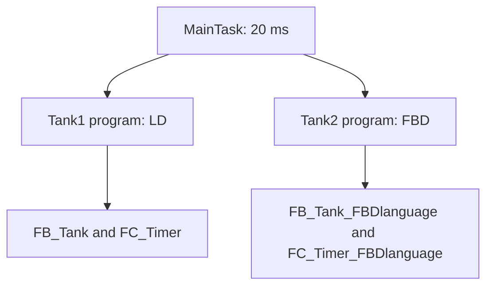

# Two Tanks — Ladder Diagram and FBD Refactor

## Overview

This CODESYS learning project refactors one half of the preceding two-tank application from Ladder Diagram (LD) into Function Block Diagram (FBD).

It deliberately retains both implementations for comparison:

- Tank 1 runs the original LD `FB_Tank` and `FC_Timer` POUs;
- Tank 2 runs the new FBD `FB_Tank_FBDlanguage` and `FC_Timer_FBDlanguage` POUs;
- `MainTask` calls separate `Tank1` and `Tank2` programs every 20 ms; and
- Symbol Configuration exposes five variables from each program.

The project demonstrates graphical-language refactoring, POU reuse, task composition, namespace changes, and the importance of proving behavioural equivalence after a refactor.

It also provides a useful real example of refactor drift: the FBD Tank 2 implementation does not currently match the intended Tank 2 countdown, and its discharge edge differs from Tank 1.

## Current Status

| Area | Status | Notes |
|---|---|---|
| PLC logic | Implemented | Twelve networks across six POUs |
| Language comparison | Implemented | Tank 1 path uses LD; Tank 2 path uses FBD |
| Portable source export | Included | CODESYS V3.5 SP22 Patch 3 `.export` file |
| Direct-open project | Not included | Recreate a project by importing the export |
| Static code review | Complete | Interfaces, calls, edges, presets, symbols, task, and refactor differences traced |
| Behavioural equivalence | Not achieved | Tank 2 fill countdown uses 15 s while its valve pulse uses 8 s |
| Runtime verification | Pending | Manual comparison and regression tests are documented |
| Symbol Configuration | Configured | Ten variables split across `Tank1` and `Tank2` |
| Physical I/O mapping | Not configured | No `%I`, `%Q`, or field-device addresses are present |
| Factory I/O / KEPServerEX | Not included | Integration placeholders retained |

The native export is the source of truth for this documentation.

## Technologies

- CODESYS Development System V3.5 SP22 Patch 3
- CODESYS Control Win V3 x64, device version 3.5.22.30
- Ladder Diagram (LD)
- Function Block Diagram (FBD)
- IEC 61131-3 functions, function blocks, and programs
- CODESYS Standard `TP` timers
- CODESYS Symbol Configuration with OPC UA support enabled

## Execution Architecture



`MainTask` executes `Tank1` first and `Tank2` second. The programs do not share process variables, so their normal operations are independent.

## POU Inventory

| POU | Kind | Language | Networks | Used by |
|---|---|---|---:|---|
| `FB_Tank` | Function block | LD | 2 | `Tank1` |
| `FC_Timer` | Function returning `INT` | LD | 1 | `Tank1` |
| `Tank1` | Program | LD | 3 | `MainTask` |
| `FB_Tank_FBDlanguage` | Function block | FBD | 2 | `Tank2` |
| `FC_Timer_FBDlanguage` | Function returning `INT` | FBD | 1 | `Tank2` |
| `Tank2` | Program | FBD | 3 | `MainTask` |

## Tank Behaviour

| Tank | Fill request | Fill pulse | Fill countdown reference | Discharge request | Discharge pulse |
|---|---|---:|---:|---|---:|
| Tank 1 / LD | `Fill` rising edge | 15 s | 15 s | `Discharge` falling edge | 10 s |
| Tank 2 / FBD | `Fill2` rising edge | 8 s | **15 s** | `Discharge2` rising edge | 12 s |

Tank 1 relies on the LD function block's default ten-second discharge preset. Tank 2 explicitly connects both presets.

### Tank 2 countdown defect

`FB_Tank_FBDlanguage_0` correctly receives `Fill_PT := T#8S`, but the enabled fill countdown call receives `Max_Time := T#15S`.

The implemented calculation is therefore:

```text
Timer2 := TO_INT(T#15S - Fill_ET2) / 1000
```

During an eight-second fill pulse, `Timer2` is expected to begin near 15 and stop near 7 instead of counting 8 to 0. Runtime evidence must confirm the exact final retained value. The fill countdown reference should be corrected to `T#8S`.

## Refactor Comparison

| Aspect | Previous two-tank version | Current refactor |
|---|---|---|
| Top-level program | One six-network `PLC_PRG` | Separate three-network `Tank1` and `Tank2` programs |
| Tank implementation | Two instances of one LD function block | Tank 1 uses LD version; Tank 2 uses duplicated FBD version |
| Countdown function | One LD function used by both tanks | LD version for Tank 1; duplicated FBD version for Tank 2 |
| Tank 2 discharge edge | Falling edge | Rising edge |
| Tank 2 fill countdown | Correct 8-second reference | Incorrect 15-second reference |
| External namespace | `Application.PLC_PRG.*` | `Application.Tank1.*` and `Application.Tank2.*` |

The FBD timer function simplifies the expression into one direct chain and no longer uses its declared `Var1` and `Inv_Time_INT` locals. The numeric result still has the same signed 16-bit `INT` limitation as the LD version.

## Interlock Behaviour

Both tank function blocks use the same local valve interlock:

- fill can start only while the discharge valve is false;
- discharge can start only while the fill valve is false;
- fill logic executes before discharge logic; and
- a request received while the opposite valve is active is discarded rather than queued.

If both valid request edges arrive in one idle scan, fill starts first and blocks discharge later in the same function-block scan.

## External Interface

The ten selected symbols are now split by program:

- `Application.Tank1`: `Fill`, `Discharge`, `Fill_Valve`, `Discharge_Valve`, and `Timer`;
- `Application.Tank2`: `Fill2`, `Discharge2`, `Fill_Valve2`, `Discharge_Valve2`, and `Timer2`.

All ten currently have read/write access. PLC-generated valve outputs and countdowns should normally be read-only to external clients.

Existing clients configured for `Application.PLC_PRG.*` must be migrated to the new paths.

## Engineering Documentation

- [Control philosophy and refactor comparison](Documentation/control-philosophy.md)
- [I/O, variables, and symbol migration](Documentation/io-list.md)
- [State and sequence model](Documentation/state-machines.md)
- [Verification and regression plan](Documentation/verification.md)

## Repository Layout

```text
5-twoTanksFBDlanguageRefactor/
├── CODESYS/
│   └── twoTanksFBDlanguageRefactor.export
├── Documentation/
│   ├── control-philosophy.md
│   ├── io-list.md
│   ├── state-machines.md
│   └── verification.md
├── FactoryIO/
├── Kepware Server/
├── Media/
└── README.md
```

## Running the Current Version

1. Install CODESYS Development System V3.5 SP22 Patch 3 and CODESYS Control Win V3 x64.
2. Create a compatible standard project for CODESYS Control Win V3 x64.
3. Select **Project → Import**.
4. Import `CODESYS/twoTanksFBDlanguageRefactor.export`.
5. Confirm that all six POUs, `Symbols`, and `Task Configuration` are present.
6. Confirm that `MainTask` calls `Tank1` followed by `Tank2` at a 20 ms interval.
7. Build without errors and refresh Symbol Configuration if requested.
8. Start the runtime, log in, download, and place the application in Run.
9. Follow [the verification plan](Documentation/verification.md), first recording the current defect and then repeating the regression tests after correction.

## Important Static-Review Findings

- Tank 2's fill pulse is 8 seconds, but its fill countdown is calculated from 15 seconds.
- Tank 1 discharge is falling-edge triggered while Tank 2 discharge is rising-edge triggered.
- Keeping separate LD and FBD implementations has already allowed their behaviour to diverge.
- `Tank1` retains eight unused declarations copied from the former combined program.
- `FC_Timer_FBDlanguage` retains two unused local variables from the LD implementation.
- Symbol paths changed from `Application.PLC_PRG.*` to two program namespaces.
- Both countdown functions convert milliseconds to a 16-bit `INT`, limiting safe future presets to about 32.767 seconds.
- All ten external symbols are writable, including PLC-generated values.
- No level feedback, process fault handling, stop, emergency, or safety function is implemented.
- All twelve network titles and comments are empty.

## Safety Boundary

The valve outputs are timed Boolean commands in a Windows soft-PLC simulation. The application does not measure or control real tank level and must not directly operate physical valves. A physical design requires engineered feedback, independent overfill safeguards, fail-safe outputs, electrical protection, risk assessment, and appropriate safety hardware.

## Planned Improvements

- Change Tank 2's fill countdown reference from `T#15S` to `T#8S`.
- Define one discharge command convention and apply it consistently to both tanks.
- Regression-test LD and FBD behaviour with the same input traces.
- After comparison is complete, consolidate both tanks onto one verified reusable function block and one timer function.
- Remove unused Tank 1 declarations and unused FBD timer locals.
- Decide whether the new symbol namespaces are final and update all clients.
- Use a wider timer intermediate type and define an explicit idle countdown value.
- Restrict external write access to genuine commands.
- Add level feedback, permissives, diagnostics, and fault recovery.
- Add network titles and comments in CODESYS.
- Add Factory I/O, KEPServerEX, and dated runtime evidence when available.
