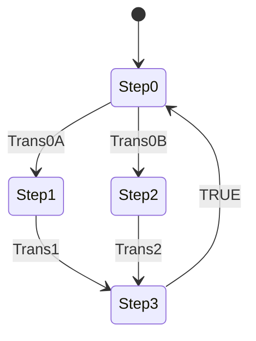

# Control Philosophy and SFC/ST Comparison

## 1. Purpose

This document describes `introToSFC` as reconstructed from the supplied CODESYS V3.5 SP22 Patch 3 export.

The project is a language-learning exercise rather than a complete machine control system. Its main purpose is to show how a small cyclic sequence can be represented with native Sequential Function Chart elements and then approximated manually with a Structured Text `CASE` statement.

The review treats `PLC_PRG` as the operational source because it is the only program scheduled by `MainTask`. `PLC_PRG_ST` is a separate, unscheduled comparison implementation.

## 2. Source and Verification Boundary

The supplied files are:

- `introToSFC.project`, the native direct-open project; and
- `introToSFC.export`, the portable XML source export used for static reconstruction.

This documentation environment cannot compile or execute CODESYS projects. Statements about project structure, task configuration, variables, steps, transitions, and qualifiers are static findings from the export. Timing and Boolean results that depend on the generated runtime must be confirmed with the tests in `verification.md`.

## 3. Execution Model

| Property | Configured value |
|---|---|
| CODESYS profile | V3.5 SP22 Patch 3 |
| Runtime target | CODESYS Control Win V3 x64 |
| Device version | 3.5.22.30 |
| Task | `MainTask` |
| Task type | Cyclic |
| Interval | 20 ms |
| Priority | 1 |
| Watchdog | Disabled |
| Scheduled program list | `PLC_PRG` only |
| Task group | `IEC-Tasks` |

The configured 20 ms interval is the nominal sequence evaluation period. CODESYS Control Win is a Windows soft PLC, so measured timing can include host operating-system jitter.

## 4. Application Architecture

| Object | Kind | Language | Runtime role |
|---|---|---|---|
| `PLC_PRG` | Program | SFC | Active sequence called by `MainTask` |
| `PLC_PRG_ST` | Program | Structured Text | Unscheduled manual state-machine comparison |
| `Library Manager` | Application object | — | Resolves standard, device, and SFC support libraries |
| `MainTask` | Cyclic task | — | Calls `PLC_PRG` every 20 ms |

There are no function blocks, functions, methods, actions, global variable lists, visualisations, Symbol Configuration objects, or mapped field devices in the exported application.

## 5. Resolved Libraries

| Library or placeholder | Exported resolution |
|---|---|
| `IoStandard` | 3.5.22.0, System |
| `3SLicense` | 0.0.0.0, CODESYS |
| `CAA Device Diagnosis` | 3.5.22.0, CAA Technical Workgroup |
| `Standard` | Placeholder redirected to 3.5.22.0, System |
| `Breakpoint Logging Functions` | Version placeholder |
| `IecSfc` | 4.4.0.0, System |
| `Analyzation` | 4.1.0.0, System |

`IecSfc` is present because native IEC SFC action qualifiers are used.

## 6. Active Program Interface

`PLC_PRG` declares seven program-local Boolean variables:

```iecst
PROGRAM PLC_PRG
VAR
    A: BOOL;
    B: BOOL;
    C: BOOL;
    Trans0A: BOOL;
    Trans0B: BOOL;
    Trans1: BOOL;
    Trans2: BOOL;
END_VAR
```

All variables use their default Boolean initial value of `FALSE`. They have no fixed IEC addresses and are not selected in a Symbol Configuration object.

## 7. Native SFC Topology



| Element | Exported configuration |
|---|---|
| Initial step | `Step0` |
| Branch | `Branch0`, alternative (`Parallel = FALSE`) |
| Left branch | `Trans0A → Step1 → Trans1` |
| Right branch | `Trans0B → Step2 → Trans2` |
| Convergence step | `Step3` |
| Return transition | Literal `TRUE` |
| Return target | Jump to `Step0` |
| Step minimum times | None |
| Step maximum times | None |
| Transition monitoring | None |
| Element comments | Empty |

## 8. Alternative-Branch Arbitration

The two routes are mutually exclusive. This is an alternative branch, not a simultaneous or parallel branch.

When `Step0` is active, CODESYS evaluates the first transitions from left to right:

1. evaluate `Trans0A`;
2. if true, open the `Step1` branch;
3. otherwise evaluate `Trans0B`; and
4. if true, open the `Step2` branch.

If both guards are true during the same transition evaluation, the left `Trans0A` route wins. This matches the intended priority expressed by `IF Trans0A ... ELSIF Trans0B` in the ST comparison.

If both are false, `Step0` remains active and `A` remains active through its `N` action association.

## 9. IEC Action Associations

The SFC uses Boolean variables directly as IEC actions.

| Step | Qualifier | Action variable | Meaning |
|---|---|---|---|
| `Step0` | `N` | `A` | Non-stored: active while `Step0` is active |
| `Step1` | `S` | `B` | Stored set: remains active until reset |
| `Step2` | `S` | `C` | Stored set: remains active until reset |
| `Step3` | `R` | `B` | Overriding reset: deactivates `B` |
| `Step3` | `N` | `C` | Non-stored: active while `Step3` is active |

`Step3` lists `B` before `C`. CODESYS processes IEC action control according to the SFC runtime rules; the key engineering distinction is the qualifier, not merely the list order.

## 10. Intended Sequence Narrative

### 10.1 Initial condition

On the first call, `Step0` becomes active. Its `N A` association makes `A` active. The chart waits for a route guard.

### 10.2 Left route

1. `Trans0A` becomes true while `Step0` is active.
2. `Step0` is deactivated and `Step1` becomes active.
3. `A` is no longer active through its non-stored association.
4. `S B` stores `B` active.
5. The chart waits for `Trans1`.
6. When `Trans1` becomes true, the chart activates `Step3`.
7. `R B` resets the stored `B` action.
8. The literal `TRUE` transition returns the chart to `Step0`.

### 10.3 Right route

1. `Trans0B` becomes true while `Trans0A` is false and `Step0` is active.
2. `Step0` is deactivated and `Step2` becomes active.
3. `A` is no longer active through its non-stored association.
4. `S C` stores `C` active.
5. The chart waits for `Trans2`.
6. When `Trans2` becomes true, the chart activates `Step3`.
7. `N C` is active while `Step3` is active.
8. The literal `TRUE` transition returns the chart to `Step0`.

The right route contains no explicit operation that resets the stored state created by `S C`.

## 11. Scan-Cycle Behaviour

CODESYS evaluates active-step actions before checking transitions for the next activation. A transition that becomes true does not make the entire route execute as one textual statement in the same task call.

Important consequences for this chart are:

- each selected branch step is observable for at least a processing cycle;
- `Step3` executes its action associations before the unconditional return is completed;
- a transition guard already true when its preceding step becomes active can pass at the next eligible transition check;
- a held `Trans1` or `Trans2` can make its branch step short-lived; and
- a held route guard can select a new route immediately after the chart returns to `Step0`.

The verification trace should sample faster than the 20 ms task or synchronise to it where possible.

## 12. Stored `C` Finding

`Step2` applies `S C`. The documented meaning of `S` is that the action continues after its step is deactivated until it receives a reset. No `R C` association exists in the chart.

`Step3` instead applies `N C`, whose documented meaning is that the action is active while `Step3` is active. It is not the explicit reset counterpart to `S`.

Static engineering conclusion:

- the source does not define a stored reset for `C`;
- the SFC therefore does not clearly implement the ST statement `C := FALSE` in state 3; and
- if the design intent is symmetric branch cleanup, `Step3` should use `R C`.

Because the same Boolean action name is associated with different qualifiers, capture the exact generated-runtime value across `Step2 → Step3 → Step0` before and after correction. The acceptance requirement should be stated explicitly rather than inferred from the graphic.

## 13. Structured Text Comparison

`PLC_PRG_ST` declares separate copies of all seven Boolean variables plus `state : INT := 0`.

Its implemented state assignments are:

| Current state | Condition | Output statements | State assignment |
|---:|---|---|---|
| 0 | Every scan | `A := TRUE` | None initially |
| 0 | `Trans0A` | `A := FALSE` | **None** |
| 0 | `NOT Trans0A AND Trans0B` | `A := FALSE` | `state := 2` |
| 1 | Every scan | `B := TRUE` | None initially |
| 1 | `Trans1` | — | `state := 3` |
| 2 | Every scan | `C := TRUE` | None initially |
| 2 | `Trans2` | — | `state := 3` |
| 3 | Every scan | `B := FALSE`; `C := FALSE` | `state := 0` |

### 13.1 Unreachable state 1

The program starts in state 0. The only assignments in normal source code are `state := 2`, `state := 3`, and `state := 0`. No statement assigns 1.

State 1 and its `B` logic are therefore unreachable from normal execution. `Trans0A` only clears `A` for that scan; on the next scan state 0 sets `A` true again.

The minimum correction is:

```iecst
IF Trans0A THEN
    A := FALSE;
    state := 1;
ELSIF Trans0B THEN
    A := FALSE;
    state := 2;
END_IF
```

### 13.2 Unscheduled program

Even with the assignment corrected, `PLC_PRG_ST` will not run until it is added to a task or called by another scheduled POU. Running it alongside the SFC would produce two independent demonstrations, not two implementations controlling the same variables.

For a clean comparison, create a controlled build that schedules one implementation at a time or wrap each implementation behind a deliberate mode selector and a common interface.

### 13.3 Invalid state handling

The `CASE` statement has no `ELSE`. If `state` becomes a value outside 0–3 through a force, online write, corruption, or later edit, the program performs no assignments and cannot recover automatically.

A comparison-quality implementation should define an invalid-state policy, normally clearing outputs and returning to the initial state or entering a diagnosed fault state.

## 14. Equivalence Assessment

| Behavioural property | Assessment |
|---|---|
| Four named/logical states | Structurally represented in both |
| Initial state | SFC `Step0`; ST state 0 |
| Alternative route priority | Intended to match |
| Left route selection | **Not equivalent: missing ST state assignment** |
| Right route selection | Nominally equivalent |
| `A` non-stored behaviour | Similar intent |
| `B` stored then reset | Similar intent if ST state 1 is repaired |
| `C` stored then cleared | **Not equivalent: SFC has no `R C`** |
| Return to initial state | Native `TRUE` transition versus state-3 assignment |
| Invalid state recovery | Only relevant to ST; not implemented |
| Runtime execution | **Not equivalent: ST is unscheduled** |

The ST POU is therefore a useful teaching draft, but it is not currently a verified executable equivalent of the SFC.

## 15. External Interface Philosophy

The export has no Symbol Configuration object and no fixed I/O addresses. The program variables should be treated as internal test signals.

If an HMI, Factory I/O, OPC UA client, or KEPServerEX connection is added:

- expose only variables from the scheduled `PLC_PRG` unless the ST comparison is deliberately activated;
- make `Trans0A`, `Trans0B`, `Trans1`, and `Trans2` the writable command/guard interface;
- keep `A`, `B`, and `C` observational or read-only to external clients;
- use a separate reset command if stored actions are retained;
- document the generated symbol paths after a successful build; and
- do not map both POU namespaces as though they were shared aliases.

## 16. Control Limitations

The current sequence has no logic for:

- operator stop or pause;
- reset to initial step;
- action reset independent of the sequence;
- minimum step dwell time;
- maximum step timeout;
- transition conflict diagnostics;
- invalid or stuck sensor detection;
- command debounce or edge qualification;
- communication loss;
- task overrun monitoring;
- process feedback or actuator confirmation;
- fault latching and acknowledgement; or
- emergency and safety functions.

The SFC setting entries for diagnostic flags exist, but their `Use` values are false. Step minimum and maximum time properties are blank.

## 17. Recommended Corrected SFC

If the intended exercise is a symmetric one-of-two route followed by cleanup:

| Step | Recommended association |
|---|---|
| `Step0` | `N A` |
| `Step1` | `S B` |
| `Step2` | `S C` |
| `Step3` | `R B`, `R C` |

An even simpler design is to use non-stored `N B` and `N C` on their respective branch steps if neither output needs to persist beyond the active step. The correct choice depends on the lesson being demonstrated; it should be stated in the step comments.

## 18. Recommended Corrected ST Pattern

A comparison implementation should:

- assign state 1 on `Trans0A`;
- define output values or latches deliberately rather than relying on accidental retention;
- include an `ELSE` recovery or fault branch;
- use a named enumeration instead of bare integers;
- document level-sensitive guard priority;
- expose one consistent interface; and
- be scheduled only in a controlled test configuration.

Example state names could be `ROUTE_SELECT`, `LEFT_ACTIVE`, `RIGHT_ACTIVE`, and `RESET_RETURN`.

## 19. Safety Boundary

The project contains unaddressed Boolean learning signals only. It has no evidence-based safe state, no physical feedback, and no safety-rated function. It must not directly control real actuators without an engineered control and safety design.

## 20. References

- [CODESYS: Qualifiers for Actions in SFC](https://content.helpme-codesys.com/en/CODESYS%20SFC/_cds_sfc_action_qualifier.html)
- [CODESYS: SFC Element — Branch](https://content.helpme-codesys.com/en/CODESYS%20SFC/_cds_sfc_element_branch.html)
- [CODESYS: Processing Order in SFC](https://content.helpme-codesys.com/en/CODESYS%20SFC/_cds_sfc_sequence_of_processing.html)
