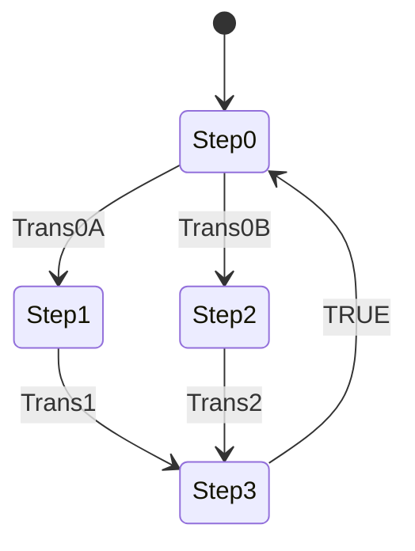
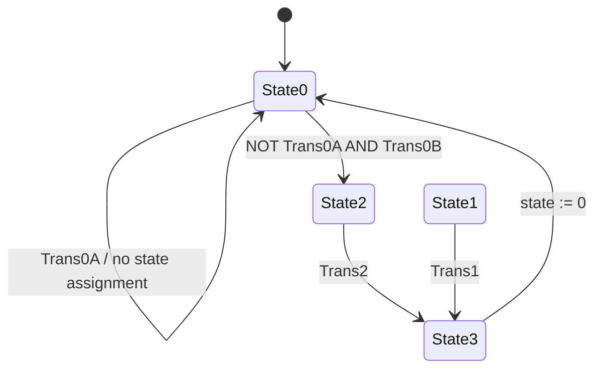

# State-Machine and Scan-Cycle Model

## 1. Scope

This document reconstructs the active SFC sequence and the separate Structured Text comparison as implemented in `introToSFC.export`.

It distinguishes:

- the chart topology;
- IEC action-qualifier state;
- scan-cycle timing;
- held and simultaneous transition conditions; and
- defects in the manual ST state model.

## 2. Active SFC State Model



`Step0` is marked as the initial step. `Step1` and `Step2` are mutually exclusive alternative paths. `Step3` is their common convergence step.

## 3. Step Table

| Active step | Purpose | Action associations | Outgoing condition | Successor |
|---|---|---|---|---|
| `Step0` | Initial state and route selection | `N A` | `Trans0A` | `Step1` |
| `Step0` | Initial state and route selection | `N A` | `Trans0B`, if left branch did not open | `Step2` |
| `Step1` | Left branch active | `S B` | `Trans1` | `Step3` |
| `Step2` | Right branch active | `S C` | `Trans2` | `Step3` |
| `Step3` | Convergence and action handling | `R B`; `N C` | Literal `TRUE` | `Step0` |

## 4. Alternative Branch Priority

`Branch0` has `Parallel = FALSE`. Its two first transitions are processed from left to right.

| `Trans0A` | `Trans0B` | Selected path |
|---:|---:|---|
| `FALSE` | `FALSE` | Stay in `Step0` |
| `TRUE` | `FALSE` | Left path to `Step1` |
| `FALSE` | `TRUE` | Right path to `Step2` |
| `TRUE` | `TRUE` | Left path to `Step1` |

The lower-priority guard is not queued. If `Trans0B` remains true, it may be selected on a later visit to `Step0` after `Trans0A` becomes false.

## 5. Action Qualifier State

The sequence state and action state are related but not identical. `S` actions retain state after their step is inactive; `N` actions follow their step; and `R` explicitly clears stored action state.

| Action | Set/active source | Reset/inactive source | Static interpretation |
|---|---|---|---|
| `A` | `N` while `Step0` is active | Deactivation of `Step0` | Follows initial step |
| `B` | `S` when `Step1` activates | `R` when `Step3` activates | Explicit stored set/reset pair |
| `C` | `S` when `Step2` activates; `N` while `Step3` is active | No `R C` exists | Stored state has no explicit reset |

The `N C` action also means that `C` is actively asserted while `Step3` is active even after the left route, where `Step2` never ran. This differs from the ST comparison, whose state 3 assigns `C := FALSE`.

## 6. Left-Route Sequence

Assume all declared variables are false before the first call and no stored `C` state exists.

| Phase | Active step | Guard event | Expected action state | Note |
|---:|---|---|---|---|
| 1 | `Step0` | None | `A = TRUE`, `B = FALSE`, `C = FALSE` | Initial selection state |
| 2 | `Step0` | `Trans0A = TRUE` | Transition selected | Left branch has priority |
| 3 | `Step1` | None | `A = FALSE`, `B = TRUE` | `B` stored by `S` |
| 4 | `Step1` | `Trans1 = TRUE` | Transition selected | Move to convergence |
| 5 | `Step3` | Literal return pending | `B` reset; `C` active through `N` | `C` can pulse in the convergence step |
| 6 | `Step0` | Return complete | `A = TRUE`, `B = FALSE`; `C` no longer non-stored-active | Final `C` value must also account for any earlier stored right-route state |

If the sequence has previously taken the right path and stored `C`, the left route does not contain an `R C` action that clears that history.

## 7. Right-Route Sequence

Assume `Trans0A` is false when the route is selected.

| Phase | Active step | Guard event | Expected action state | Note |
|---:|---|---|---|---|
| 1 | `Step0` | None | `A = TRUE` | Wait for route |
| 2 | `Step0` | `Trans0B = TRUE` | Transition selected | Right branch opens |
| 3 | `Step2` | None | `A = FALSE`, `C = TRUE` | `C` stored by `S` |
| 4 | `Step2` | `Trans2 = TRUE` | Transition selected | Move to convergence |
| 5 | `Step3` | Literal return pending | `B` reset; `C` active through `N` | No `R C` occurs |
| 6 | `Step0` | Return complete | `A = TRUE`; stored `C` has no defined reset in the chart | Treat continued `C` as the static expectation and confirm online |

The required runtime trace is `Step2 → Step3 → Step0` with `C` sampled on every task cycle. If the design requirement is `C = FALSE` after convergence, the source should be corrected to state that requirement directly with `R C`.

## 8. Processing Order

At a high level, each active SFC task call processes actions before evaluating transitions that activate subsequent steps.

For this chart:

1. process any step activation/deactivation actions due from the prior transition;
2. execute the current IEC actions;
3. evaluate eligible transitions;
4. deactivate predecessor steps and activate successor steps for subsequent processing; and
5. repeat on the next 20 ms call.

The literal `TRUE` after `Step3` does not make `Step3` meaningless. Its action associations are still part of the sequence and must be captured in a task-resolution trace.

## 9. Guard Persistence

The transition variables are levels, not pulses or edge-qualified events.

### Held route guard

If `Trans0A` remains true, every return to `Step0` can immediately select `Step1`. If `Trans1` also remains true, the chart can cycle rapidly through:

```text
Step0 → Step1 → Step3 → Step0
```

The equivalent rapid right-hand loop occurs when `Trans0B` and `Trans2` remain true while `Trans0A` remains false.

### Held completion guard

If `Trans1` is already true when `Step1` becomes active, `Step1` can complete on its first eligible transition check. The stored `S B` action still needs to be observed according to the SFC action-processing rules.

The same applies to `Step2` and `Trans2`.

### Persistent simultaneous route guards

If `Trans0A` and `Trans0B` both remain true, the left route continues to win on every visit to `Step0`. The right route is starved until `Trans0A` becomes false.

## 10. Wait and Deadlock Conditions

| Location | Condition for indefinite wait |
|---|---|
| `Step0` | Both route guards remain false |
| `Step1` | `Trans1` remains false |
| `Step2` | `Trans2` remains false |
| `Step3` | None in normal logic; outgoing transition is literal true |

Waiting is not reported as a fault. No maximum step time, timeout action, alarm, or recovery transition is configured.

## 11. SFC Observability

The POU's optional SFC flags are present in its settings but disabled for use. This includes current-step, transition, pause, reset, error, and error-analysis flags.

For verification, the active step can still be observed in the online SFC editor. A future diagnostic revision could deliberately enable an appropriate current-step flag or expose explicit state status without granting external control over internal SFC flags.

## 12. Implemented ST State Model

`PLC_PRG_ST` is not scheduled, but its source defines the following manual model:



There is no incoming source-code transition to `State1`. It is reachable only if `state` is written or forced to 1, or if the code is corrected.

## 13. ST State Table

| Selected `state` at CASE entry | Statements executed | Exit condition | `state` after condition |
|---:|---|---|---:|
| 0 | `A := TRUE` | `Trans0A` | 0; `A` then set false |
| 0 | `A := TRUE` | `NOT Trans0A AND Trans0B` | 2; `A` set false |
| 0 | `A := TRUE` | Neither guard | 0 |
| 1 | `B := TRUE` | `Trans1` | 3 |
| 1 | `B := TRUE` | `NOT Trans1` | 1 |
| 2 | `C := TRUE` | `Trans2` | 3 |
| 2 | `C := TRUE` | `NOT Trans2` | 2 |
| 3 | `B := FALSE`; `C := FALSE`; `state := 0` | Unconditional | 0 |
| Any other value | No `CASE` branch | None | Invalid value retained |

## 14. ST Output Retention

The ST POU does not assign every output in every state.

| Variable | States that assign it | Retention concern |
|---|---|---|
| `A` | State 0 only | If state is forced directly to 1, 2, or 3, `A` retains its prior value |
| `B` | State 1 sets true; state 3 sets false | Retains in states 0 and 2 |
| `C` | State 2 sets true; state 3 sets false | Retains in states 0 and 1 |

This can be intentional state memory, but it should be explicit. A safer comparison uses clear state entry/exit semantics or assigns a complete output image for every state.

## 15. `Trans0A` Defect Detail

While ST state 0 is selected:

```iecst
A := TRUE;
IF Trans0A THEN
    A := FALSE;
ELSIF Trans0B THEN
    A := FALSE;
    state := 2;
END_IF
```

Consequences:

- a one-scan `Trans0A` pulse makes `A` false for that scan, then state 0 sets it true again;
- a held `Trans0A` keeps the program in state 0 and ends every scan with `A = FALSE`;
- when both route guards are true, `Trans0A` suppresses `Trans0B`, but still does not change state; and
- state 1 and normal `B` activation never occur.

The correction is `state := 1` inside the first branch.

## 16. SFC/ST Difference Matrix

| Scenario | SFC behaviour | Current ST behaviour |
|---|---|---|
| No route request | Wait in initial step with `A` active | Remain state 0 with `A = TRUE` |
| `Trans0A` only | Enter `Step1`; store `B` | Stay state 0; end scan with `A = FALSE` |
| `Trans0B` only | Enter `Step2`; store `C` | Enter state 2; set `C` true |
| Both route guards | Left route | Left `IF` wins but no route is entered |
| Left completion | Enter `Step3`; reset `B`; activate `C` through `N` | State 1 is normally unreachable |
| Right completion | Enter `Step3`; no explicit stored reset for `C` | Enter state 3; clear `C` |
| Invalid manual state | Native chart topology applies | No recovery |
| Normal task execution | Runs every 20 ms | Does not run |

## 17. Recommended Verification State Traces

Capture at least these ordered samples:

1. `Step0 → Step1 → Step3 → Step0` with `A`, `B`, and `C`;
2. `Step0 → Step2 → Step3 → Step0` with `A`, `B`, and `C`;
3. both route guards true to prove left priority;
4. all relevant guards held true to expose rapid cycling;
5. the right route before and after changing `N C` to `R C`;
6. the dormant ST POU to prove it is unscheduled;
7. the ST left route before and after adding `state := 1`; and
8. an invalid ST state to prove the selected recovery policy after it is implemented.

## 18. Recommended Future Model

For a machine-oriented version, replace generic state and signal names with process names and add explicit states such as:

- `READY`;
- `LEFT_SEQUENCE`;
- `RIGHT_SEQUENCE`;
- `COMPLETE`;
- `STOPPING`;
- `FAULTED`; and
- `RESET_REQUIRED`.

Each transition should have a documented permissive, timeout, failure path, and reset rule. Stored output actions should always have an explicit reset owner.
