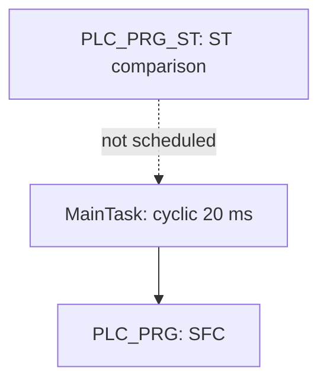
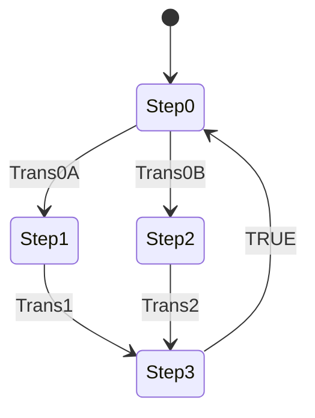

# Introduction to Sequential Function Chart (SFC)

## Overview

This CODESYS learning project introduces Sequential Function Chart (SFC) by implementing a four-step cyclic sequence with an alternative branch.

The application contains two versions of the sequence:

- `PLC_PRG` is the active SFC implementation called by `MainTask`;
- `PLC_PRG_ST` is a manual Structured Text `CASE` implementation retained for comparison; and
- both programs declare their own separate Boolean variables.

The SFC demonstrates an initial step, left-to-right alternative-branch priority, Boolean transition guards, an unconditional return transition, and the `N`, `S`, and `R` IEC action qualifiers.

Static review also found two valuable learning points. The ST comparison cannot enter state 1 because its `Trans0A` branch omits `state := 1`, and the SFC sets `C` with a stored `S` action but never gives `C` an overriding `R` reset.

## Current Status

| Area | Status | Notes |
|---|---|---|
| SFC logic | Implemented and scheduled | `PLC_PRG` is called every 20 ms |
| ST comparison | Included but not scheduled | `PLC_PRG_ST` is not in any task |
| Native project | Included | Direct-open `.project` supplied with the export |
| Portable source export | Included | CODESYS V3.5 SP22 Patch 3 `.export` |
| Static source review | Complete | Steps, branches, transitions, actions, qualifiers, task, and variables traced |
| Build and runtime verification | Pending | Test procedure and evidence matrix included |
| SFC/ST equivalence | Not achieved | ST left branch is unreachable; `C` handling differs |
| Symbol Configuration | Not configured | No external symbol object exists in the export |
| Physical I/O mapping | Not configured | No `%I`, `%Q`, or fixed IEC addresses are present |
| Factory I/O / KEPServerEX | Not included | Integration placeholders retained |

The `.export` file is the source of truth for the static documentation. The native project is included for convenient opening and should be build-checked against the documented export before runtime evidence is recorded.

## Technologies

- CODESYS Development System V3.5 SP22 Patch 3
- CODESYS Control Win V3 x64, device version 3.5.22.30
- Sequential Function Chart (SFC)
- Structured Text (ST)
- IEC 61131-3 programs and Boolean actions
- CODESYS `IecSfc` library 4.4.0.0

## Execution Architecture



`MainTask` has priority 1, its watchdog is disabled, and its program list contains only `PLC_PRG`. Editing or writing the local variables of `PLC_PRG_ST` therefore does not control the running SFC.

## Implemented SFC



The branch is configured as alternative, not parallel. CODESYS evaluates alternative branch transitions from left to right, so `Trans0A` has priority if `Trans0A` and `Trans0B` are true together.

## Step Actions

| Step | Role | IEC action associations | Implemented effect |
|---|---|---|---|
| `Step0` | Initial / route selection | `N A` | `A` is active while `Step0` is active |
| `Step1` | Left branch | `S B` | Stores `B` active until an `R B` action executes |
| `Step2` | Right branch | `S C` | Stores `C` active until an `R C` action executes |
| `Step3` | Branch convergence / return | `R B`, then `N C` | Explicitly resets `B`; makes `C` non-stored-active while `Step3` is active |

`Step3` is followed by the literal transition `TRUE`, so the chart returns to `Step0` automatically after `Step3` has been processed.

### Stored `C` review finding

The chart contains `S C` in `Step2` but no `R C` anywhere. By qualifier definition, a stored action continues until it receives a reset. The `N C` association in `Step3` is not an explicit overriding reset.

If the intended result is for both branch outputs to be cleared at `Step3`, change its second action association from `N C` to `R C`, then prove the result with an online trace. Until that test is complete, the right-hand route should be treated as capable of leaving `C` stored active after the chart returns to `Step0`.

## Transition Behaviour

| Active location | Guard | Next location | Priority / note |
|---|---|---|---|
| `Step0` | `Trans0A` | `Step1` | Evaluated first |
| `Step0` | `Trans0B` | `Step2` | Evaluated only if the left branch did not open |
| `Step1` | `Trans1` | `Step3` | Waits indefinitely while false |
| `Step2` | `Trans2` | `Step3` | Waits indefinitely while false |
| `Step3` | `TRUE` | `Step0` | Automatic return |

All four command transitions are level-sensitive Boolean guards. They are not edge detectors. A guard held true can therefore pass as soon as its preceding step becomes active.

## SFC and ST Comparison

| Concern | Active SFC `PLC_PRG` | Unscheduled ST `PLC_PRG_ST` |
|---|---|---|
| Runtime execution | Called by `MainTask` | Not called |
| Sequence representation | Native SFC steps and transitions | `CASE state OF` with integer states 0–3 |
| Route priority | `Trans0A` left branch first | `IF Trans0A ... ELSIF Trans0B` |
| Left route | `Step0 → Step1` | **Missing `state := 1`; remains in state 0** |
| Right route | `Step0 → Step2` | `state := 2` |
| `B` handling | `S B` in `Step1`; `R B` in `Step3` | Set true in state 1; set false in state 3 |
| `C` handling | `S C` in `Step2`; no `R C` | Set true in state 2; set false in state 3 |
| Invalid state recovery | Native SFC topology | No `ELSE` branch; an invalid integer state holds indefinitely |

The two POUs do not share variables. For example, `PLC_PRG.Trans0A` and `PLC_PRG_ST.Trans0A` are different memory locations.

## Variable Summary

The active program declares seven local Boolean variables:

- actions/status values: `A`, `B`, and `C`;
- transition guards: `Trans0A`, `Trans0B`, `Trans1`, and `Trans2`.

The ST comparison declares its own copies of those seven Booleans plus `state : INT := 0`.

No variables have fixed physical addresses, and there is no Symbol Configuration object. See the [I/O and variable list](Documentation/io-list.md) before adding an external client.

## Engineering Documentation

- [Control philosophy and SFC/ST comparison](Documentation/control-philosophy.md)
- [I/O, variables, and external interface](Documentation/io-list.md)
- [State-machine and scan-cycle model](Documentation/state-machines.md)
- [Verification and correction plan](Documentation/verification.md)

## Repository Layout

```text
6-introToSFC/
├── CODESYS/
│   ├── introToSFC.export
│   └── introToSFC.project
├── Documentation/
│   ├── control-philosophy.md
│   ├── io-list.md
│   ├── state-machines.md
│   └── verification.md
├── FactoryIO/
├── Kepware Server/
├── Media/
└── README.md
```

## Running the Project

### Option A — open the native project

1. Install CODESYS Development System V3.5 SP22 Patch 3 and CODESYS Control Win V3 x64.
2. Open `CODESYS/introToSFC.project`.
3. Confirm the target device and resolve any library or device prompts without silently changing the application logic.
4. Confirm that `MainTask` calls only `PLC_PRG` every 20 ms.
5. Build the application and record the result.
6. Start the runtime, log in, download, and place the application in Run.
7. Follow the [verification plan](Documentation/verification.md).

### Option B — recreate from the portable export

1. Create a compatible standard project for CODESYS Control Win V3 x64.
2. Select **Project → Import**.
3. Import `CODESYS/introToSFC.export`.
4. Confirm that `PLC_PRG`, `PLC_PRG_ST`, the Library Manager, and Task Configuration are present.
5. Confirm that `PLC_PRG` opens as SFC and `PLC_PRG_ST` opens as Structured Text.
6. Build, download, and execute the documented tests.

For the clearest online test, add the active program variables to a watch list and monitor the highlighted SFC step. Pulse only the transition variables in `PLC_PRG`, not their separate copies in `PLC_PRG_ST`.

## Important Static-Review Findings

- The active chart is an alternative branch; it is not parallel logic.
- `Trans0A` wins when both route guards are true in the same scan.
- `B` is stored by `S` and explicitly cleared by `R`.
- `C` is stored by `S`, but no `R C` action exists.
- `Step3` applies `N C`, so `C` is also active during convergence even after the left route.
- `PLC_PRG_ST` is not scheduled and cannot currently demonstrate live equivalence.
- The ST `Trans0A` branch clears `A` but does not select state 1.
- The ST program has no recovery for values of `state` outside 0–3.
- The transition guards are level-sensitive and have no debounce or edge qualification.
- No stop, reset, pause, timeout, fault, or emergency behaviour is implemented.
- SFC diagnostic flags and step time limits are configured to use defaults and are not enabled.
- The task watchdog is disabled.
- No external symbols, fixed I/O addresses, Factory I/O scene, or KEPServerEX configuration are present.
- Step and transition comments are empty.

## Safety Boundary

`A`, `B`, and `C` are unaddressed Boolean learning signals in a Windows soft-PLC project. This sequence is not a safety function and must not directly operate physical machinery. A physical implementation requires defined safe states, stop and emergency handling, feedback, timeouts, fault recovery, output mapping, electrical protection, risk assessment, and appropriate safety-rated hardware.

## Planned Improvements

- Decide whether `C` is intended to stay latched; use `R C` in `Step3` if it must clear.
- Add `state := 1` to the ST `Trans0A` branch.
- Add invalid-state recovery and explicit output policy to the ST version.
- Schedule the ST version only in a controlled comparison build, preferably instead of the SFC rather than alongside it.
- Run identical transition traces against both implementations and document equivalence.
- Add comments describing each step, transition, and qualifier choice.
- Add timeout, reset, stop, fault, and diagnostic behaviour.
- Enable appropriate SFC monitoring flags for clearer testing.
- Add a deliberately designed Symbol Configuration before connecting Factory I/O, OPC UA, or KEPServerEX.
- Add dated screenshots and traces to `Media/`.
