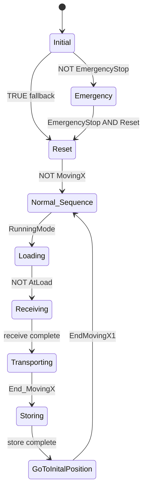
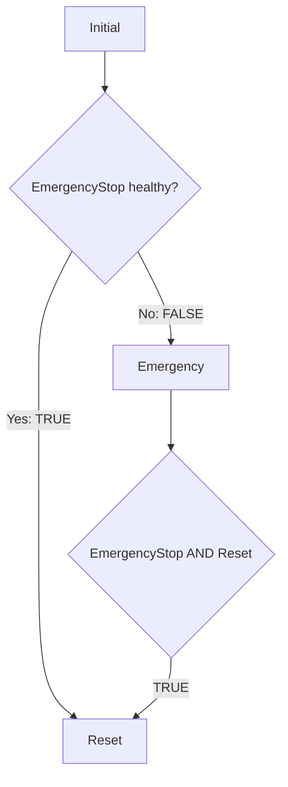
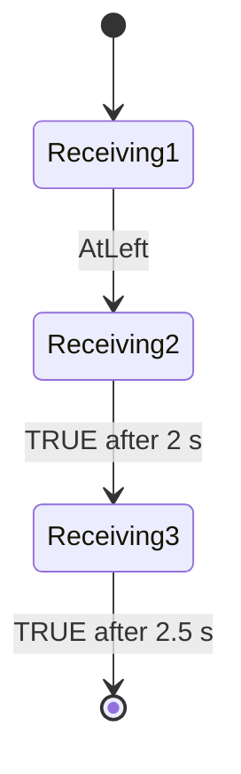
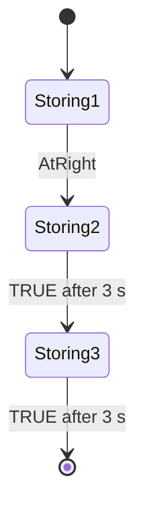
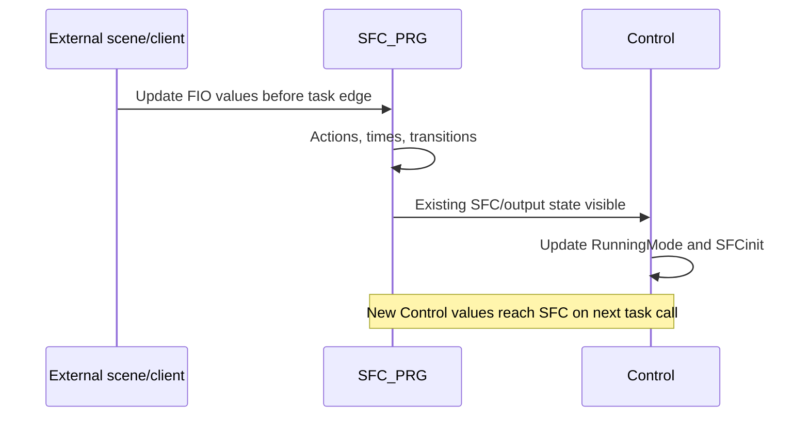
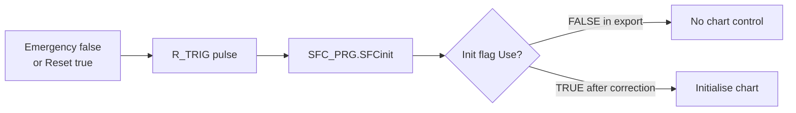
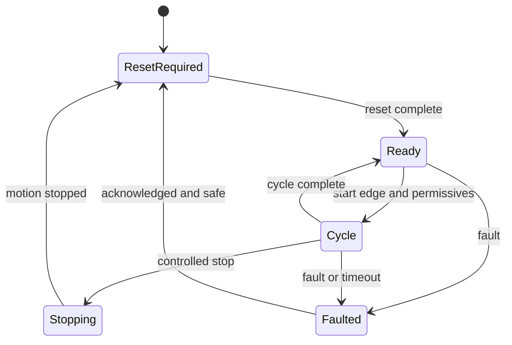

# State Machines and Scan-Cycle Model

## 1. Scope

This document presents the exported `SFC_PRG` sequence as an explicit state machine and relates it to `Control.RunningMode`, SFC action memory, motion edge detectors, and the 20 ms task order.

The chart is the sequence state machine. `RunningMode` is a separate reset-dominant Boolean latch, not a full machine mode enumeration. Stored `S`/`R` action qualifiers introduce another layer of state that can remain active after a step changes.

## 2. State Dimensions

At runtime, the controller state is the combination of at least these independent dimensions:

| State dimension | Examples | Owner |
|---|---|---|
| Main active SFC location | `Reset`, `Loading`, `Transporting` | `SFC_PRG` |
| Macro substep | `Receiving2`, `Storing3` | `SFC_PRG` |
| Run latch | `Control.RunningMode` | `Control.RS_0` |
| Stored IEC actions | lift/forks/light set/reset memory | `IecSfc` action control |
| Position index | `NextPosition` | `SFC_PRG` entry action |
| Motion-edge history | previous `MovingX` values | `F_TRIG_0`, `F_TRIG_1` |
| External scene state | sensors, buttons, motion feedback | Factory I/O/client, not supplied |

Monitoring only the highlighted SFC step is not enough to explain all output values. A useful trace includes active steps, `RunningMode`, `NextPosition`, all stored-action outputs, `MovingX`, both transition results, and `TargetPosition`.

## 3. Main SFC Topology



`GoToInitalPosition` is misspelled in the original source. The documentation preserves the identifier so that watch paths and object names remain recognisable.

## 4. Main-State Transition Table

| Current location | Guard | Next location | Guard type | Key note |
|---|---|---|---|---|
| First call | — | `Initial` | Initial-step activation | `Initial` is the sole initial step |
| `Initial` | `NOT FIO.EmergencyStop` | `Emergency` | Level | First/left alternative branch; highest priority |
| `Initial` | `TRUE` | `Reset` | Literal | Opens only if the left guard is false |
| `Emergency` | `FIO.EmergencyStop AND FIO.Reset` | `Reset` | Level | Requires healthy emergency status plus acknowledgement |
| `Reset` | `NOT FIO.MovingX` | `Normal_Sequence` | Level | Does not prove a particular home position |
| `Normal_Sequence` | `Control.RunningMode` | `Loading` | Level | New value arrives from later task call on next cycle |
| `Loading` | `NOT FIO.AtLoad` | `Receiving1` | Level | Polarity-dependent and potentially already true |
| `Receiving1` | `FIO.AtLeft` | `Receiving2` | Level | No timeout |
| `Receiving2` | `TRUE` after 2 s minimum | `Receiving3` | Timed literal | Minimum-time gate |
| `Receiving3` | `TRUE` after 2.5 s minimum | `Transporting` | Timed literal | Exits macro |
| `Transporting` | `End_MovingX` | `Storing1` | Falling edge | `F_TRIG_0` on `MovingX` |
| `Storing1` | `FIO.AtRight` | `Storing2` | Level | No timeout |
| `Storing2` | `TRUE` after 3 s minimum | `Storing3` | Timed literal | Minimum-time gate |
| `Storing3` | `TRUE` after 3 s minimum | `GoToInitalPosition` | Timed literal | Exits macro |
| `GoToInitalPosition` | `EndMovingX1` | jump to `Normal_Sequence` | Falling edge | `F_TRIG_1` on `MovingX` |

No transition tests `AtEntry`, `AtExit`, `AtUnload`, `MovingZ`, `Auto`, or `Manual`.

## 5. Initial Alternative Branch



The diagram expresses the source's healthy-true convention. The actual SFC guard on the first branch is `NOT EmergencyStop`; the second branch is literal `TRUE`.

Because alternative branches are evaluated left to right, the unconditional fallback does not bypass an active emergency input.

### 5.1 Initial step actions

`Initial` uses `S FIO.ResetLight`. This is stored action state, not merely a one-scan assignment.

### 5.2 Emergency reachability

There are no alternative transitions into `Emergency` from later states. It can be reached only through `Initial`.

The apparent design intent is that an emergency event generates `SFCinit`, returns the chart to `Initial`, and then lets the initial alternative branch select `Emergency`. That intent is not achieved in the exported configuration because the `Init` flag is not enabled for use.

## 6. Reset State

### 6.1 Actions

`Reset_active` assigns false to all declared Boolean actuators and lights. It assigns target 55 only when `AtMiddle` is true.

### 6.2 Transition

The only reset-complete guard is `NOT MovingX`.

Possible paths include:

- if `MovingX = FALSE` on entry, advance to `Normal_Sequence` at the first eligible transition check;
- if `MovingX = TRUE`, remain until it becomes false; and
- if `AtMiddle = FALSE`, advance without this action writing a new target.

The source does not distinguish “axis stopped at an arbitrary point” from “axis stopped at the required initial point.”

## 7. Ready and Cycle Start

`Normal_Sequence` is the operational waiting state.

| Output action | Qualifier | State effect |
|---|---|---|
| `ResetLight` | `R` | Clear stored reset-light state |
| `StartLight` | `N` | Active while waiting |
| `StopLight` | `R` | Clear the stored cycle/busy light |

The transition guard is the level `Control.RunningMode`.

Because `Control` executes after `SFC_PRG`, a start accepted by `RS_0` is normally visible to this transition on the next 20 ms task call. If `Start` stays true, `RunningMode` can remain or become set without a new edge after permissives recover.

## 8. Loading State

`Loading` applies non-stored conveyor actions and stores `StopLight`:

```text
N EntryConveyor
N LoadConveyor
S StopLight
```

The chart uses `NOT AtLoad` to leave the step.

### 8.1 Active-high sensor scenario

If no product means `AtLoad = FALSE`, then `NOT AtLoad = TRUE` immediately. The conveyors can be active for only the minimum SFC processing interval before the chart enters receiving.

### 8.2 Active-low sensor scenario

If the Factory I/O mapping deliberately makes “load arrived” equal to `FALSE`, the guard may be correct.

The runtime test must settle which scenario applies. Do not “correct” the source solely from the variable name without checking the scene.

## 9. Receiving Macro State Machine



| Step | On/while active | State retained after step? | Completion |
|---|---|---|---|
| `Receiving1` | `S ForksLeft`; `R Lift` | Forks left remains set until later `R` | Wait for `AtLeft` |
| `Receiving2` | `S Lift` | Lift remains set through transport | Wait at least 2 s |
| `Receiving3` | `R ForksLeft` | Left-fork stored state cleared | Wait at least 2.5 s |

Configured minimum receiving dwell after `AtLeft` is 4.5 s. No maximum dwell applies to any receiving step.

If `AtLeft` is already true when `Receiving1` activates, the step can complete at the first eligible transition check. There is no requirement to observe fork motion or a fresh sensor edge.

## 10. Transporting State

### 10.1 Entry state change

On activation:

```iecst
NextPosition := NextPosition + 1;
```

This is the only normal assignment that advances the destination index.

### 10.2 Active output

While active:

```iecst
FIO.TargetPosition := NextPosition;
```

### 10.3 Completion event

```iecst
End_MovingX := F_TRIG_0(CLK := FIO.MovingX).Q;
```

The expected motion handshake is:

1. target changes;
2. scene accepts the target;
3. `MovingX` becomes true;
4. horizontal movement occurs;
5. `MovingX` becomes false; and
6. `F_TRIG_0.Q` pulses and opens the transition.

If stages 2 or 3 never occur, no completion edge is generated. If feedback pulses faster than the task can sample, the edge may also be missed.

## 11. Storing Macro State Machine



| Step | On/while active | State retained after step? | Completion |
|---|---|---|---|
| `Storing1` | `S ForksRight` | Right forks remain set until `Storing3` | Wait for `AtRight` |
| `Storing2` | `R Lift` | Lift stored state cleared | Wait at least 3 s |
| `Storing3` | `R ForksRight` | Right-fork stored state cleared | Wait at least 3 s |

Configured minimum storing dwell after `AtRight` is 6 s. No maximum time or failure branch applies.

## 12. Return-Home State

`GoToInitalPosition` continuously commands:

```iecst
FIO.TargetPosition := 55;
```

Completion uses a second edge-detector state:

```iecst
EndMovingX1 := F_TRIG_1(CLK := FIO.MovingX).Q;
```

On the falling edge, the chart jumps to `Normal_Sequence`, not `Initial` or `Reset`.

Consequences:

- the next cycle can start without repeating the initial emergency/reset branch;
- `NextPosition` is preserved and increments again on the next transport entry; and
- any reset-light stored state is cleared in `Normal_Sequence` rather than re-set through `Initial`.

## 13. Minimum Cycle Time

The four configured minimum step times are:

| Step | Minimum time |
|---|---:|
| `Receiving2` | 2 s |
| `Receiving3` | 2.5 s |
| `Storing2` | 3 s |
| `Storing3` | 3 s |
| **Total configured dwell** | **10.5 s** |

This total excludes:

- time in initial, emergency, reset, ready, and loading;
- time waiting for `AtLeft` or `AtRight`;
- both horizontal moves;
- step activation/transition scan boundaries;
- the 20 ms task quantisation; and
- Windows runtime jitter.

The actual cycle time is therefore greater than or equal to 10.5 s plus process and scheduling time.

## 14. SFC Processing Within a Task Call

The documented CODESYS SFC order is broadly:

1. reset internal IEC action-control flags for the cycle;
2. execute eligible exit actions;
3. execute eligible entry actions;
4. check step times and execute step actions;
5. process IEC actions; and
6. evaluate transitions and activate subsequent steps.

Important consequences for this chart are:

- `Transporting_entry` increments the index on activation, before later active scans command it;
- step actions such as `Reset_active` run before IEC qualifier-controlled Boolean actions;
- a minimum time blocks a true transition until the time expires;
- a newly activated step is not equivalent to executing the entire remaining chain as one textual statement; and
- a transition condition held true can pass as soon as its preceding step is eligible.

The SFC property `Calculate active transitions only` is false. Code generation is therefore not restricted to currently active transitions. Because the two transition objects contain stateful `F_TRIG` instances, include their internal/output behaviour in the online test rather than assuming inactive-transition evaluation has no effect.

## 15. Whole-Task Scan Timeline



### 15.1 Start timeline

| Task call | `SFC_PRG` observation | `Control` result |
|---:|---|---|
| N | Sees old `RunningMode` | Accepts `Start` and sets `RunningMode` |
| N+1 | Sees new `RunningMode`; can open loading transition | Re-evaluates latch |

### 15.2 Stop/emergency timeline during an active cycle

| Task call | `SFC_PRG` result | `Control` result |
|---:|---|---|
| N | Continues current sequence using current state | Resets `RunningMode`; may generate `SFCinit` pulse |
| N+1 | Sees latch false, but current state has no latch guard; sees inert `SFCinit` input | Pulse normally returns low if edge input falls |
| Later | Continues until natural return to `Normal_Sequence`, unless another transition stalls | Holds latch false while stop/emergency/reset condition persists |

This is why the source cannot claim immediate mid-cycle stopping.

## 16. `SFCinit` Event Path



The export also has `Init — Declare = TRUE` while `SFCinit` is manually declared as `VAR_INPUT`. CODESYS documentation states that a manually declared flag should have automatic `Declare` deselected; otherwise the automatically declared flag can override the manual declaration.

The intended correction is therefore not just changing the Boolean source. A controlled revision should:

1. set `Init — Use = TRUE`;
2. set automatic `Declare = FALSE` when retaining the explicit `VAR_INPUT`;
3. build without duplicate/shadowed-variable warnings;
4. prove access from `Control`; and
5. trace chart and output behaviour for a one-scan pulse.

## 17. Stored-Action State Timeline

| Output | Set/active point | Reset/inactive point | Persistence concern |
|---|---|---|---|
| `ResetLight` | `S` in `Initial` | `R` in `Normal_Sequence` | Direct false assignments compete with stored state |
| `StartLight` | `N` in `Normal_Sequence` | Step deactivation | Waiting-only indication |
| `StopLight` | `S` in `Loading` | `R` on next `Normal_Sequence` | Stays stored for most of the cycle |
| `EntryConveyor` | `N` in `Loading` | Step deactivation | No stored state |
| `LoadConveyor` | `N` in `Loading` | Step deactivation | No stored state |
| `ForksLeft` | `S` in `Receiving1` | `R` in `Receiving3` | Can remain set indefinitely if sequence stalls |
| `Lift` | `S` in `Receiving2` | `R` in `Storing2` | Remains set through transport and initial store step |
| `ForksRight` | `S` in `Storing1` | `R` in `Storing3` | Can remain set indefinitely if sequence stalls |

An `S` action's reset owner is later in the normal path. If the chart cannot reach that step and no effective reinitialisation occurs, the stored state may remain active.

## 18. Stable Wait and Stall Conditions

The as-exported state machine can wait indefinitely in these conditions:

| Location | Stall condition | Output exposure |
|---|---|---|
| `Emergency` | Emergency status not healthy or reset not asserted | Direct emergency action is active |
| `Normal_Sequence` | `RunningMode = FALSE` | Start light active |
| `Receiving1` | `AtLeft = FALSE` | Forks left stored; lift reset |
| `Transporting` | No falling edge of `MovingX` | Lift can remain stored; target remains destination |
| `Storing1` | `AtRight = FALSE` | Forks right and lift can remain stored |
| `GoToInitalPosition` | No falling edge of `MovingX` | Target remains 55 |

`Loading` may also wait indefinitely if its inverted guard stays false (`AtLoad = TRUE`).

No state has a maximum active time, and no fault state is entered automatically.

## 19. Missing Machine States

A complete equipment model would normally distinguish states such as:

- `POWER_UP_CHECK`;
- `RESETTING`;
- `READY`;
- `CYCLE_ACTIVE`;
- `CONTROLLED_STOPPING`;
- `EMERGENCY_STATUS`;
- `FAULTED`;
- `RECOVERY_REQUIRED`;
- `MANUAL`;
- `AUTO`;
- `STORE_FULL`; and
- `UNLOAD_ACTIVE`.

The baseline has only the sequence steps and a run latch. Mode signals, stop phases, timeout faults, full-store handling, and unload flow are not implemented.

## 20. Recommended Future State Model

Keep the process sequence, but add explicit supervisory control:



Emergency safety outputs should remain outside this standard supervisory chart. The standard PLC can display emergency status and require recovery acknowledgement after the independent safety system has made the equipment safe.

## 21. State-Machine Acceptance Evidence

Capture traces for:

- initial left/right branch selection;
- emergency acknowledgement;
- reset with every combination of `AtMiddle` and `MovingX`;
- one-scan task delay from `Start` to SFC transition;
- stop and emergency during every active main/macro step;
- active-high and active-low `AtLoad` scenarios;
- all four minimum dwell times;
- held `AtLeft` and `AtRight` conditions;
- each complete `MovingX` false → true → false handshake;
- motion never starting and motion never ending;
- `NextPosition` over all available destinations;
- stored action outputs through interrupted sequences;
- as-exported inert `SFCinit` behaviour;
- corrected flag behaviour with `Use = TRUE`, automatic `Declare = FALSE`; and
- runtime/current-state diagnostic additions.

## 22. CODESYS References

- [SFC processing order](https://content.helpme-codesys.com/en/CODESYS%20SFC/_cds_sfc_sequence_of_processing.html)
- [SFC step minimum and maximum times](https://content.helpme-codesys.com/en/CODESYS%20SFC/_cds_sfc_element_properties.html)
- [SFC flags and external write access](https://content.helpme-codesys.com/en/CODESYS%20SFC/_cds_sfc_sfc_flags.html)
- [SFC Settings: Use, Declare, and active-transition code generation](https://content.helpme-codesys.com/en/CODESYS%20SFC/_cds_dlg_properties_sfc_settings.html)
- [SFC action qualifier definitions](https://content.helpme-codesys.com/en/CODESYS%20SFC/_cds_sfc_action_qualifier.html)
