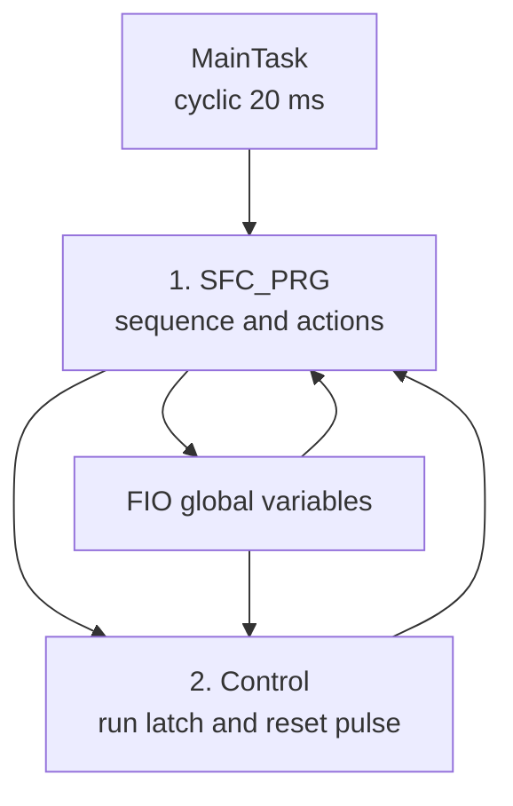
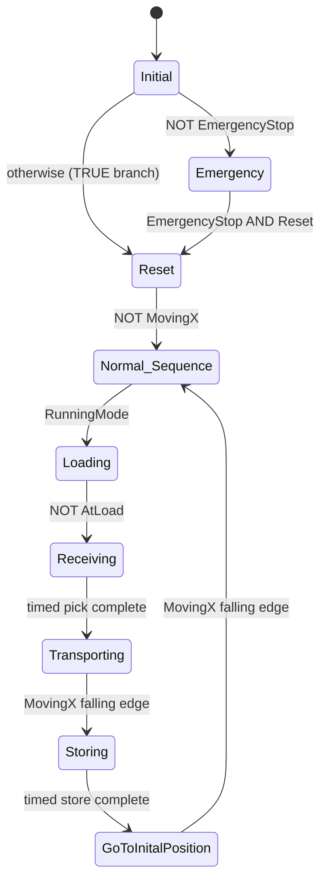

# Sorting Plant / Sequential Storage Controller

## Overview

This CODESYS project controls a multi-stage material-handling sequence using Sequential Function Chart (SFC), with supporting Function Block Diagram (FBD), Ladder Diagram (LD), and Structured Text (ST) actions.

The exported application performs this cycle:

1. check the emergency-stop condition and enter a reset path;
2. wait in `Normal_Sequence` for the run latch;
3. operate the entry and load conveyors;
4. receive the load with the left forks and lift;
5. increment a destination number and move the X axis;
6. store the load with the right forks and lift;
7. command target position `55` as the initial/home position; and
8. return to `Normal_Sequence` after a falling edge of `MovingX`.

Despite the project name, the exported logic does not contain a product-classification or route-selection decision. It implements sequential loading and storage, with `NextPosition` incremented by one for each cycle.

Static review found a significant reset-path issue: `Control` writes a pulse to `SFC_PRG.SFCinit`, but the SFC POU has its optional `Init` flag configured with `Use = FALSE`. In the supplied revision, the declared variable is therefore not active as an SFC control flag. An emergency stop or reset can clear `Control.RunningMode`, but it does not currently reinitialise an already active chart.

## Current Status

| Area | Status | Notes |
|---|---|---|
| PLC source | Included | Portable CODESYS `.export` supplied |
| Native project | Not included | Recreate a compatible project and import the export |
| Static source review | Complete | Hierarchy, POUs, task, SFC, actions, transitions, variables, and symbols traced |
| Build and runtime verification | Pending | Use the included verification matrix |
| Main sequence | Implemented | SFC with alternative emergency branch and two macros |
| Emergency/reset chart initialisation | Not effective as configured | `SFCinit` is declared and written, but SFC `Init` flag use is disabled |
| Symbol Configuration | Present | All 26 `FIO` variables selected with read/write access; OPC UA support enabled |
| Physical I/O addresses | Not configured | No `%I`, `%Q`, `%M`, or fixed IEC addresses found |
| Factory I/O scene | Not included | Mapping and polarity must be commissioned |
| KEPServerEX configuration | Not included | Placeholder and hardening guidance supplied |
| Runtime evidence | Pending | Store screenshots and traces in `Media/` |

## Technologies

- CODESYS Development System V3.5 SP22 Patch 3
- CODESYS Control Win V3 x64, device version 3.5.22.30
- Sequential Function Chart (SFC)
- Function Block Diagram (FBD)
- Ladder Diagram (LD)
- Structured Text (ST)
- IEC 61131-3 `RS`, `R_TRIG`, and `F_TRIG` function blocks
- CODESYS Symbol Configuration with OPC UA support

## Execution Architecture



`MainTask` has priority 1 and its watchdog is disabled. The program order is important: `SFC_PRG` executes before `Control` on every 20 ms task cycle.

Consequences include:

- the SFC sees a newly calculated `Control.RunningMode` value on the following task cycle;
- the SFC would also see a newly generated `SFCinit` pulse on the following cycle if the flag were activated; and
- test traces should include both task calls when diagnosing start, stop, emergency, or reset timing.

## Main SFC



The spelling `GoToInitalPosition` is retained because it is the exact object name in the export.

The initial alternative branch is evaluated from left to right. When `FIO.EmergencyStop = FALSE`, the left transition opens and activates `Emergency`. When it is `TRUE`, the left transition is false and the unconditional right branch activates `Reset`.

## Sequence Summary

| SFC location | Transition into or out of location | Principal action |
|---|---|---|
| `Initial` | Initial step | Stored `S FIO.ResetLight` |
| `Emergency` | Entered when `NOT FIO.EmergencyStop` at the initial branch | `Emergency_active` writes actuators, lights, and target to safe-looking values |
| `Reset` | From healthy initial branch or acknowledged emergency | `Reset_active` clears Boolean outputs and conditionally commands target `55` |
| `Normal_Sequence` | After `NOT FIO.MovingX` | Reset light off, start light active, stop light reset; waits for `RunningMode` |
| `Loading` | `Control.RunningMode` | Entry and load conveyors active; stop light stored on |
| `Receiving` macro | `NOT FIO.AtLoad` | Forks left, lift sequence, 2 s and 2.5 s minimum dwell times |
| `Transporting` | Unconditional macro exit | Increment `NextPosition` once; command it to `TargetPosition` |
| `Storing` macro | Falling edge of `FIO.MovingX` | Forks right, lower lift, 3 s and 3 s minimum dwell times |
| `GoToInitalPosition` | Unconditional store-macro exit | Continuously command `TargetPosition := 55` |
| Return | Falling edge of `FIO.MovingX` | Jump back to `Normal_Sequence` |

## Supporting `Control` Program

`Control` contains two FBD networks.

### Run latch

The reset-dominant `RS_0` function block calculates:

```text
SET    = FIO.Start
RESET1 = (NOT FIO.Stop) OR (NOT FIO.EmergencyStop) OR FIO.Reset
Q1     = RunningMode
```

This source assumes healthy/normal `Stop = TRUE` and `EmergencyStop = TRUE`. A false value on either signal resets the run latch. `FIO.Reset` also resets it. Because the block is `RS`, reset has priority if set and reset are true together.

### Intended SFC initialisation pulse

The second network calculates:

```text
SFC_PRG.SFCinit = R_TRIG((NOT FIO.EmergencyStop) OR FIO.Reset).Q
```

The result is a one-task-cycle pulse on the rising edge of the combined condition. However, the `SFC_PRG` properties explicitly configure the `Init` flag with `Use = FALSE`, so the variable has no chart-control function in this export. Merely declaring `SFCinit : BOOL` as `VAR_INPUT` is not sufficient.

## Receiving Macro

| Step | Minimum active time | IEC actions | Exit condition |
|---|---:|---|---|
| `Receiving1` | None | `S FIO.ForksLeft`; `R FIO.Lift` | `FIO.AtLeft` |
| `Receiving2` | 2 s | `S FIO.Lift` | `TRUE`, after minimum time |
| `Receiving3` | 2.5 s | `R FIO.ForksLeft` | `TRUE`, after minimum time |

## Storing Macro

| Step | Minimum active time | IEC actions | Exit condition |
|---|---:|---|---|
| `Storing1` | None | `S FIO.ForksRight` | `FIO.AtRight` |
| `Storing2` | 3 s | `R FIO.Lift` | `TRUE`, after minimum time |
| `Storing3` | 3 s | `R FIO.ForksRight` | `TRUE`, after minimum time |

No step has a maximum active time. A missing position sensor or motion-complete edge can therefore hold the sequence indefinitely without generating a configured SFC timeout.

## External Interface

The qualified-only global variable list `FIO` contains 26 variables. The Symbol Configuration object named `Symbols` selects all 26 with `VarAccess = 3` and `MaxVarAccess = 3`, enables OPC UA support, and disables direct I/O access.

Expected generated paths are under `Application.FIO`, for example:

```text
Application.FIO.Start
Application.FIO.AtLoad
Application.FIO.EntryConveyor
Application.FIO.TargetPosition
```

Confirm the exact paths after an error-free build and runtime browse.

The current symbol set gives external clients read/write access to sensor inputs, commands, PLC-generated actuator outputs, lights, and `TargetPosition`. That is convenient for a learning scene but too broad for a hardened interface. The recommended design is:

- writable: scene-to-PLC sensors and operator commands only;
- read-only: PLC-to-scene actuators, lights, motion targets, and diagnostic state; and
- least privilege: expose only variables actually used by the commissioned scene.

See the [I/O and external interface list](Documentation/io-list.md) for the full mapping.

## Engineering Documentation

- [Control philosophy](Documentation/control-philosophy.md)
- [I/O, variables, and symbols](Documentation/io-list.md)
- [SFC state machines and scan-cycle model](Documentation/state-machines.md)
- [Verification and correction plan](Documentation/verification.md)

## Repository Layout

```text
7-sortingPlant/
├── CODESYS/
│   └── sortingPlant.export
├── Documentation/
│   ├── control-philosophy.md
│   ├── io-list.md
│   ├── state-machines.md
│   └── verification.md
├── FactoryIO/
├── Kepware Server/
├── Media/
└── README.md
```

## Importing and Running

1. Install CODESYS Development System V3.5 SP22 Patch 3 where possible.
2. Install or select CODESYS Control Win V3 x64 version 3.5.22.30, or document any compatible substitute.
3. Create a standard project for the compatible target.
4. Select **Project → Import** and import `CODESYS/sortingPlant.export`.
5. Confirm that `FIO`, `Control`, `SFC_PRG`, its five actions and two transitions, `Symbols`, and `MainTask` are present.
6. Confirm that `MainTask` calls `SFC_PRG` first and `Control` second at 20 ms.
7. Open `SFC_PRG` properties and inspect the optional SFC flags before relying on reset behaviour.
8. Build and record all errors and warnings.
9. Log in, download, and test with a watch list before attaching any real or simulated actuator.
10. Follow the [verification plan](Documentation/verification.md), beginning with the as-exported baseline.

Only the portable export was supplied. A native `.project` file is not included, so the import path is the source-recovery workflow for this repository revision.

## Important Static-Review Findings

- `SFC_PRG.SFCinit` is written by `Control`, but the SFC `Init` flag has `Use = FALSE`; the pulse does not initialise the chart as exported.
- `Init — Declare` is also `TRUE` even though `SFCinit` is manually declared as `VAR_INPUT`; CODESYS guidance says automatic declaration should be disabled for a manually declared flag.
- The `Emergency` step is reachable only from the initial alternative branch. There is no emergency transition from every running step.
- During an active cycle, losing `EmergencyStop` or `Stop` resets `RunningMode`, but the SFC does not inspect `RunningMode` again until it returns to `Normal_Sequence`.
- Because `SFC_PRG` executes before `Control`, new latch and pulse values reach the SFC one task cycle later.
- The loading exit guard is `NOT FIO.AtLoad`. If the scene uses conventional active-high presence sensing, the chart can leave `Loading` before a load arrives. Confirm the scene polarity.
- `Reset_active` assigns target `55` only while `FIO.AtMiddle` is true; otherwise `TargetPosition` retains its previous value.
- The `Reset → Normal_Sequence` transition is only `NOT FIO.MovingX`, so reset can complete without proving a particular home position.
- `Transporting_entry` increments `NextPosition` from zero, but there is no upper bound, storage-capacity check, wrap policy, or reset assignment.
- Both X-motion completion transitions use falling-edge detectors. They require a detectable true-to-false `MovingX` cycle and have no timeout.
- `AtEntry`, `AtExit`, `AtUnload`, `Auto`, `Manual`, and `MovingZ` are declared and externally writable but unused by the PLC logic.
- `ExitConveyor` and `UnloadConveyor` are cleared in reset/emergency actions but are never commanded true.
- Several outputs are written both by SFC IEC action qualifiers and by ST step actions, creating multiple control owners whose online result should be traced.
- All optional SFC diagnostic flags are disabled, all maximum step times are empty, and the task watchdog is disabled.
- All 26 external symbols are read/write, including PLC-generated actuator commands and the position target.
- No fixed IEC addresses, Factory I/O scene, KEPServerEX project, native `.project`, or runtime evidence is included.
- SFC steps, transitions, and FBD networks contain no source comments.
- The exported `Reset_active` text ends with `END_IF` rather than `END_IF;`; record the baseline compiler result and add the terminator if it is rejected.

## Safety Boundary

This is a learning project running on a non-real-time Windows soft PLC. The Boolean named `EmergencyStop` and the `Emergency` software step are not a safety function.

Do not connect this revision directly to physical machinery. A machine implementation requires a risk assessment, safety-rated stop architecture, independent removal of hazardous energy, guarded motion, verified feedback, travel limits, fault handling, timeouts, electrical protection, controlled restart, and validation to the applicable standards.

## Planned Improvements

- Activate and explicitly test the SFC `Init` or `Reset` flag, or replace the coupling with a clear sequence-reset interface.
- Make stop and emergency handling effective from every operating step, with independently enforced safe outputs.
- Run `Control` before `SFC_PRG` if same-scan command evaluation is required, then regression-test timing.
- Confirm and correct the `AtLoad` polarity.
- Define an unambiguous home sensor, target, and reset-complete condition.
- Bound `NextPosition`, define capacity/full behaviour, and decide whether reset or emergency should preserve it.
- Add motion-start acknowledgement and completion timeouts around both `F_TRIG` transitions.
- Give each output one clear owner and remove conflicts between direct assignments and IEC qualifier control.
- Add maximum step times, SFC diagnostic flags, and a justified task watchdog.
- Reduce Symbol Configuration permissions to the minimum required by Factory I/O or an OPC client.
- Implement the currently unused exit/unload portion or remove unused interface signals.
- Add internal comments, a tested Factory I/O scene, and dated runtime evidence.

## CODESYS SFC References

- [SFC flags](https://content.helpme-codesys.com/en/CODESYS%20SFC/_cds_sfc_sfc_flags.html)
- [SFC action qualifiers](https://content.helpme-codesys.com/en/CODESYS%20SFC/_cds_sfc_action_qualifier.html)
- [SFC element properties and step times](https://content.helpme-codesys.com/en/CODESYS%20SFC/_cds_sfc_element_properties.html)
- [SFC processing order](https://content.helpme-codesys.com/en/CODESYS%20SFC/_cds_sfc_sequence_of_processing.html)
- [Alternative branch behaviour](https://content.helpme-codesys.com/en/CODESYS%20SFC/_cds_sfc_element_branch.html)
