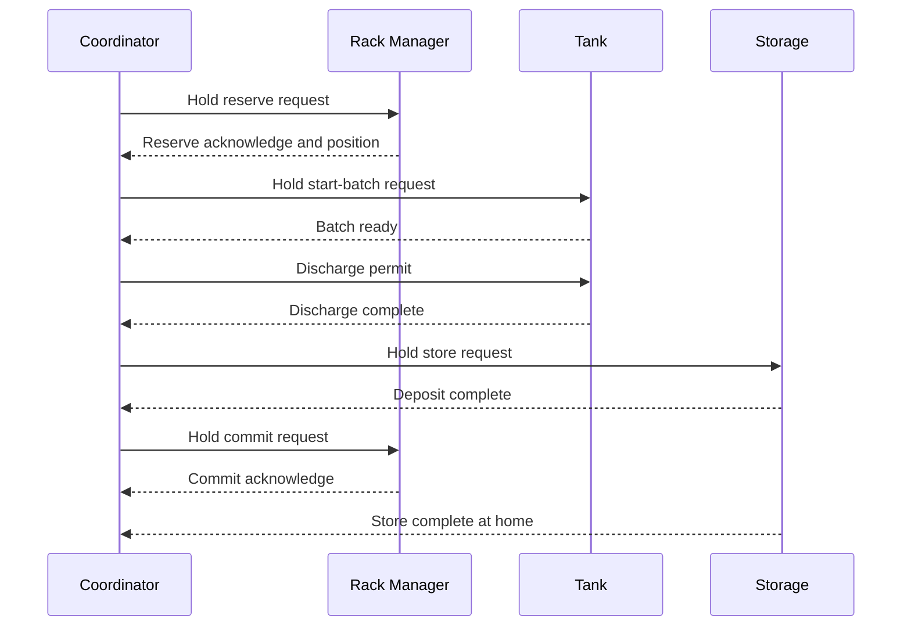

# Control Philosophy

## 1. Purpose

This document describes how the batch tank and automated storage system are intended to operate, how responsibilities are divided between PLC modules, and how commands, faults and recovery are handled.

The simulated process boundary is deliberate: one completed tank batch represents one finished production lot. Filling and closing the physical container between the tank outlet and the storage conveyor is abstracted. The control system therefore coordinates a believable process without claiming to model packaging equipment that is not present in the scene.

## 2. Operating Concept

The plant contains four cooperating control modules:

| Module | Owns | Does not own |
| --- | --- | --- |
| `FB_PlantCoordinator` | Overall sequence, permissives and module transactions | Individual actuator sequencing |
| `FB_Tank` | Tank state, valves, level decisions and tank faults | Rack capacity or crane motion |
| `FB_Storage` | Conveyors, fork movement, lift, travel, deposit and return home | Rack inventory decisions |
| `FB_RackManager` | Slot selection and the `Free → Reserved → Occupied` transaction | Physical crane movement |

Each physical command has one owner. Modules exchange explicit commands and status signals instead of reading or writing one another's internal state.

## 3. PLC Scan and Call Order

`PLC_PRG` acts as the composition root and calls the modules in this order:

1. `FB_PlantCoordinator`
2. `FB_RackManager`
3. `FB_Tank`
4. `FB_Storage`

The coordinator therefore reads module status calculated during the previous scan and generates the current scan's requests. The three equipment modules then act on those requests during the same scan. This one-scan status latency is deterministic and insignificant compared with the mechanical process times.

No normal transaction depends on a one-scan pulse. A request stays true until the receiving module acknowledges it or reaches the required completed state, which makes the interfaces tolerant of call order and easier to diagnose online.

## 4. Operating States

| Plant condition | Behaviour |
| --- | --- |
| Disabled | Module commands remain at safe defaults and no new sequence starts |
| Enabled, Auto off | Modules establish safe idle/home states but production remains stopped |
| Enabled, Auto on | The coordinator reserves capacity and runs production automatically |
| Auto removed mid-cycle | The in-progress product finishes; no new production transaction starts |
| Rack full | Production waits without declaring an equipment fault |
| Faulted | Production permissions are removed and actuator commands fall to safe defaults |

## 5. Normal Transaction

The detailed transaction is:

1. The coordinator checks that automatic operation is selected and the rack is not full.
2. The rack manager selects the first free position and changes it to `Reserved`.
3. If a batch is not already prepared, the coordinator asks the tank to fill.
4. Discharge requires all of the following:
   - tank batch ready;
   - container at the fill position;
   - transfer path clear;
   - storage module ready;
   - valid rack reservation.
5. The tank discharges and holds `xDischargeComplete` until its permit is removed.
6. Storage receives and moves the product to the reserved destination.
7. Once the forks retract after deposit, storage raises `xDepositComplete`.
8. The coordinator asks the rack manager to commit the reservation as occupied.
9. The crane returns home and holds `xStoreComplete` until the store request is removed.
10. The coordinator returns to idle and either starts the next transaction or stops.

## 6. Concurrent Production

The tank and storage system are independent unit state machines rather than steps inside one long sequence. After batch *N* has discharged, the tank can fill batch *N+1* while the crane stores product *N*.

This overlap is allowed only while:

- automatic operation remains selected;
- the current transaction remains healthy;
- at least one additional rack position is free.

If the tank finishes first, it waits safely in `BatchReady`. If the crane finishes first, it waits at home. Correct operation does not depend on their cycle times matching.

## 7. Rack Inventory Transaction

Rack inventory uses a transaction rather than immediately marking a selected slot occupied:

| Operation | Required current state | New state | Meaning |
| --- | --- | --- | --- |
| Reserve | `Free` | `Reserved` | Capacity is allocated before production release |
| Commit | `Reserved` | `Occupied` | Physical deposit has been confirmed |
| Release | `Reserved` | `Free` | An incomplete transaction gives the slot back |

Version 1 supports one active reservation. The rack contains positions `1..54`; target `55` is the crane home position and is not inventory.

`xRackFull` is derived from the slot counts. It blocks new production but is not an equipment fault because a full warehouse is a valid operating condition.

## 8. Fault Philosophy

### Tank faults

| Fault | Detection | Immediate response |
| --- | --- | --- |
| High-high level | Independent Boolean sensor | Latch fault and close both valves |
| Fill timeout | Tank remains in `Filling` too long | Latch fault and close both valves |
| Discharge timeout | Tank remains in `Discharging` too long | Latch fault and close both valves |

The normal analog fill setpoint stops routine filling. The separate high-high signal is a protective trip, so even a brief activation remains latched until a valid reset.

### Storage faults

| Fault | Detection | Immediate response |
| --- | --- | --- |
| Invalid reservation | Position is absent or outside `1..54` | Reject transaction and stop Boolean motion commands |
| Step timeout | A motion/transfer state makes no progress in time | Latch fault and stop Boolean motion commands |

Horizontal/vertical travel must first be observed active and then inactive before the state machine treats the destination as reached. This prevents a false completion while the crane has not begun moving.

### Plant and rack faults

- A tank, storage or rack fault propagates to the coordinator.
- Conflicting rack operations are treated as invalid transactions.
- Unexpected reservation state is treated as a sequence/reconciliation fault rather than silently guessing what happened.
- A newly detected fault removes discharge, storage and rack transaction permissions during the same scan.

## 9. Reset and Recovery

Reset is accepted at plant level only when automatic operation is off. This prevents a reset from also becoming an unintended restart.

A reset:

- clears latched control faults after their live cause is safe;
- returns state machines to their stopped/recovery path;
- does not command production;
- does not erase rack inventory;
- does not automatically release an uncertain reservation.

The tank high-high input must be false before its fault can reset. Storage may home during startup or recovery if its feedback says it is not already at home. Homing is a controlled machine action and is intentionally distinct from merely clearing an alarm.

An interrupted rack transaction may require operator reconciliation. Automatically freeing or occupying an uncertain slot could either lose inventory or allow two products to target the same location.

## 10. Safe-State Principles

Every scan begins by applying safe Boolean output defaults. A state explicitly enables only the actuator commands it requires. Additional defensive logic prevents fill and discharge valves from being commanded together.

These software measures support predictable simulation behaviour, but they are not safety functions. Emergency stopping, guarded access and prevention of hazardous movement would require appropriately rated hardware and a validated safety design on a real machine.

## 11. Current Constraints

- Feedback is supplied by temporary `PLC_PRG` commissioning variables.
- Packaging between tank discharge and container transfer is abstracted.
- Only one rack reservation can be active at a time.
- Lift and lower completion use timers rather than direct vertical-position feedback.
- Runtime reset does not erase inventory, but the rack array is not yet declared persistent across a download, reset origin or power cycle.
- The `Unknown` rack state exists for future reconciliation logic but is not yet assigned by a normal command.
- The `T#30M` timeouts in `PLC_PRG` are manual-test settings, not production values.
- Factory I/O, Kepware, HMI and safety-system integration remain future work.
