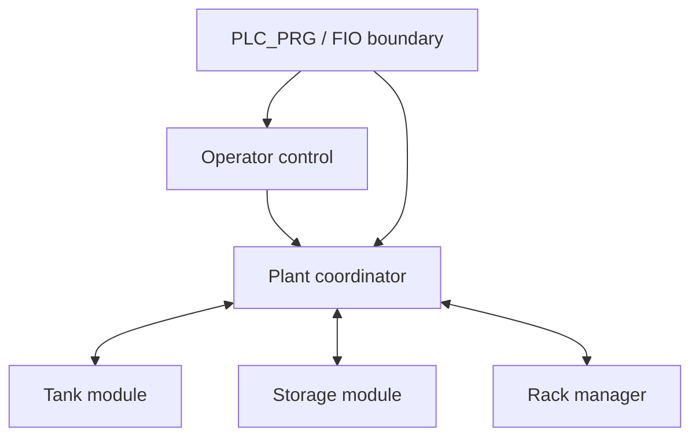

# Engineering and Debugging Notes

## 1. Why This Document Exists

The finished code shows what the system became; it does not show why the design looks this way. Project 8 included several realistic commissioning problems: incomplete process assumptions, polarity mismatches, stale controller state, OPC symbol refresh, one-to-one scene mappings and interrupted inventory transactions.

Those problems are part of the engineering evidence. This document records the decisions, diagnoses and refactors that turned two tutorial ideas into one independently designed system.

## 2. From Tutorials to a Process Story

The starting components did not naturally belong together:

- a water-tank exercise; and
- an automated warehouse/stacker-crane exercise.

The believable link became a **batch production and automated storage cell**. The tank prepares one lot; packaging is abstracted; one palletised container represents that lot; the warehouse stores it.

This boundary matters because it states what the simulation proves without pretending that liquid physically becomes a cardboard box. In an expanded factory, a filling/sealing/palletising module would occupy that boundary.

## 3. Architecture Evolution

### 3.1 First instinct

A direct combination of the old tank and storage programs would have produced a large `PLC_PRG` with tutorial-specific assumptions and tightly coupled sequence logic.

### 3.2 Final structure

The final design treats the plant as cooperating modules:



This structure has several consequences:

- equipment blocks own their actuator sequence;
- the coordinator sees status and issues permissions, not internal implementation details;
- rack inventory is independent of crane movement;
- Factory I/O-specific scaling/polarity remains outside reusable modules;
- online monitoring shows the current responsibility clearly.

### 3.3 Why cyclic signals were preferred over hidden methods

Methods such as `Start()` and `Reset()` can be useful, but a machine transaction benefits from visible cyclic signals:

- `xRackReserveRequest` / `xReserveAck`;
- `xTankDischargePermit` / `xDischargeComplete`;
- `xStorageStoreRequest` / `xStoreComplete`.

Held requests survive scan ordering and are easier to inspect through CODESYS and OPC than a method call or one-scan pulse.

## 4. Key Engineering Decisions

| Decision | Reason | Result |
| --- | --- | --- |
| Reserve before production release | Prevent a finished product with nowhere to go | Capacity is guaranteed before discharge |
| Commit at confirmed deposit | Inventory truth changes when material is physically placed, not when the crane reaches home | Rack counts reflect the physical event |
| Derive `xCraneAtHome` | Factory I/O exposes movement and target rather than a dedicated home Boolean | Home requires target 55, centred forks and no X/Z movement |
| Invert the load beam once | The raw sensor reports beam clear, not product present | Equipment logic consumes positive `xProductAtLoad` semantics |
| Keep high-high separate from 80% setpoint | Routine control and protective trip are different functions | Overfill remains independently latched |
| Pipeline tank and storage | A production cell should not wait unnecessarily for unrelated mechanical work | Batch *N+1* can fill while product *N* is stored |
| Treat RackFull as status | A full warehouse is a valid capacity condition | Production waits without false equipment alarms |
| Use `Unknown` after interruption | Free/occupied cannot be inferred safely once material may exist | Uncertain capacity is quarantined |
| Use final output clamp | Internal state may be stale during lifecycle loss/recovery | Simulation actuators are forced to a non-moving command state |

## 5. Debugging and Commissioning Record

| Symptom or obstacle | Diagnosis | Resolution | Lesson |
| --- | --- | --- | --- |
| CODESYS `.project` was not readable outside CODESYS | It is a proprietary binary container | Exported native CODESYS `.export` XML with all application objects | Keep both project and readable export in a portfolio |
| Imported sources appeared beneath extra devices | Whole export branches were imported rather than just consolidated application objects | Moved required POUs/FIO into one application and removed legacy tutorial objects | Audit the project tree before wiring logic |
| Manual simulation appeared to remember old state | Function-block states persist while the runtime/application remains loaded | Used a deliberate reset/download workflow and monitored enum states | PLC state is retained cyclic memory, not a fresh function call |
| Storage/tank timed out while values were being changed manually | Commissioning took longer than early timer values | Used generous commissioning limits, then calibrated final integrated settings | Separate manual-test timing from final process timing |
| A discharge-complete signal disappeared too quickly | Completion depended on a state transition rather than a handshake | Held completion until the coordinator removed its permit | Acknowledgements must be observable across scans |
| A pallet appeared present when the load point was empty | Warehouse sensor was normally true for beam clear | Added `xProductAtLoad := NOT xLoadBeamClear` at the boundary | Name signals by process meaning, then normalise polarity once |
| New CODESYS variables did not appear in Kepware | They were not yet regenerated/published in Symbol Configuration | Added symbols, rebuilt/downloaded, then re-imported online in Kepware | The PLC source, symbol file and OPC tag cache are separate layers |
| Kepware rejected duplicate devices | Multiple configured devices used the same logical/IP endpoint | Kept one active controller endpoint and organised project tags beneath it | One real endpoint should have one unambiguous device identity |
| One PLC conveyor tag could map to only one Factory I/O actuator | Factory I/O mapping is one endpoint per item connection | Renamed conveyors 0–3, used a Boolean array and imported individual child tags | Repeated equipment benefits from indexed interfaces |
| Conveyor array values were true in CODESYS but scene belts did not move | Kepware still exposed legacy scalar tags rather than mapped array children | Imported `axRollerConveyorCmd[x]` members and remapped the scene | Verify every integration layer, not only the PLC value |
| Factory I/O Play released a pallet before the tank was ready | Previous transaction/state and transfer ownership had become inconsistent during recovery edits | Re-audited the final export/scene, restored clean operator lifecycle and transaction sequencing | Diagnose from live state/commands before changing logic |
| Normal Stop and emergency stop initially seemed equivalent | The desired behaviours were not explicitly separated | Normal Stop completes the active product; emergency clamps immediately | Every stop category needs a defined material-recovery philosophy |
| Pressing Factory I/O square Stop left stale assumptions | The PLC had no scene-lifecycle feedback | Mapped `FACTORY I/O (Running)` and made lifecycle loss require recovery | Simulator availability is an input to the control contract |
| Reset after a mid-cycle interruption could silently free capacity | Physical material might already exist | Latched phase classification and converted the reservation to `Unknown` on Reset | Recovery must preserve uncertainty rather than invent certainty |
| Scene liquid dribbled briefly after the command closed | Factory I/O visual/physical residual continued after the PLC output reached zero | Verified command values in CODESYS and observed the flow settle | Separate command evidence from simulated process inertia |

## 6. Refactoring Record

### 6.1 Repeated conveyor outputs

The first integrated version had individual variables for conveyor sections with inherited suffixes. The scene components were renamed sequentially and the PLC interface became:

```iecst
axRollerConveyorCmd: ARRAY[0..3] OF BOOL;
```

`PLC_PRG` now distributes one route command with a loop. This removes copy/paste output logic and makes the relationship between repeated components explicit.

### 6.2 Repeated stack lights

Four warning towers each require three outputs. Three arrays express colour by location:

```iecst
axStackGreenCmd: ARRAY[0..3] OF BOOL;
axStackRedCmd: ARRAY[0..3] OF BOOL;
axStackYellowCmd: ARRAY[0..3] OF BOOL;
```

The colour condition is calculated once and distributed. This preserves individual Factory I/O endpoints while avoiding twelve independent logic branches.

### 6.3 External I/O boundary

Temporary `*Test` variables were replaced by a qualified `FIO` GVL. The boundary now owns:

- analog scaling;
- actuator type conversion;
- derived conditions;
- OPC diagnostics;
- physical input/output mapping.

The equipment blocks therefore remain independent of Kepware paths and Factory I/O component names.

### 6.4 Removed redundant interfaces

The final audit removed signals that no longer contributed to the version-1 transaction, including the unused rack-release handshake and unused public busy/waiting values. Private diagnostics remained private where no external consumer required them.

The principle was not “remove every extra value”; it was “publish only a stable external contract and keep implementation details inside their owner.”

### 6.5 State enums

Strict enums replaced unrelated latch bits. The online value `E_StorageState.ExtendingToRack` communicates more than a collection of booleans and maps directly to documentation and test evidence.

## 7. Recovery Was the Hard Part—and the Valuable Part

Normal sequencing is deterministic: reserve, fill, discharge, store, commit. Interruptions create ambiguity.

Consider an emergency during `StoringProduct`:

- the rack manager still owns a `Reserved` slot;
- the container may be on a conveyor, on the forks or already in the rack;
- the coordinator may be forced into `Faulted` before later logic reads the original phase.

The final design captures “material may exist” before fault handling overwrites the plant state. On Reset:

- pre-material reservations return to `Free`;
- post-discharge reservations become `Unknown`.

This is a small transaction-recovery model. It demonstrates the same underlying idea used in databases and warehouse-management systems: reserve resources, commit only on confirmed completion and quarantine uncertain transactions.

## 8. Controls Engineering Compared with Software Engineering

| Software concept | Project 8 equivalent |
| --- | --- |
| Composition root | `PLC_PRG` |
| Stateful service/component | Function-block instance |
| Interface/DTO | Visible command and status variables |
| Adapter layer | `FIO` mapping and conversions |
| Workflow engine | Enum/`CASE` state machine |
| Transaction | Rack reserve → physical deposit → commit |
| Circuit breaker/fail-safe gate | Final output interlock |
| Integration test | Live CODESYS–Kepware–Factory I/O regression cycle |

The important differences are the cyclic scan, retained state, continuously evaluated outputs, physical feedback, process inertia and the need to recover material whose location may be uncertain.

## 9. How to Explain the Project in an Interview

### 30-second version

> I designed a modular CODESYS batch-production cell connected through Kepware to Factory I/O. A tank prepares a batch, a conveyor positions a palletised container and a stacker crane reserves and fills the next free rack slot. The PLC uses separate operator, coordinator, tank, storage and rack-manager function blocks, with held handshakes, pipelined operation, timeout/overfill faults and transaction recovery that quarantines uncertain inventory after an interruption.

### Useful follow-up points

- Why reserve first? To prevent producing material without storage capacity.
- Why commit before the crane is home? Deposit changes inventory; returning home changes readiness.
- Why `Unknown`? An emergency can make software state diverge from physical truth.
- Why arrays? Factory I/O needs distinct endpoints, while repeated PLC logic should still be generated consistently.
- Why a separate I/O layer? Scaling, polarity and simulator naming should not contaminate reusable equipment logic.
- What was actually tested? Integrated automatic cycles, controlled stop, emergency stop, Factory I/O lifecycle loss, overfill trip, reset behaviour, OPC quality and array mappings.

## 10. Honest Limitations

- Emergency behaviour is simulation logic, not a certified safety function.
- Inventory is not fully persistent/reconstructed after every cold controller event.
- `Unknown` slots have no HMI-led reconciliation workflow.
- Packaging is abstracted.
- Retrieval, unload conveyor and remover logic are outside Project 8.
- Lift/lower actions are timed rather than confirmed by direct product-height feedback.
- One active material-handling transaction is supported.

Stating these limits improves the project: it shows the difference between a functioning simulation and an industrially validated machine.

## 11. Natural Next Extensions

1. Add persistent inventory and startup reconciliation.
2. Add an HMI for states, alarms, counts and `Unknown` slot resolution.
3. Add product retrieval, exit conveyor and remover sequencing.
4. Add direct lift/lower feedback and measured timeout margins.
5. Add production counters, cycle-time data and alarm history.
6. Use Project 9 to extend the factory with another independently controlled process module and a formal module-to-module handshake.

## 12. Final Reflection

The most important outcome is not that a tank fills or a crane moves. It is that the final plant has an explicit process story, ownership boundaries, observable state, capacity transactions, defined stop categories, recoverable faults, verified external communications and documentation that explains the design.

That is the shift from reproducing tutorial logic to designing a control system.
