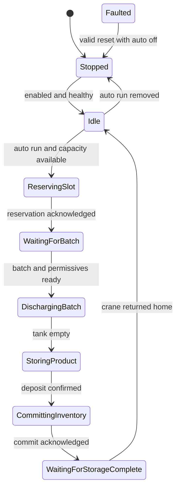
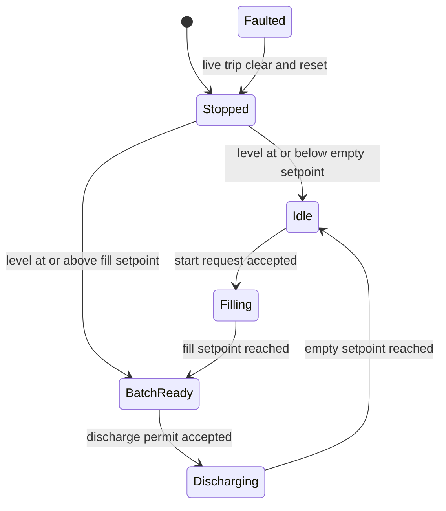
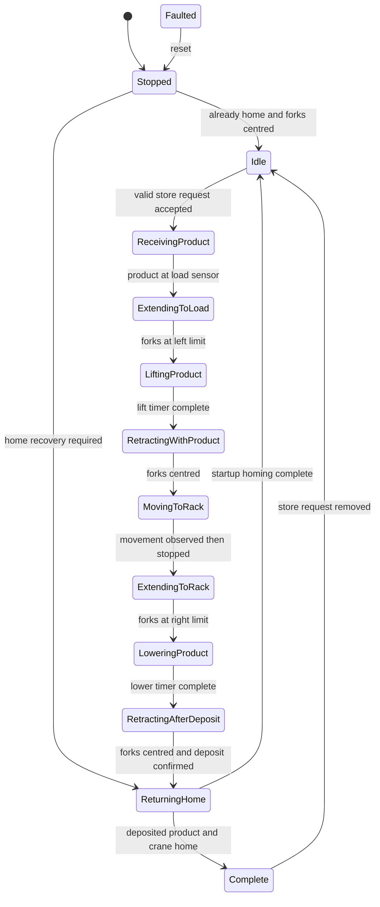
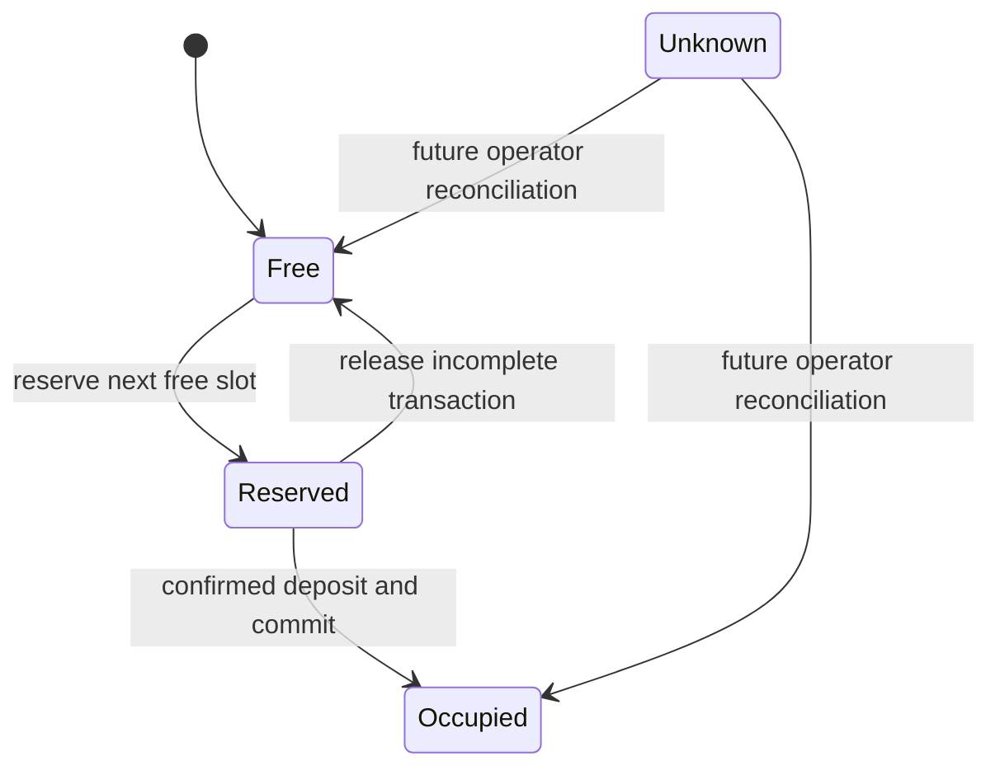

# State-Machine Reference

## Why Explicit States Are Used

Each unit retains its state between PLC scans and evaluates only the logic relevant to that state. Named enum values make online diagnostics readable and make legal transitions easier to review than a collection of unrelated latch bits.

The numeric values leave gaps so future states can be inserted without renumbering the full sequence. `Faulted` values are kept visually separate from normal process states.

## Plant Coordinator

Any active state can enter `Faulted` if the tank, storage, rack manager or coordinator reports a fault.

| Value | State | Main responsibility | Normal exit condition |
| ---: | --- | --- | --- |
| 0 | `Stopped` | Hold plant stopped and expose common module enable/reset | Plant enabled and healthy |
| 10 | `Idle` | Decide whether a new production transaction may begin | Auto selected and rack capacity available |
| 20 | `ReservingSlot` | Hold rack reservation request | Reserve acknowledgement and valid reservation |
| 30 | `WaitingForBatch` | Start/await tank batch and monitor release permissives | Batch ready, container present, transfer clear and storage ready |
| 40 | `DischargingBatch` | Hold tank discharge permission | Tank discharge completion |
| 50 | `StoringProduct` | Hold storage request while product is received and moved | Storage deposit confirmation |
| 60 | `CommittingInventory` | Hold rack commit request | Commit acknowledgement |
| 70 | `WaitingForStorageComplete` | Wait for crane to return home | Storage completion acknowledgement |
| 900 | `Faulted` | Remove transaction permissions and wait for recovery | Valid reset while auto is off |

## Tank

High-high, fill-timeout or discharge-timeout faults can move the tank from any operating state to `Faulted`.

| Value | State | Active command/behaviour | Normal exit condition |
| ---: | --- | --- | --- |
| 0 | `Stopped` | Assess the physical level before choosing a recoverable state | Level proves empty or batch-ready |
| 10 | `Idle` | Ready for a new batch request | Armed start request |
| 20 | `Filling` | `xFillValveCmd = TRUE` below the fill setpoint | Level reaches `80%` |
| 30 | `BatchReady` | Hold prepared batch with both valves closed | Armed discharge permit |
| 40 | `Discharging` | `xDischargeValveCmd = TRUE` while permit remains valid | Level reaches `5%` or lower |
| 100 | `Faulted` | Both valves held closed | Valid reset after live high-high clears |

`xDischargeComplete` is retained until the coordinator removes `xDischargePermit`. This provides a reliable completion handshake rather than a one-scan pulse.

## Storage and Crane

| Value | State | Active command/behaviour | Normal exit condition |
| ---: | --- | --- | --- |
| 0 | `Stopped` | Check crane home and centred-fork feedback | Enter idle or begin homing |
| 10 | `Idle` | Hold home target and wait for a valid reservation/request | Armed store request |
| 20 | `ReceivingProduct` | Run entry and load conveyors | Product reaches load sensor |
| 30 | `ExtendingToLoad` | Extend forks left | Left limit reached |
| 40 | `LiftingProduct` | Keep forks left and lift product | Lift timer complete |
| 50 | `RetractingWithProduct` | Hold lift while forks retract | Middle limit reached |
| 60 | `MovingToRack` | Hold lift and command reserved target | X/Z movement is seen active and then inactive |
| 70 | `ExtendingToRack` | Hold lift and extend forks right | Right limit reached |
| 80 | `LoweringProduct` | Lower product into rack | Lower timer complete |
| 90 | `RetractingAfterDeposit` | Retract forks; confirm physical deposit | Middle limit reached |
| 100 | `ReturningHome` | Command target position `55` | Crane home/complete motion and forks centred |
| 110 | `Complete` | Hold `xStoreComplete` for handshake | Store request removed |
| 900 | `Faulted` | Hold Boolean commands at safe defaults | Reset |

The common step timeout runs only in states that are expected to make physical progress. It resets when the state changes so each movement receives a fresh time allowance.

## Rack Slot Lifecycle

| Value | State | Meaning |
| ---: | --- | --- |
| 0 | `Free` | Available for a new reservation |
| 10 | `Reserved` | Allocated to the active product transaction |
| 20 | `Occupied` | Product deposit has been confirmed |
| 900 | `Unknown` | Physical inventory cannot be trusted and requires reconciliation |

Only `Free`, `Reserved` and `Occupied` are assigned during normal version-1 operation. `Unknown` is included to support a future recovery workflow after a power loss or interrupted movement.

## Command-Arming Rule

Tank and storage requests must return false before the next transaction is accepted. The internal `xCommandArmed` flags enforce this rule.

This prevents a request that remains high from starting multiple batches or storage cycles when a function block returns to idle. It is the cyclic-PLC equivalent of consuming a command and waiting for its sender to acknowledge completion by removing it.
