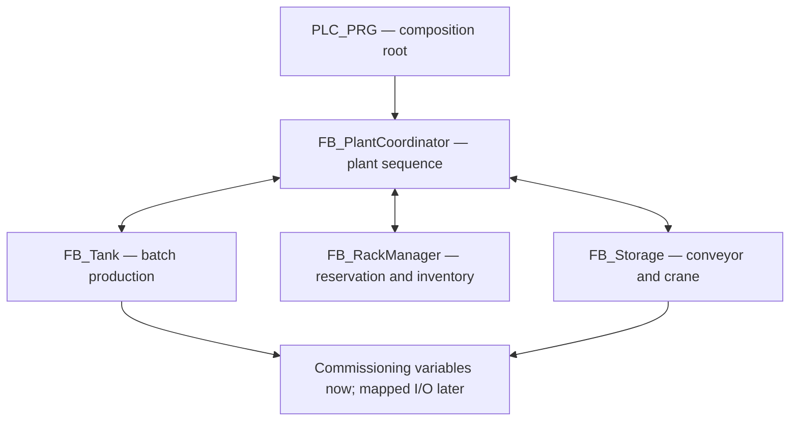

# Tank and Sorting Plant

## Overview

`tankAndSortingPlant` is a modular CODESYS control project for a simulated batch-production and automated-storage cell.

A process tank fills to a target level and discharges one batch into a waiting container. Conveyors then transfer that container to a crane, which stores it in the next available rack position. While the current container is being stored, the tank can prepare the next batch, allowing the two parts of the plant to work concurrently.

The project combines ideas first explored in separate tank and storage tutorials, but the plant coordination, transaction handshakes, rack management, fault behaviour and software architecture were designed specifically for this project.

## Current Status

| Area | Status |
| --- | --- |
| Core CODESYS logic | Complete and building with no errors or warnings |
| Manual PLC simulation | End-to-end sequence and fault/reset tests passed |

## Technologies

- CODESYS V3.5 SP22 Patch 3
- IEC 61131-3 Structured Text
- CODESYS Control Win V3 x64
- Factory I/O — planned visual simulation
- Kepware KEPServerEX — planned OPC connection

## Process Sequence

1. The plant coordinator reserves the next free rack position.
2. The tank fills to its configured batch level.
3. Discharge is permitted only when a container is present, the transfer path is clear and the storage module is ready.
4. The tank empties into the container and confirms completion from its low-level condition.
5. The conveyor carries the product to the crane loading position.
6. The crane collects the product, travels to the reserved rack position and deposits it.
7. The rack manager commits the reservation as occupied only after deposit is confirmed.
8. The crane returns home and the next production cycle can continue.

If automatic operation remains selected and capacity is available, the tank can fill the next batch while the crane stores the current product.

## Control Architecture



| Object | Responsibility |
| --- | --- |
| `PLC_PRG` | Instantiates the modules and connects their command/status interfaces |
| `FB_PlantCoordinator` | Owns the overall production sequence and cross-module permissives |
| `FB_Tank` | Controls fill and discharge states, level limits and tank faults |
| `FB_Storage` | Controls product receiving, crane movements, deposit and homing |
| `FB_RackManager` | Selects, reserves, releases and commits one of 54 rack positions |
| `E_*State` DUTs | Give each state machine and rack slot an explicit, readable state |

## Engineering Features

- Explicit enum-based state machines rather than one large monolithic program
- Held request/acknowledge handshakes instead of one-scan command pulses
- Rack reservation before production and commit only after confirmed deposit
- Independent high-high level sensor that trips and latches the tank fault
- Fill, discharge and storage-step timeout diagnostics
- Safe output defaults evaluated on every PLC scan
- Mutual interlock between tank fill and discharge commands
- Controlled stop that finishes the product already in progress
- Pipelined operation without assuming the tank and crane have matching cycle times
- Rack-full treated as a capacity condition rather than an equipment failure
- Operator reset clears control faults but does not erase rack inventory

## Repository Layout

```text
8-tankAndSortingPlant/
├── CODESYS/
│   ├── tankAndSortingPlant.project
│   └── tankAndSortingPlant.export
├── Documentation/
│   ├── control-philosophy.md
│   ├── io-list.md
│   ├── state-machines.md
│   └── verification.md
├── Factory IO/
├── Kepware Server/
├── Media/
└── README.md
```

The empty integration and media directories will appear in GitHub once their scene, configuration or media files are added.

## Running the Current Version

1. Open `tankAndSortingPlant.project` in CODESYS V3.5 SP22 Patch 3, or import the `.export` file into a compatible project.
2. Confirm that `PLC_PRG` is assigned to `MainTask`.
3. Build the application and start the CODESYS Control Win V3 x64 runtime in simulation.
4. Use the temporary variables in `PLC_PRG` to supply tank, container and crane feedback.
5. Monitor the four function-block instances to follow state, command, acknowledgement and fault values.

The current `T#30M` process timeouts are deliberately generous for manual commissioning. They must be reduced and validated when the Factory I/O scene supplies feedback automatically.

## Documentation

- [Control philosophy](Documentation/control-philosophy.md)
- [Engineering-notes](Documentation/engineering-notes.md)
- [Logical I/O schedule](Documentation/io-list.md)
- [State-machine reference](Documentation/state-machines.md)
- [Simulation verification record](Documentation/verification.md)

## Planned Development

- Replace commissioning variables with mapped Factory I/O signals
- Connect CODESYS tags through Kepware and OPC
- Tune timeouts against measured scene cycle times
- Add persistent inventory or an operator-led rack reconciliation routine
- Replace timed lift/lower actions with direct position feedback where available
- Add HMI status, alarm history and production counters
- Record an end-to-end demonstration for the `Media` folder

## Scope and Safety

This is an educational simulation project, not a safety-rated control system. A real machine would require a formal risk assessment, safety PLC or safety relays where appropriate, verified emergency-stop circuits, guarded motion, electrical protection and site-specific commissioning procedures.
