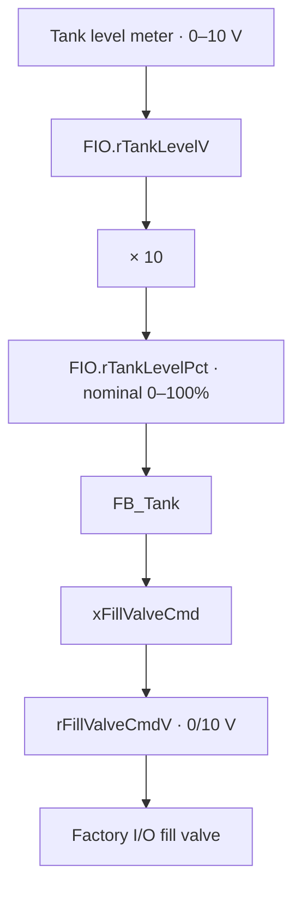

# System Architecture

## Software layers

| Layer | Responsibility |
|---|---|
| Factory I/O 2.5.10 | Simulated plant, sensors, actuators, operator panel, and lifecycle signals |
| CODESYS V3.5 SP22 Patch 3 | Deterministic control logic on Control Win V3 x64 |
| Kepware | Shared OPC namespace and transport layer |
| Ignition Perspective | Responsive supervision, status, and operator requests |

CODESYS runs `PLC_PRG` from `MainTask` every `20 ms` at priority `1`.

## CODESYS organisation

| Object | Responsibility |
|---|---|
| `PLC_PRG` | Integration, signal scaling, FB calls, I/O publication, and final output interlock |
| `FB_OperatorControl` | Start latch, Auto/Stop/E-stop processing, reset acknowledgement, and panel lights |
| `FB_PlantCoordinator` | End-to-end batch/reservation/storage transaction |
| `FB_RackManager` | 54-slot inventory, reservation, commit, and recovery quarantine |
| `FB_Storage` | Conveyor and stacker-crane sequence |
| `FB_Tank` | Fill/discharge state machine, setpoints, and tank fault supervision |
| `FIO` | Qualified global I/O and public diagnostic namespace |
| `SCADA` | Three momentary Ignition request tags |

## Data ownership

### Factory I/O to PLC

Physical feedback includes operator controls, lifecycle state, tank level, tank high-high, container detection, fork positions, motion status, and load-beam status.

### PLC to Factory I/O

The PLC owns valve voltages, emitters, conveyors, crane commands, panel lights, and stack lights.

### Ignition to PLC

Ignition writes only:

```text
Application.SCADA.xStartReq
Application.SCADA.xStopReq
Application.SCADA.xResetReq
```

`PLC_PRG` supplies each request to `FB_OperatorControl` and clears it on the same scan. Perspective uses One-Shot Button components, so the command model is request/acknowledge rather than a maintained HMI bit.

All `FIO` tags in the supplied recovery import are marked read-only in Ignition. This prevents accidental HMI writes to PLC-owned status and output tags while leaving Factory I/O and CODESYS communication unaffected.

## Analogue tank chain



The active setpoints supplied by `PLC_PRG` are:

- Fill complete: `80%`
- Empty/discharge complete: `5%`
- Fill timeout: `2 minutes`
- Discharge timeout: `2 minutes`

The present calculation is a direct `rTankLevelV × 10` conversion with no clamp, range plausibility test, or explicit OPC-quality check inside the PLC.

## Plant state machine

| Value | State | Purpose |
|---:|---|---|
| 0 | `Stopped` | Known non-running state |
| 10 | `Idle` | Ready to begin a transaction |
| 20 | `ReservingSlot` | Requests the next free rack slot |
| 30 | `WaitingForBatch` | Starts/waits for tank batch production |
| 40 | `DischargingBatch` | Transfers product into the container |
| 50 | `StoringProduct` | Runs the material-handling sequence |
| 60 | `CommittingInventory` | Changes reservation to occupied |
| 70 | `WaitingForStorageComplete` | Completes the storage handshake |
| 900 | `Faulted` | Transaction stopped by a fault/recovery condition |

Normal cycle:

```text
Stopped → Idle → ReservingSlot → WaitingForBatch → DischargingBatch
        → StoringProduct → CommittingInventory
        → WaitingForStorageComplete → Idle
```

## Tank state machine

| Value | State |
|---:|---|
| 0 | `Stopped` |
| 10 | `Idle` |
| 20 | `Filling` |
| 30 | `BatchReady` |
| 40 | `Discharging` |
| 100 | `Faulted` |

`Stopped` evaluates the real level and enters `BatchReady` if the tank is already at or above 80%; otherwise it enters `Idle`. Fill and discharge commands are mutually interlocked.

## Storage state machine

| Value | State |
|---:|---|
| 0 | `Stopped` |
| 10 | `Idle` |
| 20 | `ReceivingProduct` |
| 30 | `ExtendingToLoad` |
| 40 | `LiftingProduct` |
| 50 | `RetractingWithProduct` |
| 60 | `MovingToRack` |
| 70 | `ExtendingToRack` |
| 80 | `LoweringProduct` |
| 90 | `RetractingAfterDeposit` |
| 100 | `ReturningHome` |
| 110 | `Complete` |
| 900 | `Faulted` |

Active movement timings are `1.5 s` lift, `1.5 s` lower, and a `2 minute` step timeout.

## Rack inventory model

| Value | Slot state |
|---:|---|
| 0 | `Free` |
| 10 | `Reserved` |
| 20 | `Occupied` |
| 900 | `Unknown` |

There are 54 slots. An unused reservation is returned to `Free` during reset. A reservation that may contain physical product is quarantined as `Unknown` rather than being silently reused.

## Final output interlock

`PLC_PRG` removes all process, motion, and material-handling commands when any of these is active:

- Emergency active
- Reset required
- Plant fault
- Recovery required

The numerical crane target is set to zero and all Boolean/analogue process commands are removed. Panel and stack indication lights remain available to communicate the stopped/fault condition. This software interlock supports safe simulation behaviour but is not a substitute for a safety PLC or hardwired safety circuit.
