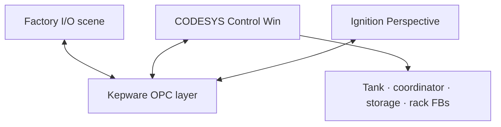

# Project 09 – SCADA Tank and Sorting Plant

A responsive Ignition Perspective SCADA layer for the Project 08 batch-production and automated-storage control system. CODESYS controls an analogue tank, container transfer conveyors, a 54-position rack manager, and a numerical stacker crane in Factory I/O. Kepware supplies the shared OPC data layer.

## What this project demonstrates

- IEC 61131-3 Structured Text organised into function blocks and state machines.
- Analogue `0–10 V` tank level measurement and valve commands.
- Transactional rack reservation and commit handling.
- Fault latching, timeout supervision, recovery acknowledgement, and safe output inhibition.
- Kepware connectivity between CODESYS, Factory I/O, and Ignition.
- Responsive desktop/mobile Perspective views with one-shot operator commands.
- Cross-layer troubleshooting from the physical simulation through OPC to the HMI.

## Architecture



The CODESYS export is the authoritative control model. Factory I/O maps physical sensors and actuators to `Application.FIO`. Ignition reads status from `[Sample_Tags]FIO` and writes only three momentary requests through `[Sample_Tags]SCADA`.


## Repository contents

```text
09-SCADA-tankAndSortingPlant/
├── CODESYS/
│   ├── 09-SCADA-tankAndSortingPlant.codesys.export
│   └── source/                       # Readable ST extracted from the export
├── FactoryIO/
│   └── 09-SCADA-tankAndSortingPlant.fixed.factoryio
├── Ignition/
│   ├── 09-Ignition-Perspective-project.fixed.zip
│   └── 09-Ignition-core-tags.json
├── Documentation/
```

## Quick start

1. Import the CODESYS export, build it, download it to CODESYS Control Win, and put `Application` into Run.
2. In Kepware, use channel `Project8` and device `SCADATankAndSortingPlant`, with symbols browsed from the running CODESYS application. A Kepware project/export is not included in this package.
3. Open the corrected Factory I/O scene and connect its `OPC Client DA/UA` driver to `PTC.KepwareServer`.
4. Import the Ignition Perspective project.
5. Ensure the Ignition OPC UA connection is named `SCADA` and the tag provider is `Sample_Tags`.
6. Import `09-Ignition-core-tags.json` at the `Sample_Tags` provider root.
7. Run Factory I/O, select Auto locally, acknowledge Reset, and press Start.

Detailed instructions and acceptance checks are in [COMMISSIONING-AND-TEST.md](Documentation/COMMISSIONING-AND-TEST.md).

## Expected tank behaviour

While the tank state is `Filling`:

| Signal | Expected value |
|---|---:|
| `FIO.xFillValveCmd` | `TRUE` |
| `FIO.rFillValveCmdV` | about `10.0 V` |
| `FIO.rTankLevelV` | rising from `0.0 V` |
| `FIO.rTankLevelPct` | `rTankLevelV × 10` |

At approximately `8.0 V / 80%`, the state changes to `BatchReady` and the fill-valve command returns to `0.0 V`. This is the nominal range: the current PLC calculation is not clamped and does not perform analogue plausibility checking.

## Documentation

- [System architecture and state machines](Documentation/ARCHITECTURE.md)
- [Factory I/O and OPC mapping](Documentation/IO-MAP.md)
- [Commissioning and test plan](Documentation/COMMISSIONING-AND-TEST.md)
- [Faults and recovery](Documentation/FAULTS-AND-RECOVERY.md)

## Scope and limitations

This is a local learning/portfolio system, not a production or safety-rated control system. The HMI does not replace hardwired safety functions. The current archive has no Perspective Alarm Status Table, Alarm Journal, or historian trend view; fault indication is derived from published PLC states and Boolean diagnostics. Authentication and role-based control restrictions would also be required before production deployment.
