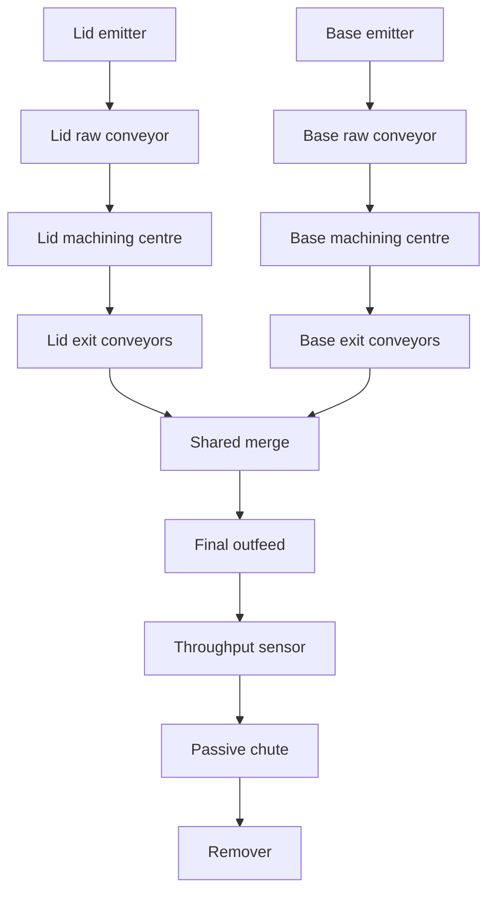
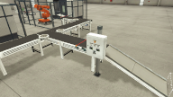
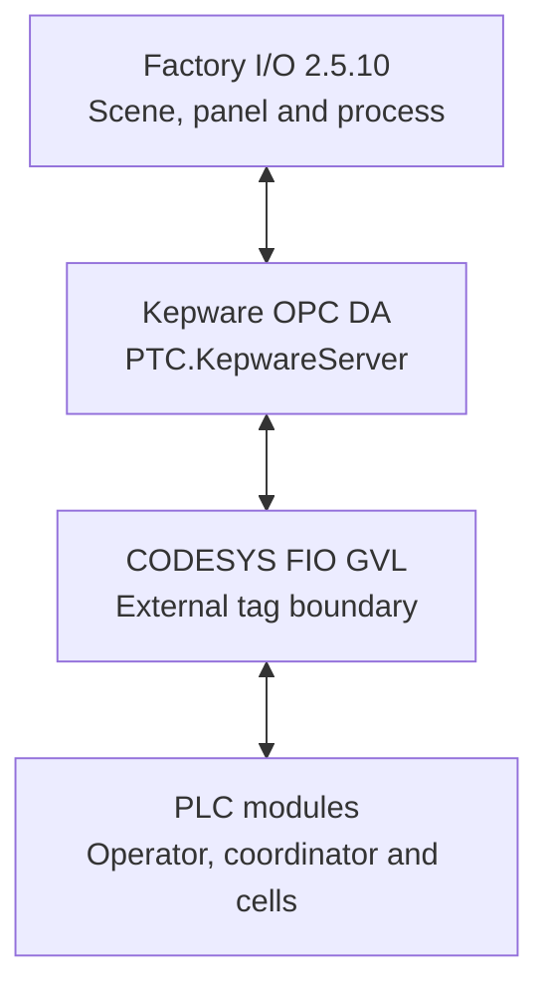

# System Overview

## Purpose

`twinCellBalancedProduction` models a small manufacturing area in which two parallel machining centres create complementary parts: one lid and one base per coordinated production request. The central control problem is not simply to run both machines; it is to keep their output matched when one cell completes before the other and both streams later share an outfeed.

The implementation separates operator control, pair coordination, equipment sequencing and external I/O. This makes the project suitable for demonstrating the structure expected in a larger industrial control application rather than a single monolithic sequence.

## Functional requirements

The supplied logic is designed to meet these requirements:

1. Produce lids and bases in matched pairs.
2. Start a pair only when both machining cells are ready and their exits are clear.
3. Allow either cell to finish first without losing its completion acknowledgement.
4. Prevent a new pair until both cells have returned ready continuously for two seconds, providing timed merge clearance.
5. Provide Auto, Start, Stop, Reset and emergency-stop operation from the Factory I/O panel.
6. Complete the active pair during a routine stop, then drain it through the final sensor before disabling.
7. Remove plant enable immediately for an emergency-stop condition; locally interlock a faulting cell in its detection scan, propagate the plant-wide equipment-fault stop on the following nominal 20 ms scan, and require a deliberate reset.
8. Detect missing material, missing pickup, missing exit arrival and blocked-exit conditions with timeouts.
9. Maintain lid, base, completed-pair and final-part totals for online PLC diagnosis, with the cell and final counts mapped to scene displays.
10. Exchange all scene data through a named `FIO` boundary rather than referencing external tags throughout the control modules.

## Material flow

The Factory I/O scene contains seven powered belt-conveyor sections: two raw-feed sections, four cell-exit sections and one shared exit section. The two side streams converge onto the shared conveyor; a passive chute then transfers the combined stream into the remover.

## Scene inventory

### Saved Factory I/O preview

The scene file contains this 192 × 108 preview image. It is retained as source evidence rather than enlarged; a native high-resolution scene capture would be the next useful portfolio asset.

| Functional area | Supplied scene components |
| --- | --- |
| Processing | 2 identical machining-centre prefabs; the PLC passes `xProduceLids := TRUE` to the lid-cell instance and `FALSE` to the base-cell instance |
| Material supply | 2 emitters and 2 raw-feed belt conveyors |
| Cell outfeed | 4 belt conveyors, two per machining cell |
| Merge and removal | 1 shared belt conveyor, 1 chute conveyor, 1 remover and guide hardware |
| Detection | 5 retroreflective photoelectric sensors with mirrors: lid entry, base entry, lid exit, base exit and final removal count |
| Operator interface | Emergency stop, Auto/Manual selector, Start, Stop and Reset pushbuttons with lamps |
| Indication | Five digital displays for local cell counts, panel counts and total final throughput |
| Navigation | Nine saved camera positions |

Passive guide and structural objects—including four wheel aligners, the switchboard, column and sensor mounts—add no controller I/O.

Both emitters are saved for blue raw material with a one-to-two-second emission interval, no position or orientation randomisation, and `UpTo = 0`. PLC output commands still determine when each emitter is enabled.

## Control and communications stack

| Layer | Supplied configuration |
| --- | --- |
| Engineering environment | CODESYS V3.5 SP22 Patch 3 |
| PLC runtime | CODESYS Control Win V3 x64, device version 3.5.22.30 |
| PLC language | IEC 61131-3 Structured Text |
| PLC scheduling | `MainTask`, cyclic 20 ms, priority 1, watchdog disabled |
| Standard IEC blocks | `TON`, `TP` and `R_TRIG` |
| OPC server | `PTC.KepwareServer` |
| Saved OPC namespace | `Channel2.project10.Application.FIO.*` |
| Simulation | Factory I/O 2.5.10 scene saved 12 August 2026 |

## Production accounting

The application uses three related but independent counts:

| Count | Increment condition | Intended relationship |
| --- | --- | --- |
| Lid count | Lid cell first detects its finished part at the cell exit | Equals base count after each complete coordinated pair |
| Base count | Base cell first detects its finished part at the cell exit | Equals lid count after each complete coordinated pair |
| Pair count | Coordinator sees both cell `Done` signals | `pairs = lids = bases` once both cell counts have updated |
| Total final parts | Final beam changes from clear to blocked | `total parts = pairs × 2` after both parts reach removal |

The final counter uses an `R_TRIG` after the clear-beam-high signal is inverted. A stationary part therefore increments the total once rather than on every PLC scan.

## System boundaries

Included:

- Automatic balanced production.
- Routine controlled stop.
- Simulated emergency-stop handling.
- Latched cell and coordinator faults.
- Reset and counter clearing.
- Scene-mounted controls and indication.
- OPC DA exchange through Kepware.

Not included:

- Manual jog or maintenance controls; Manual is currently an inhibit state.
- Safety PLC logic or a hardware safety circuit.
- Communications-quality watchdog and dedicated comms-loss alarm.
- Persistent production totals, recipes, alarm history or reject handling.
- Zone-by-zone outfeed control.
- Commissioning on real machinery.

## Source snapshot

The repository uses clean filenames while preserving the supplied bytes:

| Repository file | Supplied attachment | SHA-256 |
| --- | --- | --- |
| `CODESYS/twinCellBalancedProduction.export` | `twinCellBalancedProduction(1).export` | `da5e7a3171df24ec1ac6fc55bb46f4bd3df87530dc032802f52983b2792a70bd` |
| `FactoryIO/twinCellBalancedProduction.factoryio` | `twinCellBalancedProduction(2).factoryio` | `077f0b65e1c53a1f9b2e3da6bd477a19f8d2fc302f287f91ec9ddf61f34492d5` |

The numbered download suffixes are not retained in the repository names.

[Back to the project README](../README.md)
