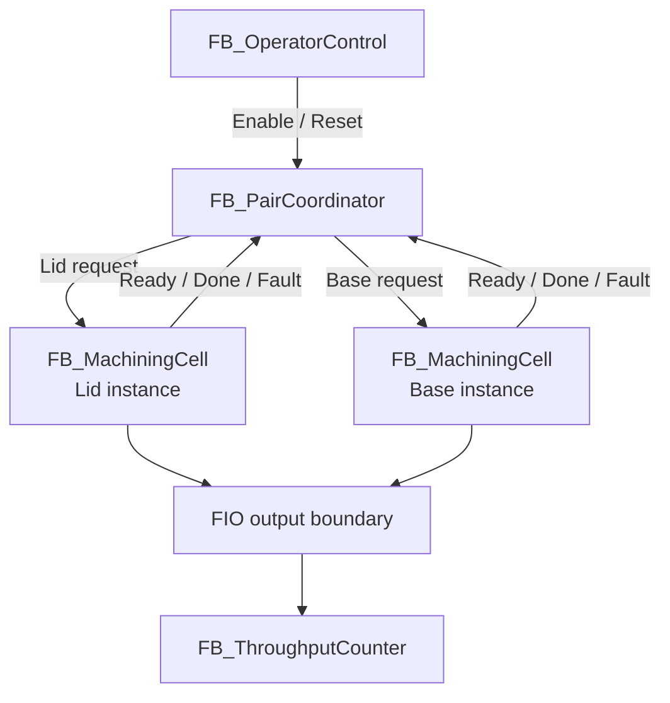
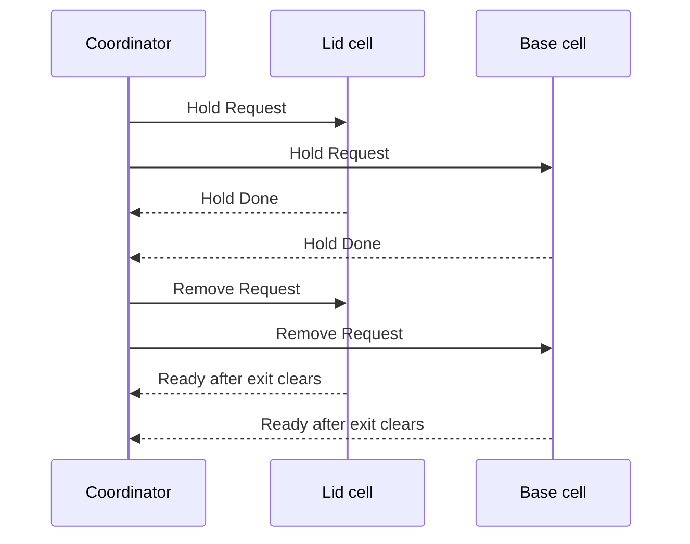

# Control Architecture

## Design approach

The application is divided by responsibility:

- The operator layer decides whether automatic operation is permitted.
- The coordinator decides when a matched pair may be requested.
- Each equipment module controls one machining cell.
- The program boundary translates internal commands and active-low scene signals.
- A separate counter records parts reaching the remover.

This separation prevents operator logic, equipment sequencing and OPC tag names from becoming interdependent.

## Program objects

| Object | Type | Responsibility |
| --- | --- | --- |
| `PLC_PRG` | Program | Calls the modules in a fixed order, aggregates faults and maps internal commands to `FIO` |
| `FB_OperatorControl` | Function block | Validates Auto mode; edge-detects Start, Stop and Reset; manages run, stop-pending and reset-required latches |
| `FB_PairCoordinator` | Function block | Starts both cells together, waits for both completions and supervises merge clearance |
| `FB_MachiningCell` | Function block | Runs one feed–pickup–process–exit sequence with timeouts and a count |
| `FB_ThroughputCounter` | Function block | Counts the leading edge of a final part-detection signal |
| `E_MachiningCellState` | Enum | Defines the seven equipment states and their online numeric values |
| `E_PairCoordinatorState` | Enum | Defines the five pair-coordination states and their online numeric values |
| `FIO` | Qualified GVL | External Factory I/O / OPC interface |
| `Commands` | Qualified GVL | Temporary Start, Stop and Reset commands for a watch list or future HMI |

## Module relationship

The same `FB_MachiningCell` implementation is instantiated as `fbLidsCell` and `fbBasesCell`. The `xProduceLids` parameter is `TRUE` for the lid instance and `FALSE` for the base instance, avoiding two near-duplicate equipment modules.

## PLC scan order

`PLC_PRG` executes in this order every 20 ms:

1. Aggregate the cell and coordinator fault values available from the previous scan.
2. Preserve whether a recovery reset was required before the current 500 ms reset pulse.
3. Evaluate the controlled-stop outfeed-clearance timer.
4. Execute `fbOperator`.
5. Execute `fbCoordinator`.
6. Execute `fbLidsCell`.
7. Execute `fbBasesCell`.
8. Execute `fbThroughputCounter`.
9. Refresh the aggregate plant fault from the equipment values produced this scan.
10. Map internal commands, counters and lamps to `FIO` outputs.

This order has two intentional one-scan effects:

- A new cell fault is consumed by the coordinator on the following scan, a maximum nominal delay of 20 ms.
- The coordinator reads the cells' previous-scan `Ready` and `Done` values. Because these acknowledgements are held states rather than one-scan pulses, they cannot be missed.

## Operator-control layer

`FB_OperatorControl` uses three `R_TRIG` instances and a 500 ms `TP`:

| Function | Implementation |
| --- | --- |
| Mode validation | Auto must be `TRUE` while Manual is `FALSE` |
| Start | Rising edge latches Run only when Factory I/O is running, not paused, no reset is required and no stop is pending |
| Routine stop | Rising edge normally sets `xStopPending`; Run clears after the pending-stop clearance becomes safe |
| Reset | Rising edge clears Run, Stop Pending and Reset Required; it does not start the plant |
| Emergency stop | Clears Run immediately and sets Reset Required |
| Plant fault | Clears Run and sets Reset Required |
| Enable | Run latched AND valid Auto AND simulation running AND not paused AND no emergency/fault/reset requirement |

Command priority is deterministic: emergency stop, Reset, plant fault, invalid mode, Stop, completion of a pending stop and finally Start.

## Pair-coordination handshake

The coordinator only leaves `Ready` when both `xLidsReady` and `xBasesReady` are true and `xAllowNewPair` is true. It then asserts both request outputs for the complete `WaitPairComplete` state.

Each cell asserts `xDone` throughout its `Complete` state. The faster cell therefore waits without producing another item. When the coordinator has seen both acknowledgements, it enters `MergeClearance`, which removes both requests together. The cells return to `Ready` only after their own exit sensor is clear. Once both are ready, a two-second TON establishes clear merge spacing before the next pair.

## Equipment-module outputs

Every scan, `FB_MachiningCell` first assigns known defaults. State logic may then enable the raw conveyor and machining-centre Start command. A final interlock is evaluated after the state machine:

- When `xEnable = FALSE` or the cell is faulted, raw conveyor and Start are forced off.
- Stop is asserted while disabled or faulted, except during Reset.
- During Reset, Start and Stop are both off and Reset is asserted.

This second output layer prevents a state-programming mistake from bypassing the equipment enable or fault condition.

## External I/O boundary

Internal state-machine variables do not directly depend on full OPC item paths. `PLC_PRG` maps them to the qualified `FIO` GVL at the end of the scan. Raw active-low signals are normalised when passed into the modules:

| Raw scene signal | Internal interpretation |
| --- | --- |
| `FIO.xLidsAtEntry` | Inverted to make `xAtEntry = TRUE` when the lid breaks the beam |
| `FIO.xBasesAtEntry` | Inverted to make `xAtEntry = TRUE` when the base breaks the beam |
| `FIO.xLidsAtExit` / `xBasesAtExit` | Inverted to make exit occupancy true |
| `FIO.xTotalPartsAtRemoval` | Inverted before edge detection |
| `FIO.xTwinCellEmergencyStop` | Inverted: raw true is released/healthy, internal true is emergency active |
| `FIO.xTwinCellStopPB` | Inverted because the Stop device is treated as normally closed |

## Timers and standard blocks

| Instance | Type | Purpose | Supplied setting |
| --- | --- | --- | --- |
| `fbFeedTimeout` | `TON` | Raw part must reach cell entry | 15 s per instance call |
| `fbPickupTimeout` | `TON` | Machining centre must assert Busy after Start | 15 s |
| `fbProcessTimeout` | `TON` | Finished part must reach the cell exit | 90 s per instance call |
| `fbExitClearTimeout` | `TON` | Cell exit must clear after completion | 10 s |
| `fbMergeClearance` | `TON` | Both cells must remain ready before another pair | 2 s |
| `fbStopOutfeedClearance` | `TON` | Final beam must be clear before controlled stop completes | 2 s |
| `fbResetPulse` | `TP` | Extends Reset across OPC communication | 500 ms |
| `fbDetectedEdge` | `R_TRIG` | Counts one final part-detection edge | One PLC scan |

The default `tProcessTimeout` declared inside `FB_MachiningCell` is 30 seconds, but both calls in `PLC_PRG` override it to 90 seconds. The effective runtime value is therefore 90 seconds.

## Scheduler

| Property | Value |
| --- | --- |
| Task | `MainTask` |
| Type | Cyclic |
| Interval | 20 ms |
| Priority | 1 |
| Program | `PLC_PRG` |
| Watchdog | Disabled in the supplied export |

[Back to the project README](../README.md)
