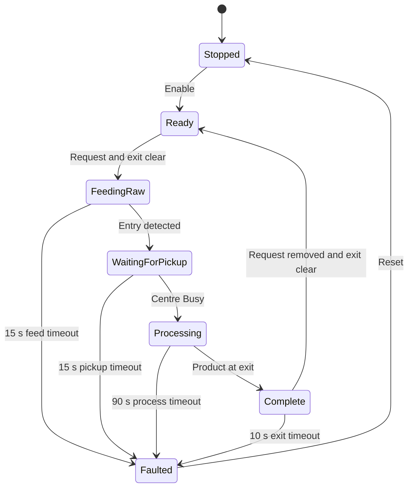
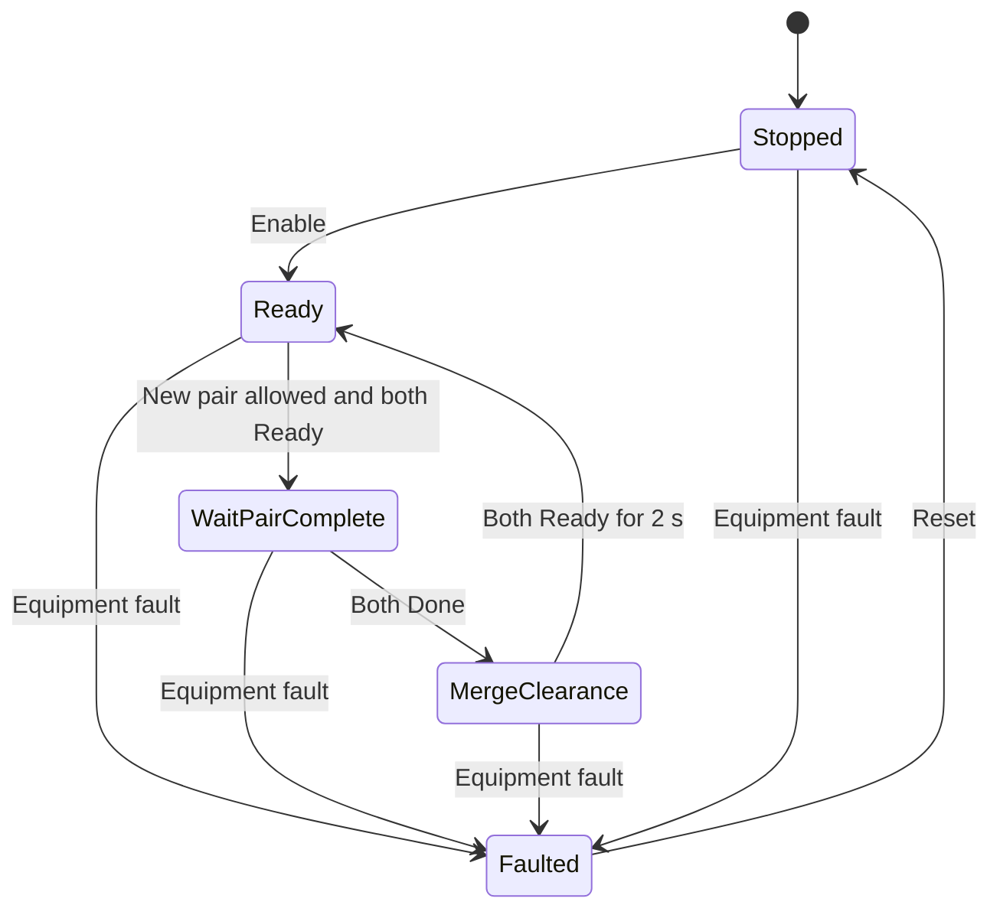
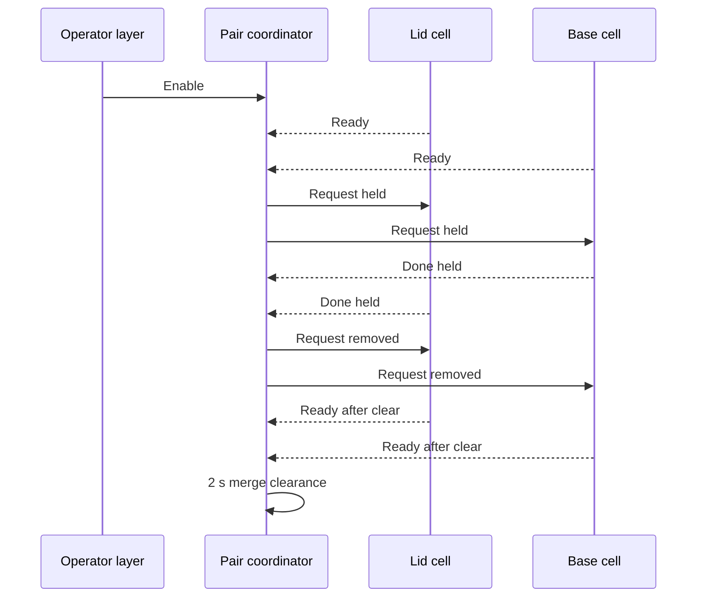

# Sequence and State Machines

## Operating prerequisites

Automatic production is enabled only when all of the following are true:

- Run has been latched by a Start edge.
- Auto is selected and Manual is not selected.
- Factory I/O reports Running.
- Factory I/O does not report Paused.
- The emergency-stop input is healthy.
- No cell or coordinator fault is active.
- Reset is not required.

At a cold start, `xResetRequired` is initialised `TRUE`. The operator must therefore establish a known state with Reset before Start can enable production.

## Normal operating sequence

1. **Reset** produces a 500 ms pulse, clears all three sequence modules and clears the production counters.
2. **Start** latches Run if the operating prerequisites are valid.
3. The coordinator moves from `Stopped` to `Ready`.
4. Each machining cell moves from `Stopped` to `Ready` when enabled.
5. When both cells report Ready and no controlled stop is pending, the coordinator asserts both requests.
6. Each cell feeds one raw blank, starts its machining centre and waits for a finished part at its exit.
7. The cell increments its own count once, then holds Done.
8. When both Done signals are present, the coordinator increments the completed-pair count and removes both requests.
9. Each cell waits for its exit to clear before returning Ready.
10. Both cells must remain Ready for the two-second merge-clearance time before the coordinator may admit another pair.
11. The final counter increments once for each lid and base that interrupts the removal beam.

## Machining-cell states

### Enum values

| State | Value | Purpose |
| --- | ---: | --- |
| `Stopped` | 0 | Known reset/startup state |
| `Ready` | 10 | Available for a request, provided the exit is clear |
| `FeedingRaw` | 20 | Moves one blank toward the entry detector |
| `WaitingForPickup` | 30 | Runs the feed and commands Start until the centre reports Busy |
| `Processing` | 40 | Waits for the finished part at the exit |
| `Complete` | 50 | Holds Done until Request is removed and the exit clears |
| `Faulted` | 900 | Latched safe state until Reset |

### State diagram

An asserted machining-centre `HasError` signal can move the block to `Faulted` from any state. An unexpected enum value also faults. Reset has priority over both conditions.

### State actions and transitions

| State | Principal outputs | Normal transition | Fault supervision |
| --- | --- | --- | --- |
| `Stopped` | Safe defaults | Enable → `Ready` | Centre error → code 1 |
| `Ready` | `xReady := NOT xAtExit` | Request and Ready → `FeedingRaw` | Centre error → code 1 |
| `FeedingRaw` | Raw conveyor on | Entry occupied → `WaitingForPickup` | No entry within 15 s → code 101 |
| `WaitingForPickup` | Raw conveyor and Start on | Busy → `Processing` | No Busy within 15 s → code 102 |
| `Processing` | Centre continues its internal cycle | Exit occupied → increment count and enter `Complete` | No exit within 90 s → code 103 |
| `Complete` | Done held on | Request off and exit clear → `Ready` | Exit occupied for 10 s → code 104 |
| `Faulted` | Fault held; final interlock commands safe state | Reset → `Stopped` | Invalid state uses code 999 |

Timers are called every PLC scan but their `IN` conditions are state-specific. Disabling the plant makes the timer inputs false, so elapsed timeout values reset while the enum state itself remains frozen.

## Pair-coordinator states

### Enum values

| State | Value | Purpose |
| --- | ---: | --- |
| `Stopped` | 0 | Known reset/startup state |
| `Ready` | 10 | Waits for both cells and permission to start a new pair |
| `WaitPairComplete` | 20 | Holds both requests until both cells are Done |
| `MergeClearance` | 30 | Waits for both cells Ready and a two-second clearance |
| `Faulted` | 900 | Latched when either cell faults or the enum is invalid |

### State diagram

An equipment fault is evaluated before Enable and can therefore move the coordinator from any state, including `Stopped`, to `Faulted`. Reset still has priority. `xLidsRequest` and `xBasesRequest` are both true only while the coordinator is enabled, not faulted and in `WaitPairComplete`. This makes the requests level handshakes rather than pulses.

## Balanced-production handshake

The sequence remains balanced even if the base finishes substantially earlier than the lid. The base cannot accept a second request because its Done signal is held and the coordinator does not return to `Ready` until both sides have completed and cleared.

## Routine controlled stop

The Stop pushbutton is treated as a normally closed input. A Stop edge does not immediately de-energise a pair already in process:

1. `FB_OperatorControl` sets `xStopPending` if the process is not yet safe to stop.
2. `xAllowNewPair := NOT xStopPending` prevents the coordinator from admitting another pair.
3. Run remains latched, so the current lid and base can finish and all outfeed conveyors continue to run.
4. The coordinator must return to `Ready`.
5. The total final-part count must be at least `diPairsCompleted × 2`.
6. The final retroreflective beam must be clear.
7. Those conditions must remain true for two seconds.
8. `xSafeToStop` becomes true; Run and Stop Pending are cleared and `xEnablePlant` drops.

This is a production-controlled stop, not an emergency-stop function.

## Emergency stop and recovery

The scene's emergency-stop signal is healthy-high. `PLC_PRG` inverts it before passing it to `FB_OperatorControl`.

When an emergency is active:

- Run is cleared immediately.
- Stop Pending is cleared.
- Reset Required is latched.
- `xEnablePlant` becomes false.
- Each cell's final output interlock removes Start and raw-conveyor commands and asserts Stop.
- The reset pulse is blocked while the emergency remains active.

Recovery sequence:

1. Correct the cause and release the emergency stop.
2. Verify the simulation and OPC connection are healthy.
3. Press Reset; do not press Start simultaneously.
4. Confirm both cells and the coordinator report `Stopped`, faults are clear and counters are zero.
5. Press Start to begin a fresh pair.

Reset is intentionally separate from Start.

## Plant fault and recovery

Either cell fault makes `xPlantFaulted` true. The operator block clears Run and sets Reset Required, while the coordinator latches `Faulted`. The cell's numeric code identifies the initiating condition. Recovery requires correction of the physical/simulated cause followed by Reset.

The coordinator has no separate numeric fault code; it reports `xCoordinatorFaulted` and state 900 when a cell fault propagates or its own enum is invalid.

## Pause and resume

Factory I/O Pause makes `xEnablePlant` false but does not clear the Run latch. The equipment enum states remain frozen and the state timers reset because their enable conditions become false. When Pause is removed and all other prerequisites remain valid, the existing sequence state is enabled again.

Because the timer elapsed values restart after a pause, timeout evidence should be interpreted from continuous running time rather than wall-clock time across a pause.

## Mode changes during a cycle

Changing the Auto/Manual selector to Manual—or leaving both mode inputs equal—does not follow the controlled-stop path. The operator block clears Run and Stop Pending immediately without setting Reset Required. The cell and coordinator enum states remain retained, while their state timers reset because plant enable is removed. Returning to a valid Auto selection and pressing Start can therefore resume from the retained mid-cycle state rather than starting a fresh pair.

For routine production shutdown, use Stop and allow the controlled-stop sequence to finish. Use Reset before restarting whenever a known fresh sequence is required.

## Reset behaviour

The reset request may originate from:

- `Commands.xResetPB` in the CODESYS watch list or future HMI.
- Factory I/O's global Reset status.
- The scene-mounted Reset pushbutton.

The rising edge creates a 500 ms pulse. During that pulse:

- Both cell states return to `Stopped`.
- Cell fault codes and cell counters clear.
- Coordinator state, fault and pair counter clear.
- Final throughput clears.
- Start and Stop commands to each machining centre are suppressed while Reset is asserted.

`xRecoveryResetRequired` preserves the pre-reset requirement through the pulse. The PLC sends a Factory I/O scene-reset command only when recovery had actually been required, avoiding an unnecessary scene reset for every operator reset edge.

[Back to the project README](../README.md)
