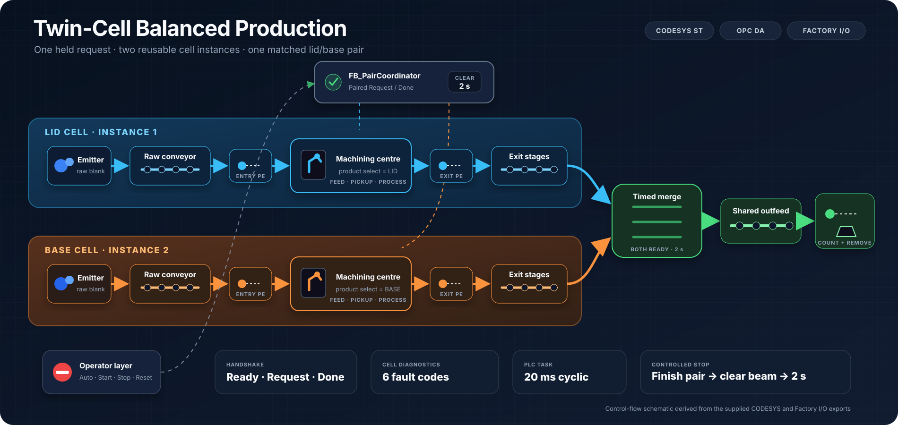
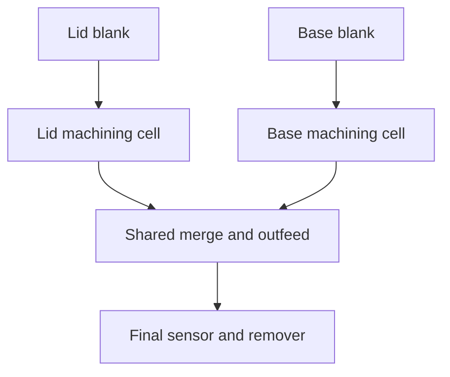

# Twin-Cell Balanced Production

A virtual twin-cell machining system developed in IEC 61131-3 Structured Text with CODESYS and Factory I/O. One reusable machining-cell function block controls parallel lid and base production, while a separate coordinator maintains a 1:1 output ratio, holds scan-safe request/done handshakes and prevents a new pair from entering until both cell exits are clear and a timed merge-clearance delay has expired.



`CODESYS` · `Structured Text` · `Factory I/O` · `Kepware` · `OPC DA` · `State machines`

## Project objective

The system must produce matching quantities of lids and bases through two independent machining centres without allowing the faster cell to start another cycle while its partner completes. It must also provide deterministic start, controlled stop, emergency-stop and fault-recovery behaviour through a scene-mounted operator panel.

## Engineering highlights

- Two parallel cells are controlled by two instances of the same `FB_MachiningCell`.
- A held `Request` / `Ready` / `Done` handshake coordinates matched production without relying on one-scan pulses.
- A dedicated `FB_OperatorControl` applies command priority, mode validation, run latching, reset handling and controlled stopping.
- Each machining cell has explicit enum states and four state-specific timeout checks.
- Per-cell, completed-pair and final-throughput counters provide three independent views of production.
- Active-low photoelectric, emergency-stop and stop-button signals are normalised at the program boundary.
- Reset is stretched to 500 ms so the command remains visible across the CODESYS–Kepware–OPC–Factory I/O path.
- The complete external interface is centralised in the qualified `FIO` global variable list.
- The supplied Factory I/O OPC DA configuration contains 53 mapped items.
- `PLC_PRG` runs in a 20 ms cyclic task.

## Process flow



Both cells must be ready before the coordinator requests a pair. The base may finish first, but its `Done` acknowledgement remains held until the lid also finishes. Requests are then removed together, both exits clear, and a two-second merge-clearance interval must expire before another pair is admitted.

## Control structure

| Object | Responsibility |
| --- | --- |
| `PLC_PRG` | Execution order, fault aggregation, FB calls and the external output boundary |
| `FB_OperatorControl` | Start/stop/reset edges, mode validation, run latch, controlled stop and interlocks |
| `FB_PairCoordinator` | Simultaneous cell requests, pair acknowledgement and merge clearance |
| `FB_MachiningCell` | Reusable per-cell sequencing, timeout supervision, counting and diagnostics |
| `FB_ThroughputCounter` | One-shot count when a part interrupts the final photoelectric beam |
| `FIO` | Qualified OPC-facing global interface |
| `Commands` | Temporary watch-list or future HMI commands |

## Operator sequence

1. Run the Factory I/O simulation, release the emergency stop and confirm the normally closed Stop input is healthy.
2. Select **Auto**.
3. Press **Reset** to establish a known stopped state and clear the reset requirement.
4. Press **Start** to latch automatic production.
5. Press **Stop** for a controlled stop: the active pair finishes, reaches the final sensor and clears the outfeed before the plant disables.
6. Use the emergency stop for an immediate software stop. Release it and press **Reset** before restarting.

## Documentation

| Document | Contents |
| --- | --- |
| [System overview](Documentation/01-System-Overview.md) | Requirements, material flow, scene inventory, software stack and boundaries |
| [Control architecture](Documentation/02-Control-Architecture.md) | Program objects, scan order, handshakes, interlocks and output design |
| [Sequence and state machines](Documentation/03-Sequence-and-State-Machines.md) | Cell/coordinator states, nominal sequence, stop, pause and reset behaviour |
| [I/O and OPC tag map](Documentation/04-IO-and-OPC-Tag-Map.md) | All 53 saved OPC items, data flow, polarity and mapping observations |
| [Commissioning and testing](Documentation/05-Commissioning-and-Testing.md) | Setup procedure, signal proving and acceptance-test record |
| [Engineering review](Documentation/06-Engineering-Review.md) | Design decisions, limitations, known issues and improvement roadmap |

## Quick start

1. Import [the CODESYS export](CODESYS/twinCellBalancedProduction.export) using CODESYS V3.5 SP22 Patch 3 or a compatible installation.
2. Verify the `CODESYS Control Win V3 x64` device and the 20 ms `MainTask`, then compile, log in and run the application.
3. Confirm Kepware exposes the `Application.FIO` symbols beneath `Channel2.project10`.
4. Open [the Factory I/O scene](FactoryIO/twinCellBalancedProduction.factoryio).
5. Select the OPC Client DA driver, connect to `PTC.KepwareServer` and verify good quality for all required items.
6. Put Factory I/O into Run, release the emergency stop, confirm Stop is released, select Auto, press Reset and then Start.

The CODESYS export retains the original workstation's machine-specific runtime identity, so rescan and select the intended target when opening it on another PC. No fixed IP address is stored. Kepware, namespace and network settings remain installation-specific; see the [commissioning guide](Documentation/05-Commissioning-and-Testing.md) before changing the saved OPC namespace.

V1 control caveat: Stop is edge-detected rather than held as a run permissive. Keep the Stop signal healthy before Reset or Start and review the [confirmed limitation](Documentation/07-Engineering-Review.md) before adapting this logic.

## Supplied versions

| Component | Supplied configuration |
| --- | --- |
| Factory I/O | Scene version 2.5.10 |
| CODESYS profile | V3.5 SP22 Patch 3 |
| Runtime device | CODESYS Control Win V3 x64 3.5.22.30 |
| Communications | Factory I/O OPC Client DA through Kepware |
| OPC server | `PTC.KepwareServer` |
| Saved namespace | `Channel2.project10.Application.FIO.*` |
| PLC task | Cyclic, 20 ms, priority 1 |

## Repository layout

```text
twinCellBalancedProduction/
├── README.md
├── CODESYS/
│   └── twinCellBalancedProduction.export
├── FactoryIO/
│   └── twinCellBalancedProduction.factoryio
└── Documentation/
    ├── 01-System-Overview.md
    ├── 02-Control-Architecture.md
    ├── 03-Sequence-and-State-Machines.md
    ├── 04-IO-and-OPC-Tag-Map.md
    ├── 05-Commissioning-and-Testing.md
    ├── 06-Engineering-Review.md
    └── Images/
        ├── factory-io-overview.png
        └── system-layout.svg
```

## Skills demonstrated

IEC 61131-3 Structured Text, reusable function blocks, enum-based state machines, industrial handshakes, parallel equipment coordination, PLC scan-cycle awareness, `TON` / `TP` / `R_TRIG`, latched diagnostics, controlled stopping, active-low signal handling, centralised I/O abstraction, Kepware/OPC DA integration and virtual commissioning.

## Scope and safety note

This is a virtual-commissioning portfolio project. Its emergency-stop behaviour is software simulation logic, not a safety-rated circuit or validated safety function. The supplied project has not been commissioned on physical machinery.
