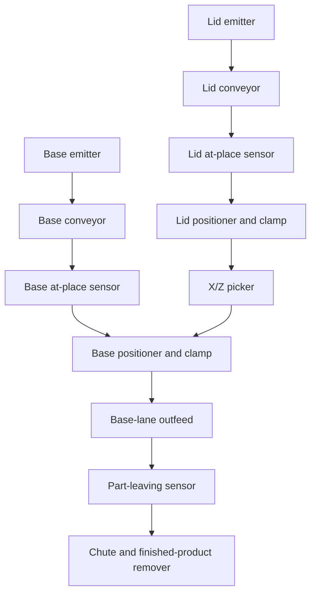
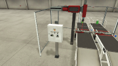
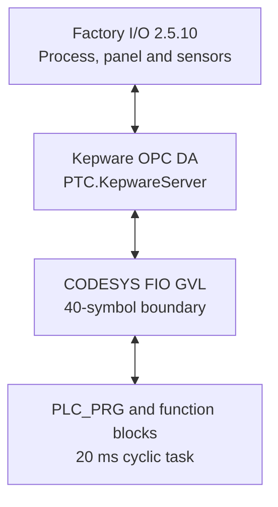

# System Overview

## Purpose

`assemblyAndPackoutCell` models a compact automated station that combines one lid and one base. Two conveyors present the parts independently, positioning bars clamp them, and an X/Z pick-and-place unit moves the lid across to the base. The assembled product then exits on the base lane and produces one downstream count.

The project extends beyond a timed pick-and-place demonstration: most sequence transitions depend on feedback from presence, clamp, gripper, motion or positioner signals, and failures are assigned state-specific diagnostic codes.

## Functional intent

The supplied logic is designed to:

1. Feed lids and bases independently until both assembly positions are occupied.
2. Clamp both parts before permitting gantry movement.
3. Return the picker to its default raised position before admitting a new assembly cycle.
4. Lower onto the lid, confirm pickup, release the lid clamp and raise clear.
5. Transfer across the X axis, lower onto the base and release the lid after a controlled dwell.
6. Raise and return the picker before releasing the base clamp.
7. Raise the base positioner and convey the combined product to the leaving sensor.
8. Count one product per leaving-sensor rising edge.
9. Request a controlled production stop at a software-defined completion boundary.
10. Detect feed, clamp, pickup, axis and base-positioner failures with timers and numeric codes.
11. Exchange all scene data through the named `FIO` global variable list.

The current implementation does not verify the quality of the lid-to-base join and does not perform boxing, labelling or palletising. Those boundaries are documented in the [engineering review](07-Engineering-Review.md).

## Material flow

The lid and base lanes are physically parallel. The X command selects the base side when true and the lid/home side when false; the Z command selects lowered when true and raised when false. The base lane is the normal finished-product route. The second chute/remover sits on the lid lane and is named as an unused-lid remover in the PLC interface.

## Scene inventory

### Saved Factory I/O preview

The `.factoryio` file contains this 192 × 108 preview. It is retained at its native size as source evidence rather than artificially enlarged; a new high-resolution scene capture would be a useful future portfolio addition.

| Functional area | Supplied scene components |
| --- | --- |
| Handling | 1 two-axis pick-and-place unit with X/Z movement status and vacuum gripper |
| Material supply | 2 emitters and 2 four-metre belt conveyors |
| Positioning | 2 right-bar positioners with clamp commands and clamp feedback |
| Detection | 3 diffuse photoelectric sensors: lid at place, base at place and part leaving |
| Outfeed | 2 passive chute conveyors and 2 removers |
| Operator interface | Start, Stop and Reset pushbuttons with lamps; emergency stop; Auto/Manual selector |
| Indication | 1 integer digital display for completed-product count |
| Structure | Electric switchboard, column, 3 metal-corner guides and 6 grouped safeguards |
| Navigation | 5 saved camera positions |

The scene contains 31 objects. Its physical I/O definitions comprise 18 binary inputs, 20 binary outputs and 1 integer output. Thirty-two of those 39 physical points are used by the saved OPC map; the remaining seven are reserved gantry-rotation points and the unused lid-positioner limit feedback.

## Saved material configuration

| Property | Lid emitter | Base emitter |
| --- | --- | --- |
| Enabled part variants | Blue and green product lids | Blue and green product bases |
| Minimum / maximum interval | 1 s / 2 s | 1 s / 2 s |
| `UpTo` | 0 | 0 |
| Random position | False | False |
| Random orientation | False | False |

There is no colour-sensing input or recipe logic. The PLC therefore coordinates one lid and one base but does not require their colours to match.

## Control and communications stack

| Layer | Supplied configuration |
| --- | --- |
| Engineering environment | CODESYS V3.5 SP22 Patch 3 |
| PLC runtime | CODESYS Control Win V3 x64, device version 3.5.22.30 |
| PLC language | IEC 61131-3 Structured Text |
| Scheduling | `MainTask`, cyclic 20 ms, priority 1, watchdog disabled |
| External tag list | 40 variables in `FIO`, all selected for symbol access |
| OPC bridge | Kepware with saved namespace `Channel2.project11.Application.FIO.*` |
| Factory I/O driver | OPC Client DA using `PTC.KepwareServer` |

The CODESYS Symbol Configuration records `SupportOPCUA = TRUE`, which indicates symbol support; it does not establish that an OPC UA server is configured or active. The supplied Factory I/O integration uses OPC DA through Kepware.

## System boundaries

### Included

- Automatic infeed, positioning and assembly sequencing.
- Start, controlled Stop, Reset, Auto selection and emergency-stop simulation.
- Cell command generation and state-specific timeout diagnostics.
- Product counting at the downstream sensor.
- Complete saved Factory I/O OPC DA map.

### External or not implemented

- The Kepware project and its device configuration.
- OPC quality, heartbeat and message-age supervision.
- Safety-rated emergency-stop, guarding and safe-motion functions.
- Product-join quality inspection and colour matching.
- Box, label, pallet or warehouse packout operations.
- Manual/jog/maintenance movement.
- Published HMI diagnostics for state, fault code, Run or Stop Pending.

[Back to the project README](../README.md)
