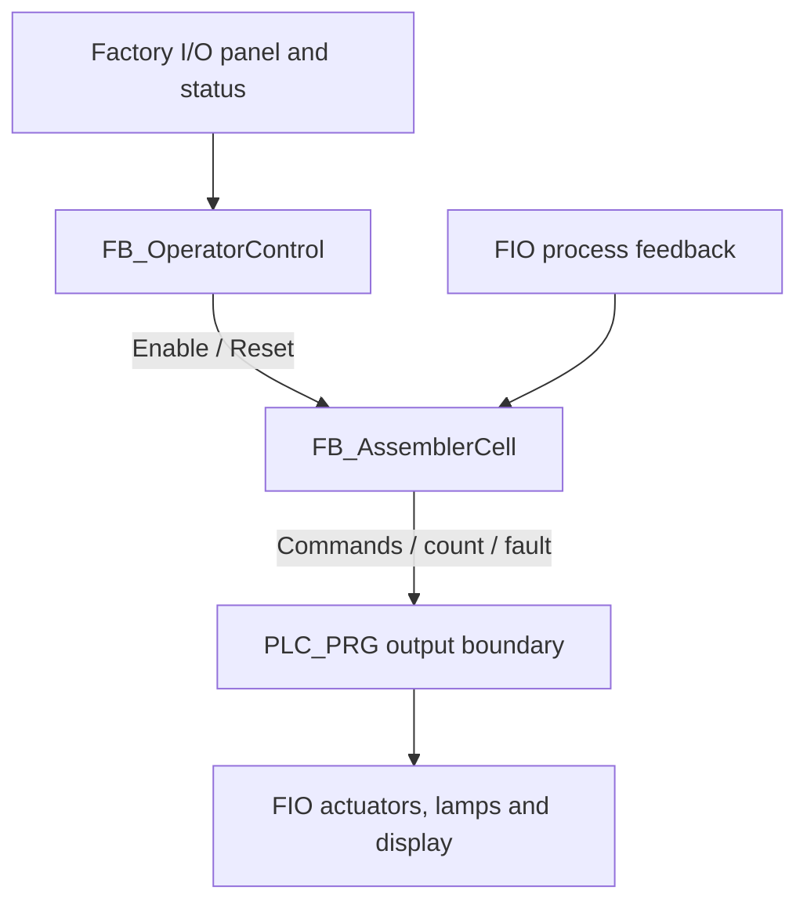

# Control Architecture

## Design approach

The application separates three concerns:

- `FB_OperatorControl` decides whether automatic execution is permitted.
- `FB_AssemblerCell` owns the equipment sequence, commands, timers, count and numeric fault code.
- `PLC_PRG` defines execution order, converts external signal polarity and maps internal commands to the `FIO` boundary.

This keeps full OPC item paths out of the state machine and avoids mixing operator-latch logic with equipment transitions.

## Program objects

| Object | Type | Responsibility |
| --- | --- | --- |
| `PLC_PRG` | Program | Executes modules, samples plant fault status and writes all scene outputs |
| `FB_OperatorControl` | Function block | Edge-detects commands, validates Auto, manages Run, Stop Pending and Reset Required |
| `FB_AssemblerCell` | Function block | Executes the complete assembly sequence and assigns cell fault codes |
| `E_AssemblerState` | Enum | Defines 16 normal/fault states with stable online values |
| `AssemblyConstants` | Constant GVL | Stores the seven supplied time settings |
| `FIO` | GVL | Holds all 40 Factory I/O / OPC values |
| `Commands` | GVL | Provides temporary Start, Stop and Reset watch-list commands |

The GVL declarations do not contain `{attribute 'qualified_only'}`. `PLC_PRG` consistently uses prefixes such as `FIO.xStartPB`, but the compiler is not instructed to enforce qualification. Adding the attribute would make the intended namespace boundary explicit.

## Module relationship

## PLC scan order

`PLC_PRG` runs in this order every nominal 20 ms:

1. Copy the assembler fault value retained from the previous scan into `xPlantFaulted`.
2. Preserve the previous Reset Required value in `xRecoveryResetRequired`.
3. Execute `fbOperator`.
4. Execute `fbAssemblerCell`.
5. Map cell commands, emitters/removers, lamps, count and simulation commands to `FIO`.

Important scan effects:

- A newly detected cell fault de-energises the cell's own commands in that same scan. Operator control and enable-driven peripheral outputs see the fault on the following nominal 20 ms scan.
- `xProductCompletePulse` is generated by the cell after the operator block has run. A pending Stop sees that held FB output on the next scan, before a new cell cycle can issue commands.
- A state transition updates the enum immediately, but command logic for the newly entered state does not run until the next scan.

## Operator-control layer

`FB_OperatorControl` uses separate `R_TRIG` instances for Reset, Start and Stop.

| Function | Current implementation |
| --- | --- |
| Auto validation | Valid only when Auto is true and Manual is false |
| Start | A rising edge latches Run when the scene is Running, not Paused and Reset is not required |
| Controlled Stop | A Stop edge sets Stop Pending until `xProductCompletePulse` is observed |
| Stop cancellation | A later Start edge can leave Run true and clear Stop Pending without Reset |
| Reset | One-scan pulse; clears Run, Stop Pending and Reset Required |
| Emergency stop | Level-controlled; clears Run and Stop Pending and sets Reset Required |
| Cell fault | Clears Run and Stop Pending and sets Reset Required on the following scan |
| Invalid mode | Clears Run and Stop Pending immediately |
| Enable | Run latched, valid Auto, scene Running, not Paused, no emergency/fault/reset requirement |

Command priority is: emergency stop, Reset, plant fault, invalid mode, Stop edge, completion of a pending Stop, then Start edge.

`xResetRequired` has no explicit `TRUE` initialiser in the supplied FB. A default cold-start value of false therefore permits Start without an initial Reset, although commissioning should still use Reset to establish a known state.

## Assembler-cell execution model

Within `FB_AssemblerCell`, each call performs these operations:

1. Set every equipment command and the completion pulse to false.
2. Execute the leaving-sensor edge detector and compare current/previous state.
3. Reset `xMotionObserved` on a state change.
4. Execute all timer FBs with state-specific `IN` conditions.
5. Apply Reset, disabled handling or the active enum-state logic.
6. Calculate Ready, Busy and Faulted.
7. Apply a final fault override that forces all cell commands off.

When enable becomes false, any non-faulted sequence state is changed to `Stopped`; it is not frozen. A faulted state remains latched until Reset.

## Motion-completion handshake

Most X/Z movements do not transition merely because a command has been active for a fixed time. Instead:

1. Entry to a new state resets `xMotionObserved`.
2. The commanded axis must report Moving true.
3. `xMotionObserved` latches true locally.
4. The sequence advances when Moving later becomes false.
5. A five-second timer faults if this pattern does not complete.

This is stronger than time-only sequencing, but it proves only that movement occurred and stopped. There are no X-home, X-base, Z-up or Z-down endpoint inputs. Homing is a special case: it accepts both axes not moving continuously for 500 ms, even if no motion was observed.

## Output strategy

The cell begins each scan with all commands false. Active-state logic selectively asserts:

- lid/base conveyors;
- lid/base clamps;
- base-positioner raise;
- gripper vacuum;
- X and Z direction commands.

The base clamp and Grab command are deliberately held through multiple transfer states. After the enum logic, a final `xFaulted` interlock forces every cell command false in the same scan that a timeout changes the state to `Faulted`.

Four peripheral commands are outside the cell FB and follow `xEnableAutomatic` directly:

- both emitters;
- the finished-product remover;
- the lid-lane remover named `xUnusedLidRemoverCmd`.

The lid-positioner raise command is mapped but written false every scan.

## Timers and edge blocks

| Instance / setting | Type | Intended purpose | Effective use |
| --- | --- | --- | --- |
| Feed timeout, 15 s | `TON` | Both parts must reach the at-place sensors | Fault 101 |
| Clamp timeout, 5 s | `TON` | Both clamps set, or lid clamp releases | Faults 102 and 204 |
| Grab settle, 300 ms | `TON` | Gripper item detection remains stable | Transition after stable detection |
| Home settle, 500 ms | `TON` | Both axes remain not moving | Homing completion |
| Motion / grab timeout, 5 s | `TON` | Supervise axis actions, pickup and base-positioner raise | Faults 201–203 and 205–210 |
| Product-exit timeout, 10 s | `TON` | Supervise the leaving sensor | Timer runs, but its `Q` is not checked in the supplied revision |
| Release settle, 300 ms | `TON` | Allow the released lid to settle onto the base | Fixed dwell; no join feedback |
| `rtPartLeaving` | `R_TRIG` | Count one product per leaving-sensor transition | Runs in every state |

`WaitingForProductExit` mistakenly checks `fbMotionTimeout.Q` instead of `fbProductExitTimeout.Q`. Because the motion timer is disabled in that state, fault 301 is unreachable. This is a confirmed source defect, not a commissioning result.

## External I/O boundary

`FIO` contains 40 selected symbols: 19 scene-to-PLC values and 21 PLC-to-scene values. No `%I` or `%Q` declarations are present; the application depends on symbolic communication through Kepware.

| External signal | Internal treatment |
| --- | --- |
| Emergency-stop raw contact | Inverted; raw true means released/healthy |
| Stop raw contact | Inverted, then rising-edge detected |
| At-place diffuse sensors | Direct positive logic |
| Clamp proofs | Direct positive logic |
| Moving X/Z | Direct positive logic |
| Gripper item detection | Direct positive logic |
| Part leaving | Direct rising-edge count/completion input |

All selected symbols have read/write access in the saved Symbol Configuration, regardless of their documented logical direction. Symbol settings record OPC UA support, but the supplied integration path is OPC DA.

## Scheduler

| Property | Value |
| --- | --- |
| Task | `MainTask` |
| Type | Cyclic |
| Interval | 20 ms |
| Priority | 1 |
| Program | `PLC_PRG` |
| Watchdog | Disabled |
| Runtime | Non-real-time Windows soft PLC |

[Back to the project README](../README.md)
