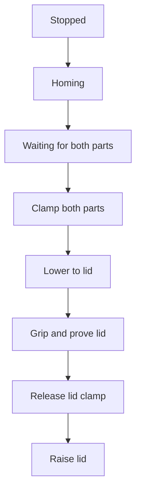
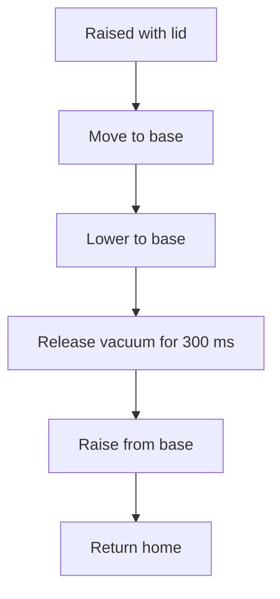
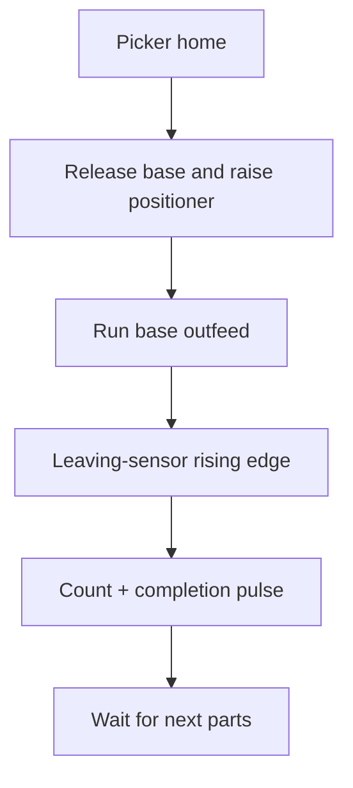

# Sequence and State Machines

## Automatic prerequisites

`xEnableAutomatic` is true only when:

- Run is latched.
- Auto is selected and Manual is not selected.
- Factory I/O reports Running.
- Factory I/O does not report Paused.
- The emergency-stop contact is healthy.
- No assembler fault has propagated to operator control.
- Reset is not required.

The supplied `xResetRequired` output has no explicit true initial value. A cold-started application can therefore accept Start without a prior Reset. Reset is still recommended before first operation because it clears the cell state, fault code and product count.

## Nominal assembly cycle

1. Start latches Run and enables the cell.
2. The cell leaves `Stopped` and commands its default raised/home direction.
3. After both axes report not moving for 500 ms, it waits for material.
4. Each conveyor runs until its own at-place sensor is true.
5. Both clamps energise; each conveyor continues only until its own clamp proof is true.
6. The Z axis lowers the picker onto the lid.
7. Vacuum Grab energises and item detection must remain true for 300 ms.
8. The lid clamp releases while the base remains clamped and vacuum remains on.
9. The picker raises, moves across to the base and lowers.
10. Vacuum releases for 300 ms so Factory I/O can join the aligned parts.
11. The picker raises and returns to the lid/home side.
12. The base clamp releases and the base positioner raises.
13. The base conveyor carries the assembled product toward the leaving sensor while the lid conveyor may preload the next lid.
14. A rising leaving-sensor edge increments the counter and pulses product complete.
15. The cell returns to `WaitingForParts` for the next base and any missing lid.

## State values

| State | Value | Principal purpose |
| --- | ---: | --- |
| `Stopped` | 0 | Disabled/reset state |
| `Homing` | 10 | Command raised/lid-side defaults and wait for no movement |
| `WaitingForParts` | 20 | Feed each lane until its part is present |
| `ClampingParts` | 30 | Clamp lid and base and prove both clamps |
| `LoweringToLid` | 40 | Lower the picker to the lid |
| `GrippingLid` | 50 | Apply vacuum and prove the lid |
| `ReleasingLidClamp` | 60 | Open the lid clamp while holding vacuum |
| `RaisingLid` | 70 | Raise the held lid |
| `MovingToBase` | 80 | Traverse to the base side |
| `LoweringToBase` | 90 | Lower the lid onto the base |
| `ReleasingLid` | 100 | Remove vacuum and allow a 300 ms join dwell |
| `RaisingFromBase` | 110 | Raise clear of the product |
| `ReturningHome` | 120 | Traverse back to the lid/home side |
| `ReleasingProduct` | 130 | Release the base and raise its positioner |
| `WaitingForProductExit` | 140 | Convey, detect and count the completed product |
| `Faulted` | 900 | Latched command-off state until Reset |

## Phase diagrams

### Feed and pickup



### Transfer and placement



### Release and count



## Detailed state actions and supervision

| State | Active commands / transition evidence | Timeout result |
| --- | --- | --- |
| `Stopped` | No cell command; enable advances to `Homing` | None |
| `Homing` | X=false, Z=false by defaults; both Moving signals false for 500 ms | 201 after 5 s if motion remains active |
| `WaitingForParts` | Each conveyor runs while its own at-place input is false | 101 after 15 s |
| `ClampingParts` | Both clamps on; each conveyor runs until its clamp proof | 102 after 5 s |
| `LoweringToLid` | Both clamps on; Z=true; Moving Z must become true then false | 202 after 5 s |
| `GrippingLid` | Both clamps, Grab and Z=true; Item Detected true for 300 ms | 203 after 5 s |
| `ReleasingLidClamp` | Base clamp, Grab and Z=true; lid clamp defaults off; wait for Lid Clamped false | 204 after 5 s |
| `RaisingLid` | Base clamp and Grab; Z=false; observe Z movement then stop | 205 after 5 s |
| `MovingToBase` | Base clamp, Grab and X=true; observe X movement then stop | 206 after 5 s |
| `LoweringToBase` | Base clamp, Grab, X=true and Z=true; observe Z movement then stop | 207 after 5 s |
| `ReleasingLid` | Base clamp, X=true and Z=true; Grab defaults off | Fixed 300 ms dwell; no fault |
| `RaisingFromBase` | Base clamp, X=true, Z=false; observe Z movement then stop | 208 after 5 s |
| `ReturningHome` | Base clamp; X=false and Z=false; observe X movement then stop | 209 after 5 s |
| `ReleasingProduct` | Base clamp defaults off; base positioner raise=true; wait for raised limit | 210 after 5 s |
| `WaitingForProductExit` | Base conveyor and base-positioner raise on; lid conveyor refills; wait for leaving edge | Intended code 301 after 10 s is unreachable in the supplied revision |
| `Faulted` | Final interlock forces all cell commands off | Reset only |

An invalid enum value assigns fault 999 and enters `Faulted`.

## Motion feedback details

Except during Homing, an axis state requires both parts of a feedback handshake:

```text
command target → Moving = TRUE → Moving = FALSE → advance
```

This prevents a transition on an old false Moving value. It does not prove the actual endpoint, because the scene exposes movement status rather than dedicated home/base/up/down position inputs. Homing is less strict: 500 ms of no movement is accepted without requiring movement to have been seen.

## Product completion and counting

`rtPartLeaving` executes every PLC scan. Its rising edge in `WaitingForProductExit`:

- increments `diProductsCompleted` once;
- asserts `xProductCompletePulse` for one cell call;
- returns the state to `WaitingForParts`.

The edge proves that an object reached the downstream sensor. It does not prove that the lid is attached, that the product has cleared the sensor or that it has entered the remover.

There is also an edge-order limitation: if `xPartLeaving` rises before the cell reaches `WaitingForProductExit`, the global `R_TRIG` consumes that edge. The state then needs the input to return false and rise again. Because the intended 10-second product-exit fault is currently broken, an early or missing edge can leave the cell waiting indefinitely.

## Controlled Stop

A Stop edge does not immediately disable an active automatic sequence:

1. `xStopPending` becomes true.
2. Run remains latched and automatic enable stays true.
3. Emitters, removers and the current assembly sequence remain enabled.
4. The cell completes a product and pulses `xProductCompletePulse` on the leaving-sensor rising edge.
5. On the following scan, operator control clears Run and Stop Pending.
6. The cell sees enable false, returns to `Stopped` and its commands default off.

Three limitations matter:

- A Stop request while the cell is waiting for parts can cause the cell to create another product merely to obtain the completion pulse.
- The pulse occurs when the product reaches the leaving sensor, not after confirmed outfeed clearance.
- A fresh Start edge while Stop is pending clears Stop Pending and cancels the requested stop.

The Stop contact is inverted and edge-detected. Its healthy level is not held in the run permissive, so Reset followed by Start can relatch Run while Stop remains pressed/false after the original edge has been consumed.

## Emergency stop and recovery

The scene emergency-stop contact is healthy-high and is inverted before operator control. While emergency stop is active:

- Run and Stop Pending clear.
- Reset Required becomes true.
- Reset edges are ignored.
- Automatic enable drops in the same scan.
- A non-faulted cell returns to `Stopped` and all cell commands default off.

Recovery requires releasing the emergency stop, pressing Reset and then pressing Start. This is simulated standard-control logic, not a safety-rated emergency-stop function.

## Pause and scene Stop

Factory I/O Pause or `xFactoryIORunning = FALSE` removes automatic enable but does not clear the Run latch. The cell does **not** retain its active sequence state: any non-faulted state returns to `Stopped`.

When Running resumes or Pause is removed, the retained Run latch can automatically re-enable the cell and restart from `Homing` without a new Start edge. Physical parts, clamp states or a lid held by the gripper may therefore remain in the scene while the logical sequence restarts.

## Mode changes

Manual, neither selector input or both selector inputs make Auto invalid. Operator control clears Run and Stop Pending; the cell returns to `Stopped`. Returning to valid Auto does not restart automatically because Run was cleared—a fresh Start edge is required.

Manual is an inhibit only. No manual/jog movement is implemented.

## Reset behaviour

Reset has higher priority than plant fault, invalid mode, Stop and Start, provided emergency stop is not active. A Reset edge:

- produces a one-scan `xResetPulse`;
- clears Run, Stop Pending and Reset Required;
- sets the cell state to `Stopped`;
- clears the cell fault code and product count;
- forces current cell commands to their defaults.

A routine Reset can therefore abort an active cycle. The Factory I/O scene reset command is sent only if Reset Required was already true before the edge. That external command lasts one 20 ms PLC scan and must be proved against the actual OPC update rate.

## Fault propagation

A cell timeout changes the state to `Faulted` and the final interlock removes cell commands in the same scan. `PLC_PRG` samples `xAssemblerFaulted` before the cell call, so operator control sees the new plant fault on the next scan. Enable-driven emitters/removers can therefore remain on for one additional nominal 20 ms scan.

The fault state survives Stop, Pause, a scene Stop and a mode change. Only Reset returns it to `Stopped`.

[Back to the project README](../README.md)
