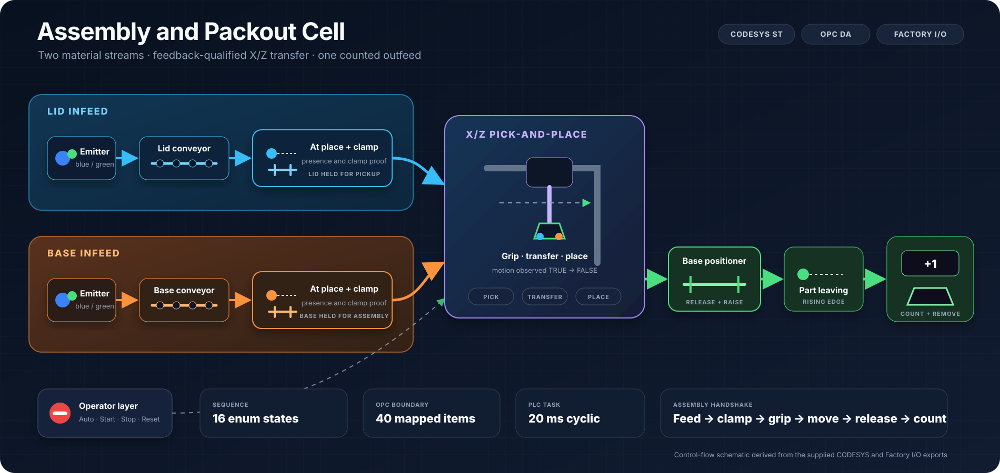
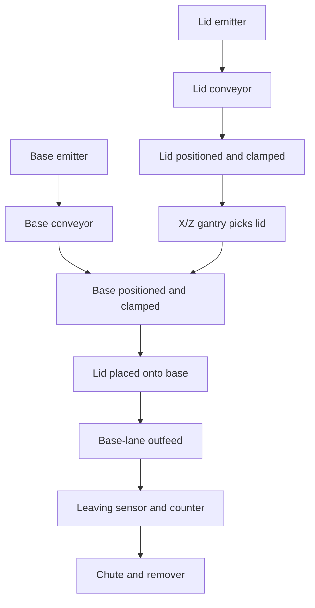

# Assembly and Packout Cell

A virtual IEC 61131-3 Structured Text assembly cell that coordinates independent lid and base infeeds, two positioning clamps and an X/Z pick-and-place mechanism. An enum-based equipment state machine sequences pickup, transfer, placement and downstream detection, while a separate operator-control block manages Auto, Start, Stop, Reset, pause and emergency-stop simulation through a 40-item Kepware OPC DA interface.



`CODESYS` · `Structured Text` · `Factory I/O` · `Kepware` · `OPC DA` · `State machine`

## Project objective

The cell receives lids and bases on parallel conveyors, stops each lane independently when its part arrives, clamps both components, transfers the lid onto the base and releases the assembled product through the base-lane outfeed. The project demonstrates how a single PLC sequence can coordinate material flow, clamping, two-axis motion, vacuum pickup, operator controls, counting and fault recovery.

In this project, **packout** means controlled outfeed and removal. The supplied scene does not box, label, palletise or otherwise package the product.

## Engineering highlights

- A 16-state `FB_AssemblerCell` separates feed, clamp, pickup, transfer, placement, release and outfeed phases.
- Lid and base conveyors stop independently, allowing asynchronous part arrival without advancing until both parts are present.
- Gantry pickup and transfer transitions require movement to be observed and then stop before advancing; Homing is separately inferred from 500 ms of stationary feedback.
- Gripper detection must remain true for a 300 ms settle period before the lid clamp releases.
- Clamp, feed, pickup, axis and positioner operations have explicit diagnostic codes and intended timeout supervision.
- Every cell command defaults off each scan, with a final same-scan de-energisation override after a cell fault.
- A separate `FB_OperatorControl` handles command edges, mode validation, run latching, controlled-stop requests and reset requirements.
- A rising edge at the downstream sensor increments the completed-product count once and updates the scene display.
- Timing values are centralised in `AssemblyConstants` rather than scattered through the sequence.
- All 40 external variables are collected in the `FIO` global variable list and selected in Symbol Configuration.
- `PLC_PRG` executes from a 20 ms cyclic task.

## Process flow



The lid lane may preload the next lid while the previous assembled product leaves on the base lane. A separate lid-lane remover is enabled during automatic operation to clear any lid that passes the intended station.

## Control structure

| Object | Responsibility |
| --- | --- |
| `PLC_PRG` | Fixed scan order, module calls, previous-scan fault aggregation and final `FIO` output mapping |
| `FB_OperatorControl` | Start/Stop/Reset edges, Auto validation, run latch, Stop Pending and reset requirement |
| `FB_AssemblerCell` | Complete assembly sequence, commands, state timers, fault codes and product count |
| `E_AssemblerState` | Online numeric values for all 16 normal/fault states |
| `AssemblyConstants` | Central timing configuration |
| `FIO` | Factory I/O and OPC-facing global interface |
| `Commands` | Temporary watch-list commissioning commands |

## Operator sequence

1. Start the Factory I/O simulation and release the emergency stop.
2. Confirm the normally closed Stop signal is healthy and select **Auto** only.
3. Press **Reset** to establish a known stopped state and clear any retained fault/count information.
4. Press **Start** to latch automatic operation.
5. Observe both parts arrive and clamp, the gantry pick and place the lid, and the completed product leave on the base lane.
6. Press **Stop** to request a controlled production stop at the next product-completion pulse.
7. Use the emergency stop for an immediate software stop. Release it and press Reset before restarting.

## Documentation

| Document | Contents |
| --- | --- |
| [System overview](Documentation/01-System-Overview.md) | Requirements, material flow, 31-object scene inventory, stack and boundaries |
| [Control architecture](Documentation/02-Control-Architecture.md) | Program objects, scan order, operator logic, motion feedback and output design |
| [Sequence and state machines](Documentation/03-Sequence-and-State-Machines.md) | All 16 states, transitions, timers, stop, pause, mode and reset behaviour |
| [I/O and OPC tag map](Documentation/04-IO-and-OPC-Tag-Map.md) | All 40 saved OPC items, direction, address, polarity and unused points |
| [Commissioning and testing](Documentation/05-Commissioning-and-Testing.md) | Import, setup, signal proving and an uncompleted acceptance-test record |
| [Faults and troubleshooting](Documentation/06-Faults-and-Troubleshooting.md) | Fault codes, recovery cautions and symptom-based checks |
| [Engineering review](Documentation/07-Engineering-Review.md) | Design strengths, confirmed defects, limitations and improvement roadmap |

## Quick start

1. Import [the CODESYS export](CODESYS/assemblyAndPackoutCell.export) using CODESYS V3.5 SP22 Patch 3 or a compatible installation.
2. Rescan and select the intended `CODESYS Control Win V3 x64` runtime, then confirm the 20 ms `MainTask`.
3. Compile, download and run the application.
4. Confirm Kepware exposes `Application.FIO` beneath `Channel2.project11`.
5. Open [the Factory I/O scene](FactoryIO/assemblyAndPackoutCell.factoryio), select OPC Client DA and connect to `PTC.KepwareServer`.
6. Verify good quality for the required points, put the scene into Run, release Emergency Stop and Stop, select Auto, press Reset and then Start.

The export retains the original workstation's machine-specific runtime identity, so reselect the target when opening it on another PC. No fixed IP address is stored. Kepware, namespace and network settings remain installation-specific.

Before treating this as a completed commissioning baseline, review the [confirmed engineering findings](Documentation/07-Engineering-Review.md). The supplied revision has an inactive product-exit timeout, edge-only Stop handling and a completion pulse that detects arrival at the leaving sensor rather than confirmed outfeed clearance.

## Supplied versions

| Component | Supplied configuration |
| --- | --- |
| Factory I/O | Scene version 2.5.10; saved 12 August 2026 |
| CODESYS profile | V3.5 SP22 Patch 3 |
| Runtime device | CODESYS Control Win V3 x64 3.5.22.30 |
| Communications | Factory I/O OPC Client DA through Kepware |
| OPC server | `PTC.KepwareServer` |
| Saved namespace | `Channel2.project11.Application.FIO.*` |
| OPC items | 40: 19 scene-to-PLC and 21 PLC-to-scene |
| PLC task | Cyclic, 20 ms, priority 1; watchdog disabled |

## Repository layout

```text
assemblyAndPackoutCell/
├── README.md
├── CODESYS/
│   └── assemblyAndPackoutCell.export
├── FactoryIO/
│   └── assemblyAndPackoutCell.factoryio
└── Documentation/
    ├── 01-System-Overview.md
    ├── 02-Control-Architecture.md
    ├── 03-Sequence-and-State-Machines.md
    ├── 04-IO-and-OPC-Tag-Map.md
    ├── 05-Commissioning-and-Testing.md
    ├── 06-Faults-and-Troubleshooting.md
    ├── 07-Engineering-Review.md
    └── Images/
        ├── factory-io-overview.png
        └── system-layout.svg
```

## Skills demonstrated

IEC 61131-3 Structured Text, enum-based sequencing, modular function blocks, independent material-lane control, clamp verification, X/Z handling, motion-feedback handshakes, edge detection, `TON` and `R_TRIG`, fault latching, operator-state management, centralised timing constants, symbolic I/O abstraction, Kepware/OPC DA integration and virtual-commissioning test design.

## Scope and safety note

This is a virtual-commissioning portfolio project. Its emergency-stop and Stop behaviour are standard PLC simulation logic transported over OPC DA, not safety-rated circuitry or validated safety functions. The supplied project has not been commissioned on physical machinery.
