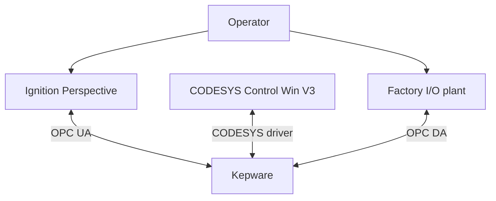
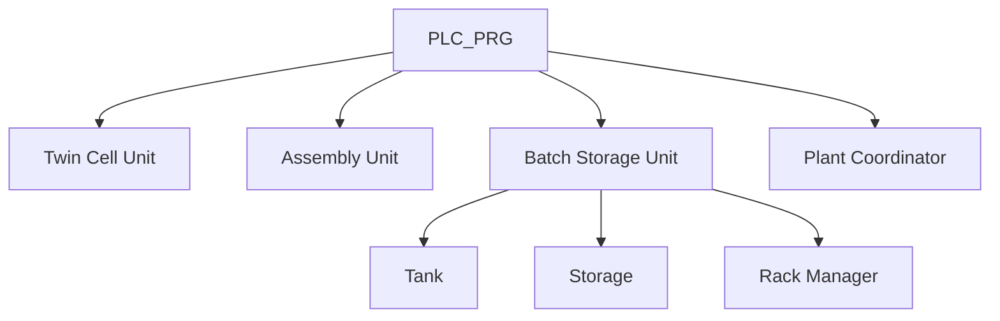

# System Architecture

## Design intent

Project 12 separates the simulated plant, deterministic control, communications and visualisation layers. Each layer has one clear responsibility and exposes a deliberate interface to the next.

| Layer | Responsibility | Project evidence |
|---|---|---|
| Factory I/O | Physical plant, devices, sensors, actuators and operator stations | 184 scene objects and 158 physical I/O points |
| Kepware | Signal brokerage between simulation, PLC and SCADA | 154 Factory I/O mapping entries use `PTC.KepwareServer` |
| CODESYS | Sequencing, state, interlocks, handshakes, faults and inventory | 15 FBs, 14 state enums and one 20 ms cyclic program |
| Ignition | Operator status, commands, responsive layout and history | 8 Perspective views, reusable cards and tank historian trend |

## Communications topology



Factory I/O and Ignition do not own the sequence. They present inputs to and consume outputs from the PLC. That keeps the controller as the authoritative source of operating state.

## Production topology

The physical route is:

| Stage | Main equipment | Controller boundary |
|---|---|---|
| Twin Cell | Two machining centres and parallel conveyors | `FB_TwinCellUnit` with two `FB_MachiningCell` instances |
| Pair Sorter | Count sensor, junction, conveyor and pusher | `FB_PairDiverter` |
| Pair Transfer | Inter-unit handshake | `FB_TransferCoordinator` instance |
| Assembly | Two infeed paths, clamps and X/Z pick-and-place | `FB_AssemblyUnit` owning `FB_AssemblerCell` |
| Product Transfer | Assembly-to-packout handshake | Second `FB_TransferCoordinator` instance |
| Packout | Buffer conveyors, carrier feed and X/Z loader | `FB_PackoutLoader` and `FB_PackoutCarrierStation` |
| Batch/Tank | Carrier transfer, fill, high-high protection and discharge | `FB_BatchStorageUnit` owning `FB_Tank` |
| Storage | Entry/load/unload conveyors and stacker crane | `FB_Storage` |
| Inventory | 54 logical slot states and reservation lifecycle | `FB_RackManager` |
| Plant | Overall phase and controlled-stop coordination | `FB_PlantCoordinator` |

## PLC composition

Project 12 uses composition, not inheritance.



This suits the domain: a batch-storage unit *owns and coordinates* a tank, storage mechanism and inventory manager. Those are not specialised forms of one another, so `EXTENDS` would add the wrong relationship.

## Program scan order

`PLC_PRG` is a single, cyclic composition root. `MainTask` calls it every 20 ms.

| Order | Scan section | Purpose |
|---:|---|---|
| 1 | Input normalisation | Convert raw voltages and beam-clear signals into operator-friendly process semantics |
| 2 | Safety and commissioning | Combine emergency-stop health and global permits |
| 3 | Operator control | Merge physical selectors and buttons with SCADA requests |
| 4 | Unit boundaries | Execute Twin Cell and Assembly controllers |
| 5 | Inter-unit transfers | Execute reusable transfer coordinators and the pair diverter |
| 6 | Packout and batch/storage | Load carriers, batch tank contents and store products |
| 7 | Plant coordination | Aggregate faults, phases and controlled-stop state |
| 8 | SCADA publication | Publish states, counts, fault codes and status bits |
| 9 | Output mapping | Drive Factory I/O commands from calculated safe outputs |

The SCADA momentary requests are cleared only after all consumers have sampled them in the current scan. This makes the HMI buttons behave like pulses without Perspective scripting.

## Control hierarchy

The simulation contains three physical operator stations:

- Twin Cell local/plant control;
- Plant automatic/manual control;
- Master automatic/manual control.

`FB_MasterOperatorControl` owns the master run latch, start/reset edges and controlled-stop request. `FB_UnitOperatorControl` provides a reusable boundary for local versus master control and prevents unsafe local reset during an active transfer.

The Ignition Auto command is deliberately merged at the master request boundary:

```iecst
xAutoModeSelected :=
    FIO.xMasterAutoModeSelected
    OR SCADA.xIgnitionAutoModeReq;
```

This allows either the simulated physical panel or the SCADA to request automatic mode while retaining one PLC authority for the resulting active state.

## Data ownership

| Data | Authoritative owner | Consumers |
|---|---|---|
| Raw sensor/actuator signals | Factory I/O | CODESYS `FIO` GVL |
| Process state and faults | CODESYS function blocks | Plant coordinator and Ignition |
| Rack slot state | `FB_RackManager` | Batch storage, SCADA counts and reserved-position display |
| Momentary operator requests | Ignition/physical panel, consumed by PLC | Master operator control |
| Maintained Auto request | Ignition or physical selector | Master operator control |
| Tank history | Ignition historian | Perspective Time Series Chart |

## Safety boundary

The PLC calculates a combined emergency-stop health value from the Master, Plant and Twin Cell panels. Faults are aggregated before entering the plant coordinator, and physical commands are generated from state and permits each scan.

This is a simulation-level safety model. It demonstrates fail-safe software structure and recovery behaviour, but the architecture does not include safety-rated hardware or a safety PLC.
