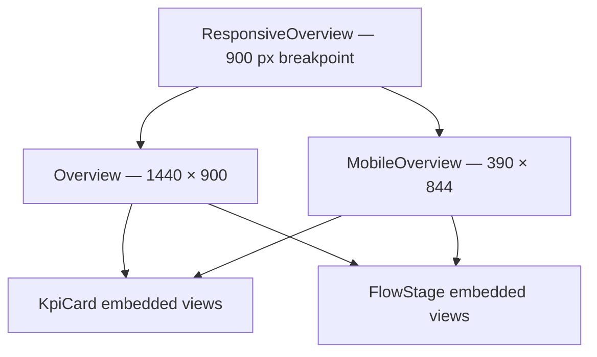

# SCADA and Responsive HMI

## Perspective structure

The Ignition export contains eight Perspective views and nine P12 style classes. All embedded-view references and referenced style classes resolve correctly, and the export contains no `meta.name`, view path or component value set to `null`.

The `/` page route points to `P12/Pages/ResponsiveOverview` with the title **Project 12 | Integrated Manufacturing System**.



## Reusable components

### `KpiCard`

Parameters:

- `title`
- `valueText`
- `detail`
- `status`
- `iconPath`

It provides a consistent card for Plant State, Production Phase, Operating Mode, E-stop, Completed Loads and Factory I/O connection status.

### `FlowStage`

Parameters:

- `title`
- `stateText`
- `detail`
- `status`
- `iconPath`

The same component renders Twin Cell, Pair Sorter, Assembly, Packout, Tank and Storage. Enum values are translated into operator-friendly words at the page binding layer.

## Desktop layout

The desktop view contains:

1. Shared brand, architecture, connection, clock and operator header.
2. Six-card KPI ribbon.
3. Six-stage process strip.
4. Three live diagnostic groups:
   - Plant Control
   - Transfer Handshake
   - Storage Availability
5. Cylindrical tank level graphic.
6. Tank-level trend.
7. Storage allocation, four inventory metrics and reserved-position status.
8. Operator controls and recovery banner.

## Mobile layout

The mobile view is deliberately rearranged rather than merely scaled down:

- compact shared header;
- two-column KPI ribbon;
- horizontally scrollable stage strip;
- live diagnostic groups hidden to reduce clutter;
- tank visual and trend stacked vertically;
- Operator Controls shown before Storage Summary;
- root vertical scrolling.

The responsive wrapper switches at 900 px.

## Status model

Reusable status values drive consistent colour and border behaviour:

| Status | Meaning |
|---|---|
| `good` | Running, ready, healthy or online |
| `warning` | Transitional, batch-ready or attention state |
| `bad` | Faulted, unhealthy or failed state |
| `neutral` | Stopped, idle or not active |

The page converts PLC enum values to readable text. For example:

| Plant value | Display |
|---:|---|
| 0 | STOPPED |
| 10 | READY |
| 20 | STARTING |
| 30 | RUNNING |
| 40 | STOPPING |
| 900 | FAULTED |
| 910 | RECOVERY REQUIRED |

## Tank visual and history

The cylindrical tank and trend share the tag:

```text
[Sample_Tags]P12/SCADA/rTankLevelPct
```

The Time Series Chart is configured for:

- series name `TankLevel`;
- most recent 10 minutes;
- 120 rows;
- `MinMax` aggregation;
- wide dataset;
- 2-second polling.

The cylindrical tank uses a 90% warning threshold. Using one source for the instantaneous graphic and trend prevents the mismatch that occurred during early design iterations.

The project-resource export contains the history binding, but not the Gateway historian database or tag-history configuration. Those belong to Gateway-level resources.

## Storage summary

The HMI presents:

- free count;
- occupied count;
- reserved count;
- unknown count;
- allocation percentage;
- reserved slot, with `NONE` for no active reservation or the home sentinel;
- conditional rack-full warning.

This mirrors the PLC inventory model instead of inferring storage state from the Factory I/O rack graphic.

## Operator controls

No Perspective event scripts are required for the control panel.

| Control | Binding strategy | PLC tag |
|---|---|---|
| Auto | Bidirectional maintained Boolean | `xIgnitionAutoModeReq` |
| Start | One-Shot Button | `xStartReq` |
| Stop | One-Shot Button | `xStopReq` |
| Reset | One-Shot Button | `xResetReq` |

The PLC consumes and clears the three momentary requests. Button enable expressions prevent commands in inappropriate states, while the PLC remains the final authority.

Reset is enabled when Factory I/O is online, all simulated E-stops are healthy and the plant is stopped. A recovery banner appears when the plant is faulted or recovery is required.

## Style classes

The P12 namespace contains:

- `P12/App`
- `P12/Panel`
- `P12/Kpi`
- `P12/FlowStage`
- `P12/MiniMetric`
- `P12/Title`
- `P12/SectionTitle`
- `P12/KpiValue`
- `P12/Muted`

Centralising the industrial dark palette, borders, spacing and typography reduced repeated component styling and made the desktop/mobile views visually consistent.

## Session defaults

- Locale: `en-GB`
- Time zone: `Europe/London`

## Export boundary

This Perspective ZIP contains the project views, styles, page configuration, session properties and project metadata. It does not contain the Gateway tag provider, OPC connection, historian storage provider or Kepware configuration. See [Export and Restore](EXPORT_AND_RESTORE.md).
