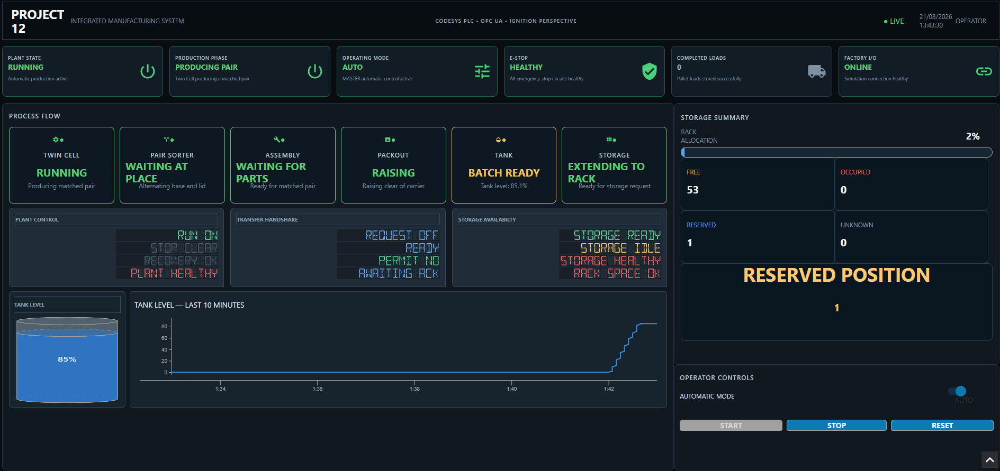
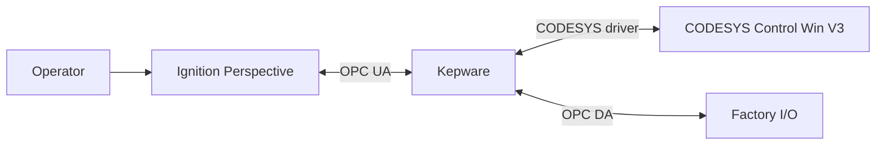

# Project 12 — Integrated Manufacturing System

An end-to-end industrial automation portfolio project combining a CODESYS Structured Text controller, a Factory I/O production plant, Kepware communications, and a responsive Ignition Perspective SCADA.

## What the system does

Project 12 coordinates a complete simulated production route:

1. Parallel lid and base machining in a twin cell.
2. Pair detection and pusher-based routing.
3. Robotic lid-to-base assembly.
4. Robotic product-to-carrier packout.
5. Analogue tank filling and discharge.
6. Carrier transfer into automated rack storage.
7. Reservation and commit of a logical 54-position inventory.

The design goes beyond a single sequence. It includes local/master control boundaries, inter-unit handshakes, controlled stopping, fault and recovery states, analogue values, storage accounting, SCADA commands, historian-backed trending, and desktop/mobile HMI layouts.

## Project at a glance

| Area | Evidence in the supplied exports |
|---|---:|
| CODESYS function blocks | 15 |
| Typed state enumerations | 14 |
| PLC task interval | 20 ms |
| Factory I/O scene objects | 184 |
| Factory I/O OPC mappings | 154 |
| Physical scene I/O points | 158 |
| Named Factory I/O cameras | 13 |
| Logical rack positions | 54 |
| Physical operator stations | 3 |
| Ignition Perspective views | 8 |
| Reusable P12 style classes | 9 |
| Responsive HMI breakpoint | 900 px |

## Architecture

The PLC owns the control decisions. Factory I/O provides the plant and field signals. Kepware brokers the communications. Ignition presents status, history and controlled operator commands.

The Factory I/O scene specifically contains an OPC DA client configuration. Ignition uses the Kepware OPC UA interface. This distinction is retained in the documentation rather than describing the entire route as one protocol.

## Controls architecture

`PLC_PRG` acts as the composition root and runs the application in a deliberate scan order:

1. Normalise raw Factory I/O signals into process semantics.
2. Calculate safety health and permissives.
3. Evaluate master and unit operator controls.
4. Execute unit, transfer and plant-coordination function blocks.
5. Publish SCADA values.
6. Consume momentary SCADA requests.
7. Map safe commands back to Factory I/O outputs.

The implementation favours small, stateful function blocks and typed enums over one monolithic sequence. Reusable handshake and operator-control blocks are instantiated more than once, while higher-level units own their equipment controllers through composition.

## Engineering highlights

- Explicit request/ready/permit/acknowledge/complete handshakes between production areas.
- State machines with safe defaults, timeouts and invalid-state fallbacks.
- Controlled stop behaviour that allows the active transaction to finish.
- Three-level operator control: Twin Cell, Plant and Master.
- Analogue tank level and flow feedback with analogue valve commands.
- Independent discrete high-high level protection.
- Two-phase storage inventory: reserve a slot, then commit it only after physical deposit.
- Interrupted deposits can be quarantined as `Unknown` rather than incorrectly returned to `Free`.
- Responsive Perspective HMI with reusable KPI and process-stage views.
- Tank-level historian trend using the same source as the cylindrical tank display.
- One-shot Start, Stop and Reset commands plus a maintained remote Auto request.

## HMI design

The Perspective project provides:

- a six-card KPI ribbon;
- six process-stage cards;
- detailed live status groups;
- tank level visualisation and a 10-minute trend;
- free, occupied, reserved and unknown storage metrics;
- reserved-position and rack-full indications;
- operator Auto, Start, Stop and Reset controls;
- a breakpoint wrapper selecting 1440 × 900 desktop or 390 × 844 mobile views.

`KpiCard` and `FlowStage` are parameterised embedded views. Status values drive consistent good, warning, bad and neutral visual treatments instead of duplicating card logic throughout the page.

## Normal operating sequence

1. Start the CODESYS runtime, Kepware and Factory I/O.
2. Confirm communications and release all three simulated emergency stops.
3. Select Twin Cell `Plant/Auto`.
4. Select Plant `Auto`.
5. Select Master `Auto`, or issue the maintained Ignition Auto request.
6. Press Master or Ignition Reset momentarily.
7. Press Master or Ignition Start momentarily.
8. Observe machining, pairing, assembly, packout, tank batching and storage.
9. Confirm the reserved rack position commits to occupied only after deposit.

See [Commissioning and Testing](docs/COMMISSIONING_AND_TESTING.md) for a repeatable test sheet.

## Documentation

| Document | Purpose |
|---|---|
| [Architecture](Documentation/ARCHITECTURE.md) | Layer boundaries, production flow and data ownership |
| [PLC Control Design](Documentation/PLC_CONTROL_DESIGN.md) | Program structure, state machines, handshakes and rack logic |
| [Factory I/O Scene](Documentation/FACTORY_IO_SCENE.md) | Plant inventory, I/O counts and mapping evidence |
| [SCADA and Responsive HMI](Documentation/SCADA_AND_HMI.md) | Perspective views, bindings, controls and historian |
| [Commissioning and Testing](Documentation/COMMISSIONING_AND_TESTING.md) | Startup, functional, stop, fault and recovery tests |
| [Learning and Findings](Documentation/LEARNING_AND_FINDINGS.md) | Candid lessons, troubleshooting and design decisions |
| [Export and Restore](Documentation/EXPORT_AND_RESTORE.md) | What each supplied file does and does not contain |
| [Review and Next Steps](Documentation/REVIEW_AND_NEXT_STEPS.md) | Optional polish and production-hardening backlog |

## Supplied project files

- `Ignition/P12_IntegratedManufacturingSystem.zip` — Ignition project-resource export.
- `CODESYS/integratedManufacturingSystem.export` — CODESYS XML object export.
- `Factory IO/integratedManufacturingSystem.factoryio` — Factory I/O scene and mapping file.

Kepware server configuration and the Ignition Gateway tag provider, historian database and OPC connection are not included in these three files. The project export is therefore evidence of the application design, not a one-click reconstruction of the complete workstation.

## Safety and scope

This is a simulation and portfolio project. The emergency-stop chain, permissives and fault responses demonstrate control-software design, but they are not a substitute for safety-rated hardware, a safety PLC, validated risk assessment or production commissioning.

## Current status

The integrated cycle, remote commands, storage metrics, analogue tank visual and historian trend were functionally exercised. The supplied exports are internally consistent and readable. Remaining items are optional cleanup or production-hardening work and are recorded openly in [Review and Next Steps](docs/REVIEW_AND_NEXT_STEPS.md).
