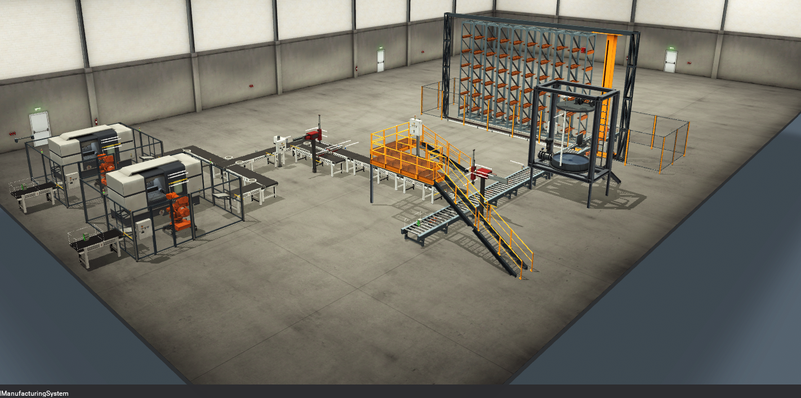

# PLC & Industrial Automation Portfolio

Self-directed controls projects built with CODESYS, Factory I/O, Kepware and Ignition Perspective — progressing from IEC 61131-3 fundamentals to an integrated, multi-cell virtual production system.

I am Jordan Bromley, a software engineer transitioning into controls and industrial automation. I built this portfolio to demonstrate PLC sequencing, modular control design, industrial communications, SCADA/HMI development, fault handling, virtual commissioning and clear engineering documentation.

**Reviewing the portfolio? Start with [Project 12 — Integrated Manufacturing System](12-FLAGSHIP-integratedManufacturingSystem/README.md).** The early exercises remain as evidence of progression; the later systems represent my current approach.

| Factory I/O plant | Ignition Perspective SCADA |
|:---:|:---:|
|  |  |

## Flagship — Project 12

[**Integrated Manufacturing System**](12-FLAGSHIP-integratedManufacturingSystem/README.md) coordinates an end-to-end simulated production route: parallel lid and base machining, pair sorting, robotic assembly, carrier loading, analogue tank batching and automated storage in a logical 54-position rack.

CODESYS owns the control decisions, Factory I/O supplies the plant and field signals, Kepware brokers communications, and Ignition provides responsive desktop/mobile supervision.

Key engineering work includes:

- reusable function blocks and typed, enum-based equipment state machines;
- held request/ready/permit/acknowledge/complete handshakes between production areas;
- safe-default outputs, timeout diagnostics, invalid-state fallbacks and controlled stopping;
- three-tier operator control across Twin Cell, Plant and Master boundaries;
- reserve-then-commit rack transactions, with interrupted deposits quarantined as `Unknown`;
- analogue `0–10 V` tank signals, discrete high-high protection and historian-backed HMI trending; and
- one-shot SCADA commands, reusable Perspective views and desktop/mobile layouts.

**Evidence:** [Factory I/O demonstration](12-FLAGSHIP-integratedManufacturingSystem/Factory%20IO%20-%20integratedManufacturingSystem%28COMPRESSED%29.mp4) · [Ignition desktop demonstration](12-FLAGSHIP-integratedManufacturingSystem/Ignition-Desktop%28COMPRESSED%29.mp4) · [Ignition mobile demonstration](12-FLAGSHIP-integratedManufacturingSystem/Ignition-Mobile.mp4) · [Architecture](12-FLAGSHIP-integratedManufacturingSystem/Documentation/ARCHITECTURE.md) · [Commissioning and testing](12-FLAGSHIP-integratedManufacturingSystem/Documentation/COMMISSIONING_AND_TESTING.md)

## Selected systems

| Project | Engineering focus | Evidence |
|---|---|---|
| [09 — SCADA Tank and Sorting Plant](09-IgnitionAndP08/README.md) | Ignition Perspective supervision of an analogue batch tank and 54-position storage system; responsive views, OPC integration and cross-layer troubleshooting | [Desktop demo](09-IgnitionAndP08/SCADA-DashboardAndFactoryIoWorking%28COMPRESSED%29.mp4) · [Mobile demo](09-IgnitionAndP08/SCADA-Mobile.mp4) · [Architecture](09-IgnitionAndP08/Documentation/ARCHITECTURE.md) |
| [10 — Twin-Cell Balanced Production](10-twinCellBalancedProduction/README.md) | Two instances of one machining-cell function block coordinated through held handshakes to produce matched lid/base pairs | [Working cycle](10-twinCellBalancedProduction/working-twinCellBalancedProduction%28COMPRESSED%29.mp4) · [Control design](10-twinCellBalancedProduction/Documentation/02-Control-Architecture.md) |
| [11 — Assembly and Packout Cell](11-finalAssemblyAndPackoutCell/README.md) | Independent part infeeds, clamping and a 16-state X/Z pick-and-place sequence with feedback checks and diagnostics | [Working cycle](11-finalAssemblyAndPackoutCell/working-assemblyAndPackoutCell%28COMPRESSED%29.mp4) · [State machine](11-finalAssemblyAndPackoutCell/Documentation/03-Sequence-and-State-Machines.md) |
| [08 — Batch Production and Automated Storage](08-tankAndSortingPlant-Batch-Production-And-Automated-Storage/README.md) | Modular Structured Text for tank batching, crane control and transactional rack allocation; the control foundation later extended by Project 09 | [Working cycle](08-tankAndSortingPlant-Batch-Production-And-Automated-Storage/WORKING-TankAndSortingPlant%28COMPRESSED%29.mp4) · [Engineering notes](08-tankAndSortingPlant-Batch-Production-And-Automated-Storage/Documentation/engineering-notes.md) |

## Development progression

The early exercises are intentionally presented compactly. They show how the later architecture developed without giving small syntax projects the same weight as integrated virtual systems.

| Stage | Projects | Progression demonstrated |
|---|---|---|
| PLC and communications fundamentals | [01 Mini Conveyor](01-miniConveyor/), [02 Timer and Alarm](02-miniConveyorTimerAndAlarm/), [03 Sensor and Counter](03-conveyorLeftRightSensorAndCounter/), [04 Water-Tank Functions and Blocks](04-waterTankFunctionsAndBlocks/) | Basic conveyor logic, timers, alarms, edge handling, counting, first reusable POUs and an initial CODESYS-to-Kepware/OPC connectivity proof |
| Reuse and IEC languages | [05 Reusable Two-Tank Control](05-twoWaterTanksFuncAndBlockContinued/README.md), [06 LD/FBD Refactor](06-twoTanksFBDlanguageRefactor/README.md), [06.5 Introduction to SFC](06.5-introToSFC/README.md) | Multiple function-block instances, valve interlocks, Factory I/O evidence, LD-to-FBD comparison, regression findings and SFC/ST sequence comparison |
| Sequenced material handling | [07 Sequential Storage Controller](07-sortingPlant/README.md) | Multi-stage SFC material handling and rack placement in Factory I/O, including a documented reset-path design finding |
| Modular plant coordination | [08 Batch Production and Automated Storage](08-tankAndSortingPlant-Batch-Production-And-Automated-Storage/README.md) | Coordinated state machines, pipelined operation, handshakes, timeouts, controlled stop and reserve/commit inventory handling |

## Skills demonstrated

| Discipline | Evidence across the repository |
|---|---|
| PLC programming | Structured Text, Ladder Diagram, Function Block Diagram and Sequential Function Chart; reusable POUs; scan-order awareness; timers, counters and edge detection |
| Control design | Equipment state machines, permissives, mutual interlocks, held handshakes, safe output defaults, timeouts, fault latching, reset/recovery and controlled stops |
| Plant integration | CODESYS Control Win, Factory I/O, KEPServerEX, CODESYS V3 Ethernet, OPC DA for the simulated plant and OPC UA for Ignition |
| SCADA/HMI | Ignition Perspective, responsive desktop/mobile views, reusable view components, KPIs, status visualisation, operator commands and process history |
| Engineering practice | Control philosophies, architecture diagrams, I/O and OPC tag maps, commissioning procedures, test matrices, troubleshooting notes and candid engineering reviews |

## How to review or run the projects

1. For a quick review, watch the Project 12 Factory I/O and Ignition demonstrations.
2. For control architecture, read the Project 12 overview and architecture documents.
3. For focused examples, use Project 09 for SCADA/connectivity, Project 10 for parallel-cell coordination, or Project 11 for an equipment-level assembly sequence.
4. To run a project, follow its own README: runtime identity, Kepware namespaces and OPC mappings vary between projects and may need to be reselected on another workstation.

Later project folders generally include portable CODESYS exports, Factory I/O scenes, tag or OPC evidence, documentation and demonstration media. Projects 09 and 12 also include Ignition project exports. The supplied files are engineering evidence and learning artifacts, not a one-click backup of every workstation-level connection or historian resource.

## Scope and safety

All processes in this repository are simulations. Emergency-stop, permissive and fault-response logic demonstrates standard PLC software behaviour only; it is not a safety-rated function and has not been commissioned on physical machinery. Real deployment would require suitable hardware, risk assessment, electrical design, safeguarding and validated commissioning.
